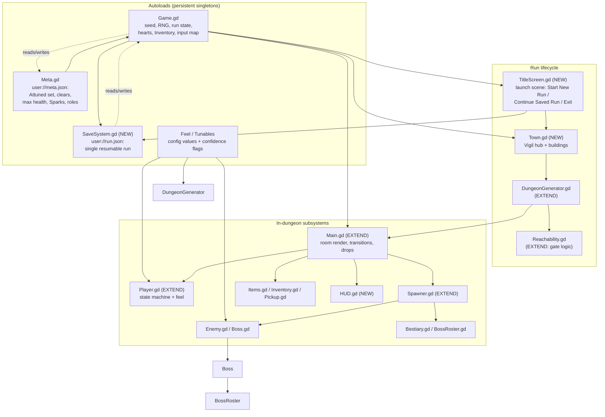
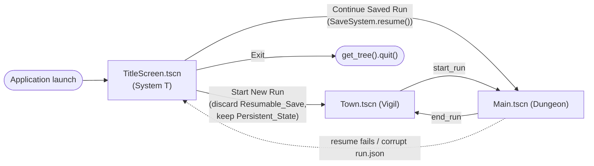
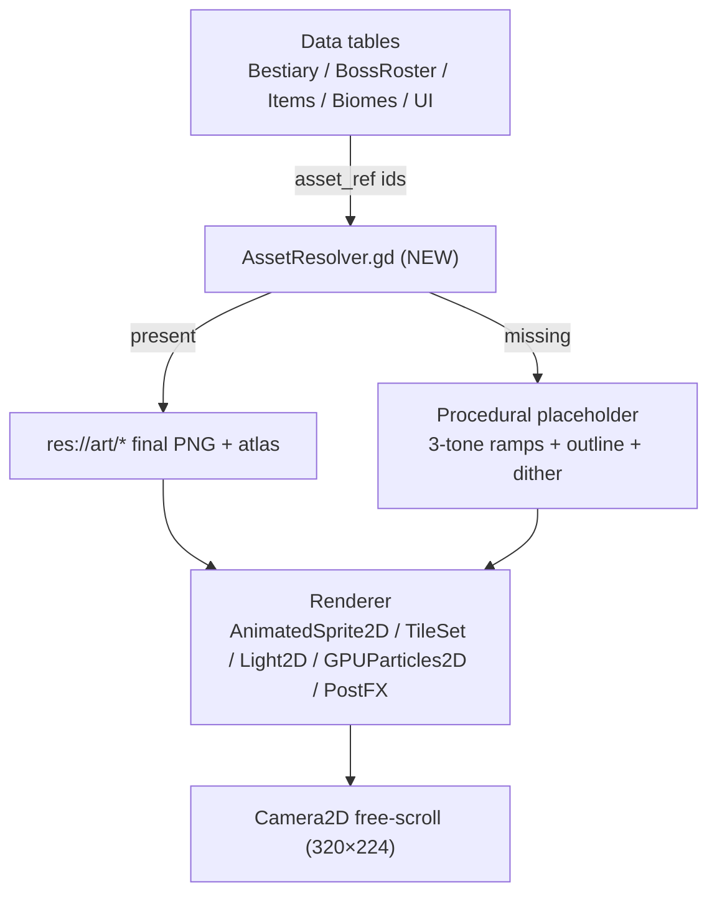

# Design Document

## Overview

This design describes a top-down, *A Link to the Past*-style action-adventure **roguelike** built in
**Godot 4 (GDScript)**. It realizes the 49 requirements (Systems A–R) by extending an existing,
reviewed-but-unvalidated Godot 4 scaffold under `_incoming/godot/` rather than starting fresh. The
scaffold already proves out the hardest "feel" problems — a seeded run, a BFS reachability gate, a
player state machine with LTTP damage feel (knockback + i-frames + passive facing shield), a
data-driven bestiary of ~40 enemies across 7 biomes and 9 archetypes, a 100-boss ladder with a phase
machine, and the Attunement persistence loop. The design's job is to grow that slice into the full
game described by the requirements while keeping its conventions intact.

The game is framed around two places and one loop:

- **Vigil** — the last warm town, the persistent hub where every **Run** begins and ends. It holds
  the bar (*The Last Call*), the restaurant (*The Warm Machine*), *The Board*, *The Chapel*, the
  Forge, the Apothecary, and the Pawnbroker, and is populated mostly by **simulacra** whose reality
  is never confirmed.
- **Dungeon** — one seeded, procedurally generated descent of `20×14`-tile rooms following a fixed
  biome route (Hollow Crypts → Silkfall Warrens → Thornwild → Emberdeep → Glacier Barrow → Sunken
  Ruins → The Arcanum), ending in exactly one **Boss** drawn from the 100-rung ladder. Rooms are the
  generation/collision/reachability unit; the camera **free-scrolls** across stitched contiguous rooms
  (see System S), so there are no hard room-to-room screen snaps.

Three pillars drive the whole architecture, and all three are already seeded in the scaffold:

1. **Attunement as progression** (`Meta.gd`, `Inventory.gd`, `Game.gd`). The player starts poor with
   only the bare sword swing. ATTACK/UTILITY items found in a dungeon work for that run; carried
   through a **Clear**, they Attune and become permanent (`user://meta.json`). Deviating from the
   source, **maximum-health upgrades also persist on a Clear**. Death loses the run's finds.
2. **Determinism from a single seeded RNG** (`Game.rng`). Layout, loot, and enemy placement are all
   drawn from one `RandomNumberGenerator`, so a Seed plus the Attuned_Set reproduces an entire
   dungeon and is shareable.
3. **Guaranteed completability** (`Reachability.gd`). The generator plans gates so each gate's opener
   is reachable before it, then runs a reachability check and re-rolls on failure — no impossible
   seeds.

Every feel number is a named **Tunable** carrying the reference's `exact` / `[approx]` / `[verify]`
confidence flag, held in `Feel.gd`-style data (Requirement 48), never a scattered constant.

Graphics is a first-class system (**System S — Graphics & Art Direction**), not an afterthought. The
look is **modern HD pixel art — "16-bit, but more advanced"**: a real 16×16 pixel grid, integer
positions, nearest-neighbour sampling, strong silhouettes and limited ramps (16-bit honesty), lit and
composited with modern 2D techniques (dynamic lighting, particles, shader water/fire, selective bloom,
parallax, animated tiles, optional CRT filter). The base pixel canvas is **320×224 (20×14 tiles)**
with integer scaling only, and the camera **free-scrolls** across the dungeon. All art is referenced
as **data** so hand-authored sheets swap in for procedural placeholders without touching gameplay
code. The art-direction reference is `_incoming/06-graphics.md`.

This is a documentation pass only; no implementation is included. GDScript signatures appear
throughout to pin down interfaces and to show how new systems bind to the existing scaffold.

## Architecture

### High-level architecture

The game is organized into autoload singletons that hold cross-scene state, and per-scene subsystems
(the player, rooms, enemies, bosses, items, town) that read from them. The seeded RNG lives in the
`Game` autoload and is threaded into every generation subsystem.



### Scene / node structure

The scaffold uses `CharacterBody2D` for the player, `Node2D` roots for rooms/containers, and plain
`RefCounted` classes for data and generation. Combat currently uses direct geometry tests
(`attack_box()` as a `Rect2`, distance checks) rather than physics bodies; this design keeps that for
movement/room collision but introduces `Area2D` hitbox/hurtbox nodes where the requirements call for
arc-based blocking, blast radii, and projectile overlap, so that collision reads cleanly in generated
rooms.

```mermaid
graph TD
    Root["Main (Node2D) — Main.gd"]
    Root --> Parallax["ParallaxBackground — NEW\nbiome parallax layers"]
    Root --> TileW["TileMapLayer(s) — NEW\nstitched room tilesets"]
    Root --> Enemies["Enemies (Node2D)"]
    Root --> ItemsN["Items (Node2D)"]
    Root --> PlayerN["Player (CharacterBody2D)"]
    Root --> VFX["VFX (Node2D) — NEW\nGPUParticles2D, shader water/fire"]
    Root --> Lights["Lighting (Node2D) — NEW\nLight2D per biome + emissive"]
    Root --> Post["PostFX (CanvasLayer) — NEW\nselective bloom, optional CRT"]
    Root --> HUDN["HUD (CanvasLayer) — NEW"]
    Root --> MapN["MapView (CanvasLayer) — NEW"]

    PlayerN --> Sprite["AnimatedSprite2D (SpriteFrames) — NEW\nplaceholder Polygon2D until art swaps in"]
    PlayerN --> Hurtbox["Hurtbox (Area2D) — NEW"]
    PlayerN --> SwordHit["SwordHitbox (Area2D) — NEW"]
    PlayerN --> ShieldArc["ShieldArc (facing test) — NEW"]
    PlayerN --> Cam["Camera2D rig — NEW\nfree-scroll: smoothing + limits"]

    Enemies --> E1["Enemy (CharacterBody2D)"]
    E1 --> EBody["Body (Polygon2D)"]
    E1 --> EHurt["Hurtbox (Area2D) — NEW"]
    Enemies --> BossN["Boss (CharacterBody2D) extends Enemy"]

    ItemsN --> Pick["Pickup (Node2D/Area2D)"]

    TownRoot["Town (Node2D) — Town.gd NEW"]
    TownRoot --> Buildings["Bar / Restaurant / Board / Chapel /\nForge / Apothecary / Pawnbroker"]
    TownRoot --> NPCs["Simulacrum / HumanNPC nodes — NEW"]
```



The application **boots to `TitleScreen.tscn` first** (System T), then swaps between two in-game
top-level scenes the `Game` autoload manages: `Town.tscn` (Vigil) and `Main.tscn` (the active
Dungeon). `Game._boot()` shows the Title Screen at launch; from there **Start New Run** discards any
Resumable_Save and enters Vigil, **Continue Saved Run** calls `SaveSystem.resume()` back into the
Dungeon, and **Exit** quits. Once in-game, `Game.start_run()` enters the Dungeon and `Game.end_run()`
returns to Vigil, as before. The boot flow:



The base pixel canvas is **320×224 (20×14 tiles @ 16 px)** with integer scaling only (nearest,
`canvas_items` stretch, keep aspect, `integer` scale mode; target 1440p ×6 = 1920×1344, ×5 fallback).
A **`Camera2D` rig childed to the Player free-scrolls** across the dungeon with position smoothing and
limits; contiguous rooms are stitched into one continuous space, so the 320×224 canvas is the viewport
rather than a per-room screen lock (Requirement 46; see System S). This **supersedes the hard
room-to-room snap transition described by Requirement 27.3** — rooms remain the
generation/collision/reachability unit but are not individually screen-locked; the requirement should
be updated to reflect free-scroll.

### Node-type decisions

| Concern | Node type | Rationale |
|---|---|---|
| Player | `CharacterBody2D` | Already in scaffold; `move_and_slide` not used — custom per-axis slide against the Room tile grid stays for edge-alignment control (Req 3). |
| Player hurtbox / sword hit | `Area2D` (NEW) | Requirements 5, 8, 9, 16 need arc-blocking, blast radius, and projectile overlap; `Area2D` reads these cleanly vs. the current `Rect2.has_point` test. |
| Rooms | `RefCounted` data (`Room.gd`) rendered into stitched `TileMapLayer`s | Rooms are generated data, not persistent nodes; contiguous rooms are stitched into one continuous world so the camera free-scrolls between them (System S). Generation/collision/reachability still operate per-room. |
| Camera | `Camera2D` rig (NEW), child of Player | Free-scroll with position smoothing + limits clamped to the stitched active bounds; replaces per-room screen locking (System S, supersedes Req 27.3). |
| Enemies / Boss | `CharacterBody2D` (`Enemy.gd`, `Boss.gd`) | Archetype AI + contact-damage contract already implemented. |
| Projectiles | `Projectile` (RefCounted + draw) in scaffold | Keep; extend with `Area2D` overlap for shield/blast interactions. |
| Town, NPCs | `Node2D` scenes (NEW) | Vigil is an interactive hub scene, not generated data. |
| HUD / Map / menus | `CanvasLayer` (NEW) | Pause-the-world menus (Req 47) and screen-space HUD (Req 46). |

### Determinism and ordering (critical architectural rule)

Because determinism (Req 31) and reachability (Req 30) are the two prime correctness properties, the
architecture fixes a **single, ordered draw sequence** from `Game.rng`:

1. Layout: room cells scattered and connected (`DungeonGenerator.generate`).
2. Route/depth: biome assigned per room by depth (`Bestiary.biome_for_depth`).
3. Gate plan + opener placement (NEW gate planner in the generator).
4. Loot: pedestal pool shuffled and placed, filtered against the Attuned_Set.
5. Enemies: per-room spawns (`Spawner.spawn_room`).

No subsystem may draw from `Game.rng` out of this order, and no subsystem may use `randi()` /
`randf()` globally. Any sub-stream (e.g. a boss's internal `rng`) is seeded from `Game.rng.randi()`
so the whole tree remains a pure function of `(seed, Attuned_Set)`.

## Keep / Extend / Replace: scaffold mapping

The scaffold's "What is stubbed / next" list in `_incoming/godot/README.md` is the starting backlog.
This table maps every scaffold script and names the new ones.

| Script / scene | Disposition | Work needed |
|---|---|---|
| `Game.gd` (autoload) | **KEEP + EXTEND** | Add Sparks balance + banking, `has_pegasus_boots`/dash gating, equipped-item binding, resumable-save hooks, return-to-town instead of auto-`_new_run`; **boot to the Title Screen at launch (`_boot()`) and expose `start_new_run()` / `continue_saved_run()` / `quit_game()` helpers** (System T). |
| `Meta.gd` | **KEEP + EXTEND** | Persist max-health count, banked Sparks, recruited NPC roles alongside `attuned`/`clears`; keep JSON format + migration. |
| `Feel.gd` | **KEEP + EXTEND** | Add the missing Tunables (dodge-dash, hold-threshold, dash/run speed usage, mail factors, bomb radius, Weak_Window, boss formulas, authentic-diagonal default = authentic-fast, target run duration) with confidence flags. |
| `Player.gd` | **KEEP + EXTEND** | Implement `_interact()` context verbs; add dodge-dash/run states; add `Area2D` hurtbox/sword hitbox; per-type i-frames; mail reduction; sword-tier multipliers; spin facing-lock. |
| `Room.gd` | **KEEP + EXTEND** | Add real interior layout (not just a wall border), gate tiles, hazard tiles, door-type (locked/key) metadata. |
| `DungeonGenerator.gd` | **EXTEND** | Route-ordered biome sizing by biome count; gate planning + opener-before-gate placement; depth-scaled composition; re-roll loop on reachability failure. |
| `Reachability.gd` | **KEEP + EXTEND** | `completable()` already models item gates; wire it into generation as the pre-play gate and the re-roll trigger. |
| `Bestiary.gd` | **KEEP** | Data already covers 9 archetypes, 7 biomes, hazards-by-tag; add hazard-tile effects + telegraph data if missing. |
| `Enemy.gd` | **KEEP + EXTEND** | Telegraph-first on every harmful action; weakness-by-tag resolution; honor spawn-rule context from Spawner. |
| `Boss.gd` | **KEEP** | 7 patterns + phase machine + weak window already present; bind Weak_Window/double-damage to Tunables. |
| `BossRoster.gd` | **KEEP** | 100-rung ladder + HP/speed/phase formulas present; expose formulas as Tunables (Req 26.5). |
| `Spawner.gd` | **KEEP + EXTEND** | Add room-shape-aware weighting (SWARM/CHASE wide, TURRET/LOBBER cover, CHARGER corridor); keep elite leak + one-summoner + no-summoner-first-room rules. |
| `Items.gd` | **KEEP + EXTEND** | Catalogue is data-driven; add `biome`/`tier`/`desc` coverage and depth-weighting metadata for pedestals. |
| `Inventory.gd` | **KEEP + EXTEND** | Add single Equipped_Item binding; CONSUMABLE/ammo/magic resource tracking. |
| `Pickup.gd` | **KEEP** | Walk-into pickup; reuse for pedestal + boss drop + claim-to-clear. |
| `Projectile.gd` | **KEEP + EXTEND** | Straight/lob/laser/spread present; add shield-block and blast-radius interactions. |
| `Main.gd` | **EXTEND** | Replace auto-`_new_run` clear loop with return-to-Vigil; add HUD/Map; claim-to-clear already modeled. |
| **`TitleScreen.gd`** + `TitleScreen.tscn` | **NEW** | Launch scene (System T): title/logo + three-entry menu (Start New Run / Continue Saved Run / Exit); enables/dims Continue from `SaveSystem.has_resumable()`; a `CanvasLayer`/`Control` rendered at the 320×224 integer-scaled canvas with art per System S. |
| **`Town.gd`** | **NEW** | Vigil hub scene, buildings, return-to-town flow, per-visit purchase reset. |
| **`Buff.gd`** | **NEW** | Timed/run-scoped buff (`stat`, `amount`, `duration_rooms` or `run_long`); never attuned. |
| **`TownStock.gd`** | **NEW** | Data tables for drinks + meals, mirroring `Items.gd`'s style; price scaling. |
| **`Rumors.gd`** | **NEW** | Reads the already-generated next dungeon; emits a truthful, partial hint. |
| **`Wallet.gd`** | **NEW** (or fold into `Game.gd`) | Sparks balance, banking on clear, affordability checks. |
| **`SaveSystem.gd`** | **NEW** | Single resumable in-progress run (`user://run.json`); discard on new game / run end. |
| **`HUD.gd`** + `HUD.tscn` | **NEW** | Hearts (evolving icon), equipped item, seed, depth, boss HP bar. |
| **`MapView.gd`** + scene | **NEW** | Door-graph map; pauses the world. |
| **`HealthContainer.gd`** | **NEW** | Max/current in containers, evolving leaf→star→rainbow icon by progression. |
| **`NpcDensity.gd`** | **NEW** | Simulacra/Human density gradient peaking at Vigil, thinning with distance. |
| **`Simulacrum.gd` / `HumanNPC.gd`** | **NEW** | Mechanical glitch vs. emotional glitch; recruiting a human to a town role. |
| **`RuinedVigil.gd`** | **NEW** | Mirror-dungeon variant reusing the Crypts undead roster, reskinned. |
| **`DodgeDash` (Player sub-state)** | **NEW** | Tap-dodge / hold-run gated on Pegasus Boots; i-frames; contact damage/break. |
| **`AssetResolver.gd`** | **NEW** | Data-driven art swap-in (System S): resolves sprite/tileset/palette/icon ids to real `res://art/...` resources or procedural placeholders; graceful fallback on missing art. |
| **Camera2D rig (Player child)** | **NEW** | Free-scroll camera (System S): position smoothing + look-ahead + limits clamped to the stitched active bounds; replaces per-room screen lock. |
| **Procedural placeholder generator** | **EXTEND** | Upgrade scaffold's flat `Polygon2D` placeholders to pixel-arty 3-tone ramps + outlines + dithered gradients + one signature prop per biome (System S), behind `AssetResolver`. |

## Components and Interfaces

### System A — Input & Control

**Responsibilities.** Own the fixed six-input map and resolve attack/context/item/map/pause. The
scaffold already builds the six actions at runtime in `Game._setup_input_map()`
(`move_*`, `attack`, `interact`, `item`, `map`, `inventory`, plus a debug `F1`). No seventh
player-facing combat/interaction input is added (Req 1.9).

**Key interfaces** (extensions in bold):
```gdscript
# Game.gd — unchanged action set; add helpers
func _setup_input_map() -> void              # existing: six actions + debug
func equipped_item() -> String               # NEW: id bound to the Item (Y) button, or ""
func set_equipped(id: String) -> bool        # NEW: single-equip rule (Req 2)
func has_pegasus_boots() -> bool             # NEW: gates dodge/run (Req 12)
```
Tap-vs-hold on the Context_Action (A) is resolved in `Player` using the `HOLD_THRESHOLD` Tunable
(§System D). Map (X) and Inventory/Start pause the world (Req 47) by setting
`get_tree().paused = true` on the relevant `CanvasLayer`.

### System B — Movement

**Responsibilities.** 8-directional continuous movement, per-axis wall slide, 4-cardinal facing,
edge alignment at doorways, and the authentic fast-diagonal quirk — all driven by Tunables.

The scaffold's `Player._walk()`, `_input_dir()`, `_snap_facing()`, and `_move()` already implement
continuous movement, per-axis slide against `Room.is_world_walkable`, and cardinal facing from the
dominant axis. Two deltas:

- **Authentic fast diagonals (Req 4).** `Feel.DIAGONAL_IS_FASTER` exists but currently defaults to
  `false`. The requirement makes **authentic-fast the default**, so the Tunable default flips to
  `true`; when `true`, each axis advances at full `WALK_SPEED` (≈1.41× diagonal), when `false`
  (`normalized`) the vector is normalized.
- **Edge alignment (Req 3.3).** Add a nudge in `_move()` when the character pushes a wall adjacent to
  a one-tile doorway, snapping toward the door cell (`Room.door_cell(dir)`), so doorways enter
  cleanly.

Collision bounds smaller than the sprite (Req 3.2) is a config on the player's collision shape; walk
and dash speeds come from `Feel.WALK_SPEED` / `Feel.DASH_SPEED` (Req 3.5).

### System C — Combat

**Responsibilities.** Melee sword with reach + tier multipliers, charged spin, sword beams at full
health, contact damage with knockback + i-frames, passive facing shield, and mail reduction.

The scaffold implements the spine: `Player` state machine (`IDLE/WALK/CHARGE/ATTACK/SPIN/HURT`),
`attack_box()` footprint (enlarged for `SPIN`), `_maybe_fire_beam()` (Master Sword + full health),
`take_damage()` (i-frames + knockback + hit-stun via `_is_blocked()` facing dot), and the enemy side
(`Enemy._take_hit`, `_contact_damage`). Deltas:

```gdscript
# Player.gd additions
func attack_box() -> Rect2                    # existing; move to Area2D SwordHitbox
func attack_damage() -> int                   # EXTEND: × current sword tier (Req 5.2)
func _is_blocked(from_pos) -> bool            # existing facing-arc block; extend for beam/laser tiers (Req 9.2)
func take_damage(hp, from_pos, type := "")    # EXTEND: per-type i-frames + mail reduction (Req 8.4, 10)
func _mail_reduction() -> float               # NEW: 0% / 50% / 75% from equipped mail (Req 10)
```
- **Sword tiers (Req 5.2).** `attack_damage()` multiplies base swing by the tier of the held sword
  passive (`sword`/`tempered_sword`/`golden_sword` ×1/×2/×3/×4 Tunable).
- **Spin facing lock (Req 6.2).** The `SPIN` state locks `facing` for `Feel.SPIN_DURATION`.
- **Per-type i-frames (Req 8.4).** `take_damage()` takes a `type` and consults a small per-type
  i-frame map; sources flagged to ignore i-frames bypass the guard (the scaffold's `apply_freeze`
  already models a control effect that ignores i-frames).
- **Mail reduction (Req 10).** Damage_Units reduced by the equipped mail factor before applying.

### System D — Interaction

**Responsibilities.** The single Context_Action (A) resolves exactly one verb from the faced
tile/entity and capabilities: lift/throw, pull/push, talk/read, open chest, swim, dash/run.

The scaffold's `Player._interact()` is an explicit stub. This design makes it a dispatcher:
```gdscript
func _interact() -> void                      # EXTEND: resolve one verb by facing + capability
func _context_verb() -> String                # NEW: inspect faced tile/entity -> verb
func _carry_or_throw() -> void                # NEW: lift/throw lifecycle (Req 11.3)
```
Talk/read lock movement for the text's duration (Req 11.2); chest open suspends play for the item-get
(Req 11.4); push moves a block one tile per push, pull on away-press while adjacent (Req 11.5); deep
water + Flippers enters swim (Req 11.6).

**Dodge-dash / run (Req 12).** Gated on `Game.has_pegasus_boots()`. A new sub-state machine inside
`Player`:
```gdscript
# Tap A, released before HOLD_THRESHOLD -> DODGE: short fast burst in move/facing dir,
#   grants dodge i-frames (DODGE_IFRAME_TIME), damages/breaks on contact.
# Hold A past HOLD_THRESHOLD -> RUN: sustained dash at DASH_SPEED in facing dir,
#   cannot turn; any new direction ends the run; contact damages/breaks.
enum Dash { NONE, DODGE, RUN }
func _resolve_dash(pressed_time: float) -> void   # NEW
```
When the player lacks Pegasus Boots, A performs neither dodge nor run and falls through to the other
context verbs (Req 12.7).

### System E — Items & Attunement

**Responsibilities.** Classify every item (ATTACK/UTILITY/PASSIVE/CONSUMABLE); read a data-driven
catalogue; enable found verbs for the run; gate verbs behind items; items double as gate keys;
pedestals + boss loot as sources; Attune ATTACK/UTILITY on Clear; max-health is the persisting
exception.

The scaffold's `Items.gd` already keys items by id with `name`/`kind`/`verb`/`mp`/`gate`/`tier`/
`attune`, exposes `pedestal_pool()` (ATTACK+UTILITY only), and classifies via `Kind`. `Inventory.gd`
holds two layers (`attuned` permanent, `run_items` per-run), `has()` over both, `attunable_now()` for
the clear reward, and `has_verb()` for verb gating. `Game.acquire()` bumps hearts on
`heart_container` and emits `item_acquired`. `Meta.attune()` persists.

Deltas:
```gdscript
# Inventory.gd additions
var equipped: String                          # NEW: single Equipped_Item (Req 2)
func consume(id, n := 1) -> bool              # NEW: ammo/consumable spend (Req 14.3)
func can_use(id) -> bool                      # NEW: magic/ammo sufficiency check (Req 14.3)
# Items.gd additions
# add "biome", "tier", "desc", and depth-weight metadata to pedestal entries (Req 13.2, 17.1)
```
- **Attunement on Clear (Req 18).** `Game.complete_run()` already calls `inventory.attunable_now()`
  then `Meta.attune()` and `Meta.record_clear()`. PASSIVE/CONSUMABLE excluded by `can_attune`.
- **Max-health exception (Req 42).** `heart_container` is a PASSIVE but its container count persists
  via `Meta` (see System M), overriding the general passive-reset rule.
- **Insufficient resource (Req 14.3).** `Game` checks `Inventory.can_use()` before activating a
  verb; if insufficient, no action and the resource is unchanged.

### System F — Enemies

**Responsibilities.** Data-driven bestiary, 9 archetypes, telegraph-first fairness, no off-screen
first-contact, spawn rules, biomes + hazards, corrupted-elite leak.

`Bestiary.gd` is fully data-driven (no hardcoded enum in the spawner), covers the 9 archetypes, 7
biome rosters with per-biome colors/hazard tags, `GLOBAL`/`RARE` pools, and weakness tags
(`splits_on_fire`, `weak_ice`, `armored`, `freezes`). `Enemy.gd` dispatches behavior by archetype and
already telegraphs the charger wind-up (`"windup"` tint flash). `Spawner.gd` enforces one-summoner,
no-summoner-first-room, elite leak at depth ≥ 5, and seeds each enemy from `Game.rng`.

Deltas:
```gdscript
# Enemy.gd additions
func _telegraph(kind) -> void                 # EXTEND: every harmful action flashes/winds first (Req 20.1)
func _weakness_from_tags(dmg_type) -> float   # NEW: tag-driven weakness multiplier (Req 19.4)
# Spawner.gd additions
func _room_shape(room) -> String              # NEW: "wide"/"cover"/"corridor" for weighting (Req 22.1)
```
Off-screen first-contact is prevented because enemy simulation/aggro is gated to the room the player
occupies and its stitched neighbours currently on-camera; because the free-scroll camera is clamped to
the stitched active bounds (System S), no enemy outside the visible region deals a first hit, and
telegraphs still apply to anything entering view (Req 20.2).

### System G — Bosses

**Responsibilities.** Telegraphed, phased boss cycle over the 7 patterns; weak window after a big
attack; guaranteed loot required to count a Clear; the 100-rung ladder with monotonic scaling.

`Boss.gd` runs `idle → telegraph → act → recover` over `{breath, volley, stomp, ring, charge, laser,
summon}`, swaps pattern sets at HP phase thresholds (`_apply_phase`), and enters a 1.5 s weak window
(`_winded`) after a breath, doubling damage in `_take_hit`. `BossRoster.gd` defines all 100 bosses in
fixed order with per-rank `hp = 12 + rank×2`, `speed = 48 + rank×0.8`, and phase count growing at
ranks 20/60/85. `Spawner` places exactly one boss in the exit room via `BossRoster.for_clear(Meta.clears())`,
so clears 0 → the tutorial dragon Gloamwing (rank 1).

Deltas: bind `Weak_Window` duration, double-damage multiplier, and the HP/speed formulas to Tunables
(Req 24.5, 26.5); guarantee 1–2 unowned ATTACK/UTILITY drops not duplicating an Attuned_Item (Req 25.1,
already partly in `Main._on_enemy_died` + `_reward_item`); count the Clear only when loot is claimed
(Req 25.2 — `Main._check_clear` already requires `items_root` empty).

### System H — Dungeon Generation

**Responsibilities.** `20×14`-tile rooms on a door graph; start + far exit; locked doors with keys;
depth-based difficulty; run length scaling with biome count. Rooms are the generation/collision/
reachability unit; adjacent rooms are stitched into one continuous world for the free-scroll camera
(System S) — there are **no hard room-to-room screen snaps**. (This supersedes the locked-screen
scroll transition of Requirement 27.3; see System S and the Architecture note.)

`DungeonGenerator.generate(rng, count)` scatters `count` rooms on a cell grid, connects orthogonal
neighbors bidirectionally, assigns depth (`cell.length()`) and biome by depth, tags start + farthest
exit, and asserts full reachability. Deltas:
```gdscript
func generate(rng, biome_count: int) -> void  # EXTEND: size from biome_count -> target run duration (Req 29)
func _plan_gates(rng) -> Array                 # NEW: choose gate plan + place openers before gates (Req 30)
func _place_loot(rng) -> void                  # NEW: shuffled unattuned pool, depth/biome weighted (Req 17, 28)
func _generate_room_interior(room, rng) -> void# NEW: real tile layout, not just a border (README #1)
```
- **Run length (Req 29).** Room count derives from a `TARGET_RUN_MINUTES` Tunable that grows with the
  number of available biomes; the first world targets 15–25 min.
- **Depth scaling (Req 28).** Composition adds archetype combinations with depth (via Spawner) rather
  than only inflating HP; pedestal quality weights upward with depth and biome rarity.
- **Locked doors/keys (Req 27.4).** Door edges carry a `locked`/`key` type in the graph; the gate
  planner places the matching key before the locked door.

### System I — Reachability & Validity

**Responsibilities.** Guarantee completability; place each gate's opener in a room reachable before
the gate without the gated item; re-roll on failure.

`Reachability.completable(rooms, start, exit, have_ids)` already does a gated BFS: a room with a
`gate` is only entered if the opener (`GATE_ITEMS[gate]`) is held, mapping cracked→bombs,
water→flippers, gap→hookshot, web→fire_rod, boulder→titans_mitt, peg→hammer. `all_reachable` /
`farthest` support start/exit tagging. The generator wraps this as a validity gate:

```gdscript
# DungeonGenerator (EXTEND)
var MAX_REROLLS := 32
for attempt in MAX_REROLLS:
    _build_layout(rng); _plan_gates(rng); _place_loot(rng)
    var openers := _openers_before_each_gate()               # Attuned_Set + openers placed pre-gate
    if Reachability.completable(rooms, start_cell, far, openers):
        return
# else: fall back to an ungated layout (always completable) — never hand over a broken dungeon
```
The check uses the Attuned_Set plus openers reachable before each gate (Req 30.4). On failure the
generator re-rolls from the same seed stream; it never hands an uncompletable dungeon to the player
(Req 30.5).

### System J — Seeding

**Responsibilities.** One seeded RNG threaded through layout, loot, and enemy placement; same
Seed + same Attuned_Set ⇒ identical dungeon; seed visible and shareable.

`Game.rng` is a single `RandomNumberGenerator` seeded in `start_run()` and passed into
`DungeonGenerator.generate(Game.rng, …)` and `Spawner.spawn_room(…, Game.rng, …)`. The design forbids
global `randi()`/`randf()` and fixes the draw order (see Architecture) so output is a pure function of
`(seed, Attuned_Set)`. `Game.seed_value` is displayed in the HUD (Req 46) and readable for sharing
(Req 31.3).

### System K — Town / Vigil & Economy

**Responsibilities.** Vigil as run boundary; buildings; one drink + one meal per visit; run-scoped
buffs; Sparks economy with banking, price scaling, pawnbroker, affordability dimming; Board + Chapel.

New scene + scripts (code hooks from `05-town-bar-restaurant.md`):
```gdscript
# Town.gd (NEW)
func enter_town(outcome: String) -> void       # "clear" | "death": reset visit purchases
func enter_building(id: String) -> void        # bar/restaurant/board/chapel/forge/apothecary/pawn
# Buff.gd (NEW)
var stat: String; var amount: float; var duration_rooms: int; var run_long: bool
# TownStock.gd (NEW) — data-driven like Items.gd
const DRINKS := { ... }   # short buff + optional rumor
const MEALS  := { ... }   # full heal + run-long buff
# Rumors.gd (NEW)
func for_dungeon(dungeon) -> String             # truthful-but-partial, from real generation
# Wallet.gd (NEW, or fold into Game.gd)
func balance() -> int
func can_afford(price: int) -> bool
func bank(amount: int) -> void                  # on Clear only
```
- **Run boundary (Req 32).** `Game.complete_run()` → bank Sparks → `Town.enter_town("clear")`;
  `Game.damage_player()` reaching 0 → `Town.enter_town("death")` (unbanked Sparks lost). Visit
  purchases reset; Attuned_Set intact.
- **Bar (Req 33).** At most one drink per visit; applies a short run-scoped `Buff`; may present a
  `Rumor` drawn from the next dungeon's real generation.
- **Restaurant (Req 34).** At most one meal per visit; full heal + run-long `Buff`; only one drink
  buff and one meal buff active at once.
- **Sparks (Req 36).** Enemies/bosses drop Sparks scaled by Rank × Depth; banked on Clear, lost on
  death; prices scale by `(1 + Rank × 0.05)`; the Pawnbroker converts unclaimed loot to Sparks;
  unaffordable options are shown with price and dimmed.
- **Board + Chapel (Req 37).** The Board shows the next dungeon's Rank + one hint and sets the next
  run's dungeon; the Chapel displays the Attuned_Set (from `Meta.load_attuned()`).

### System L — NPCs & Ruined Vigil

**Responsibilities.** Simulacra populate the town (mechanical glitch, never confirmed real); rare
Human_NPCs in dungeons (emotional glitch) recruited to persistent town roles; the Ruined Vigil mirror
dungeon reusing Crypts undead reskinned.

```gdscript
# NpcDensity.gd (NEW)
func simulacra_count(distance_from_vigil: float) -> int   # peaks at Vigil, decays with distance
func human_chance(distance_from_vigil: float) -> float    # rare; also peaks near Vigil
# Simulacrum.gd (NEW): mechanical glitch — loops, dropped frames, repeated lines
# HumanNPC.gd (NEW): emotional glitch — panic, mistimed jokes, tears; recruit -> Meta role
# RuinedVigil.gd (NEW): mirror layout of Vigil; enemies = Crypts undead reskinned to town NPCs
```
Density gradients (Req 38.5–38.6, 39.2) use `distance_from_vigil` (0 in town, growing with Depth).
Recruiting a human (`led back to Vigil`) writes a persistent role to `Meta` (Req 39.3). The Ruined
Vigil reuses `Bestiary.BIOMES["crypts"]` undead reskinned and never resolves its nature (Req 40).

### System M — Health & Persistence

**Responsibilities.** Containers (8 Damage_Units each) with an evolving leaf → yellow star → rainbow
star icon; persistent max-health on Clear.

`Game.hearts` tracks current health in Damage_Units; `Feel.MAX_HEARTS` × `DAMAGE_UNIT_PER_HEART`
seeds full. New `HealthContainer.gd` owns max/current in containers and the icon form:
```gdscript
# HealthContainer.gd (NEW)
func max_containers() -> int                   # from Meta persisted count (Req 42.2)
func icon_form() -> String                     # "leaf" | "yellow_star" | "rainbow_star" by progression (Req 41.2)
```
`Meta` persists the container count on Clear and restores it at run start (Req 42); death retains the
previously persisted count (Req 42.4).

### System N — Run & Death

**Responsibilities.** Town → dungeon → town lifecycle; death ends the run, discards run-scoped state,
keeps persistent state, no save-based recovery.

`Game.start_run()` grants the Attuned_Set + persisted max health and clears run-scoped finds;
`complete_run()` attunes + banks + records the clear; `end_run(won)` emits `run_ended`. The delta
replaces `Main`'s auto-`_new_run()` with a return to `Town` (Req 43.3) and ensures death discards all
Run-Scoped_State and the Resumable_Save (Req 44), with no recovery path (Req 44.4).

### System O — Save / Resume

**Responsibilities.** A single resumable in-progress run; restore exactly; discard on new game or run
end; never a death-recovery mechanism.

```gdscript
# SaveSystem.gd (NEW) — user://run.json
func save_run() -> void        # seed, dungeon state, player pos, run-scoped state (Req 45.2)
func has_resumable() -> bool
func resume() -> void          # restore exactly (Req 45.3)
func discard() -> void         # on new game or run end (Req 45.4, 45.5)
```
Because generation is deterministic from `(seed, Attuned_Set)`, the resumable save stores the seed
plus mutable progress (cleared rooms, player position, run items, keys, buffs, unbanked Sparks) rather
than the whole generated graph; resume regenerates the dungeon and replays recorded progress.

### System P — UI / HUD

**Responsibilities.** In-dungeon HUD (hearts with evolving icon, equipped item, seed, depth); boss HP
bar; pause-the-world menus.

`Main._draw()` already draws the boss HP bar top-center. New `HUD.tscn` (`CanvasLayer`) renders
hearts via `HealthContainer.icon_form()` (the evolving leaf → yellow-star → rainbow-star icon), the
equipped item, `Game.seed_value`, and `Game.depth` (Req 46). The HUD is a screen-space `CanvasLayer`
over the **320×224** canvas, so it is unaffected by the free-scroll `Camera2D` and renders at integer
scale (System S). `MapView` and the inventory sub-screen set `get_tree().paused = true` while open
(Req 47). All HUD/UI art (hearts/health icon, magic meter, item box, map, boss HP bar, menus,
dialogue, pixel font) is referenced as data and sourced from `res://art/ui/` (System S).

### System Q — Tunables

**Responsibilities.** Every feel number is named config data with a confidence flag; changeable in
data without touching the systems that read it.

`Feel.gd` already holds movement/combat/health/world constants with `[exact]`/`[approx]` comments.
The design extends it to cover the full Requirement 48 list (dodge-dash distance, dodge i-frame
duration, hold-threshold, dash/run speed reuse, mail factors, bomb radius + knockback, Weak_Window,
double-damage, boss HP/speed formulas, authentic-diagonal default = authentic-fast, target run
duration), each carrying its flag; the i-frame and dodge-i-frame durations are flagged `[approx]` and
marked tune-first (Req 48.2). See the Tunables table in Data Models.

### System R — Out of Scope

No fixed LTTP overworld/story/item-gate progression; no Nintendo assets (original placeholders only);
no Black Room hub, figure-eight overworld, or discovery-expands-the-generator meta model
(Req 49). The design intentionally omits all three.

### System S — Graphics & Art Direction

**Responsibilities.** Own the whole visual layer as a first-class system: art direction and the
"16-bit but more advanced" style; the 320×224 pixel canvas, integer scaling, and the free-scroll
camera rig; the rendering feature set (dynamic lighting, particles, shader water/fire, selective
bloom, parallax); sprite/tile sizes and animation sets; the per-biome tileset and palette plan; VFX
and lighting; UI art including the evolving health icon; the asset pipeline (tools, export, Godot
import, folder layout); the upgraded procedural placeholder generator; and the **data-driven
asset-reference layer** that lets final hand-authored art swap in without code changes. The full
art-direction reference is `_incoming/06-graphics.md`.

#### Art direction and style

**Modern HD pixel art — "16-bit, but more advanced."** It keeps 16-bit honesty (a real 16×16 pixel
grid, integer world positions, nearest-neighbour sampling, **no runtime rotation/scaling of sprites**
— rotation is faked with authored frames, strong readable silhouettes, deliberate limited colour
ramps) and adds modern features on top: unlimited colours per sprite with smooth ramps and selective
dithering, dynamic 2D lighting, particles, parallax, animated tiles, shader-driven water and fire,
selective bloom, and an optional CRT filter. **Aesthetic:** sad fantasy fused with techno-future —
cold neon against warm decay; every biome reads simultaneously beautiful and grieving.

#### Canvas, scaling, and the free-scroll camera

| Concern | Decision | Notes |
|---|---|---|
| Base pixel canvas | **320×224 (20×14 tiles @ 16 px)** | LOCKED by the art spec; supersedes the 256×224 / 16×14 of Requirement 27.1 — the requirement is recommended for update. |
| Tile size | 16×16 | LOCKED. |
| Scaling | Integer only — nearest, `canvas_items` stretch, keep aspect, `integer` scale mode | No fractional scaling, ever. |
| Scale targets | 1440p ×6 = 1920×1344 (primary); ×5 = 1600×1120 (fallback) | Letter/pillar-box inside the window. |
| Camera | `Camera2D` rig childed to the Player, **free-scroll** | Position smoothing + optional facing look-ahead; limits clamp to the stitched active bounds. |

```gdscript
# Camera rig (NEW, child of Player) — free-scroll everywhere
# Project settings: window/stretch/mode = "canvas_items", aspect = "keep",
#   scale_mode = "integer"; default base viewport 320x224.
@onready var cam: Camera2D = $Camera2D
func _ready() -> void:
    cam.position_smoothing_enabled = true
    cam.position_smoothing_speed   = Feel.CAMERA_SMOOTH         # Tunable
    _set_camera_limits(Main.stitched_bounds())                 # clamp to explored/active bounds
func _set_camera_limits(bounds: Rect2i) -> void:
    cam.limit_left = bounds.position.x;  cam.limit_top    = bounds.position.y
    cam.limit_right = bounds.end.x;      cam.limit_bottom = bounds.end.y
```

**Rooms vs. camera.** Rooms stay the generation/collision/reachability unit (door graph, biome route,
gates, keys unchanged). `Main` stitches contiguous rooms into continuous `TileMapLayer`s and reports
`stitched_bounds()`; the camera smoothly follows the Player across that space. There are **no hard
room-to-room screen snaps** — this is a deliberate deviation from Requirement 27.3 (which calls for a
locked-screen scroll transition), and the requirement is recommended for update. Enemy
simulation/aggro is still gated per-room so off-screen entities never land a first hit (System F).

#### Rendering feature set (v1 scope)

- **In v1:** dynamic 2D lighting, particles, shader water + fire, selective bloom, parallax
  backgrounds, animated tiles.
- **Deferred / parked:** **normal maps** and **HD-2D**. Explicitly out of v1 scope.

Selective bloom reads an emissive mask so only neon/lava/magic pixels bloom while base art stays
crisp. The optional CRT filter is a `PostFX` `CanvasLayer` shader, **off by default**.

#### Sprite / tile sizes and animation sets

| Asset | Size (px) | Animation clips |
|---|---|---|
| Player | 16×24 | idle, walk, attack, charge, spin, hurt, dash, lift-carry, swim, death, push-pull (4-dir) |
| Enemies | 16 / 24 / 32 / 48 | idle, walk, attack, hurt, death; **chargers add a distinct telegraph frame**; raver punks add a dance/wobble idle |
| Bosses | 64 / 96 / 128+ | idle, telegraph, 1–3 attacks, hurt, phase-transition, death; optional name-card portrait |
| UI | 8 / 16 | static + evolving health icon states |
| Font | 8×8 or 16×16 | — |

**Binding animation to gameplay.** Player clips bind one-to-one to the existing `Player` state machine
(`IDLE→idle`, `WALK→walk`, `CHARGE→charge`, `ATTACK→attack`, `SPIN→spin`, `HURT→hurt`, plus the NEW
`DODGE`/`RUN` dash sub-states → `dash`, and context verbs → `lift-carry`/`swim`/`push-pull`). The
`AnimatedSprite2D` plays the clip named for the current state and 4-way `facing`; `death` plays on
the final `HURT`. The **charger telegraph frame is gameplay-critical**: `Enemy._telegraph("windup")`
(System F) plays the enemy's dedicated telegraph clip before the first damaging frame, so the visual
tell *is* the fairness guarantee behind Property 23 (Req 20).

#### Per-biome tilesets and palettes

Each of the 7 biomes gets a tileset: **floor** (3–5 variants), **wall** (2–3 + a top face), autotile
corners/edges (Godot TileSet **terrains**), door/threshold, animated hazards, decorations (4–8), lights
(2–4), biome-to-biome floor transitions, and **one signature prop**.

| Biome | Palette | Lighting / notes |
|---|---|---|
| Hollow Crypts | desaturated blue-grey | torch warm vs. dead cold |
| Silkfall Warrens | muted violet/brown | dim, web-filtered |
| Thornwild | warm green/ochre | dappled, overgrown |
| Emberdeep | black/orange | lava red-orange; **strong bloom** |
| Glacier Barrow | cyan/white, **low contrast** | frost cyan light; **keep enemies warm-toned so they pop** |
| Sunken Ruins | teal/verdant | drowned tech; home of the frogfolk creature family (§provided refs) |
| The Arcanum | deep violet + cyan/magenta **neon** | synthetic neon; heaviest bloom |

#### VFX and lighting

VFX set: sword arc, spin ring, hit spark, **per-biome ichor** (blood/sap/coolant), projectile trails,
bomb burst, magic, dust, splash, frost, laser impact — authored as sheets under `res://art/vfx/` and
driven by `GPUParticles2D`/shaders. Per-biome lighting uses dynamic `Light2D`: torch (warm), lava
red-orange (Emberdeep), frost cyan (Glacier), neon magenta/cyan (Arcanum); emissive pixels feed the
selective-bloom mask.

#### UI art

Hearts render through `HealthContainer.icon_form()` as the **evolving health icon** (leaf → yellow
star → rainbow star by progression; Req 41). Plus magic meter, item box (equipped item), map, boss HP
bar, paused menus, dialogue box, and **one pixel font**. All sourced from `res://art/ui/` via the
asset-reference layer.

#### Asset pipeline

- **Tools:** Aseprite / LibreSprite / **Pixelorama** (Godot-native).
- **Export:** PNG sprite sheets (+ optional JSON atlas).
- **Godot import:** nearest filter; `AnimatedSprite2D` + `SpriteFrames` for characters; `TileSet` with
  terrains for tilesets; wall collision shapes; hazard `Area2D`.
- **Folder layout:**

```
res://art/
  characters/              # player, human NPCs (npc_stout, npc_flannel), simulacra
  enemies/<biome>/         # per-biome enemy sheets (e.g. enemies/sunken/frogfolk.png)
  bosses/                  # boss sheets + name-card portraits
  tilesets/<biome>/        # floor/wall/door/hazard/deco/light/transition
  vfx/                     # sword arc, sparks, ichor, bursts, trails, frost, splash
  ui/                      # hearts/health icon, magic meter, item box, map, boss bar, font
```

#### Placeholder generator and swap-in architecture

Until final art lands, an upgraded **procedural placeholder generator** makes placeholders look
genuinely pixel-arty: **3-tone shading ramps** (base + highlight + shadow), **outlines**, **dithered
gradients**, and **one signature prop per biome**.

The swap-in is **data-driven**. Every sprite, tileset, palette, and animation clip is named by an
**asset-reference id** in a data table (see the Art-asset reference schema in Data Models), never
hardcoded in a system. At load time `AssetResolver` resolves an id to a real resource under
`res://art/...` if it exists, otherwise to the procedural placeholder. Dropping a final PNG + atlas at
the referenced path therefore replaces the placeholder **without touching gameplay code**, and a
missing/unresolved asset degrades gracefully to the placeholder rather than crashing (see Error
Handling and Property 36).

```gdscript
# AssetResolver.gd (NEW)
func resolve_sprite(ref_id: String) -> SpriteFrames    # real sheet if present, else placeholder
func resolve_tileset(biome: String) -> TileSet         # biome tileset or generated placeholder set
func resolve_palette(biome: String) -> PackedColorArray # authored palette or placeholder ramp
func has_real_asset(ref_id: String) -> bool            # false => placeholder in use
```

#### Art-asset organization



#### Provided sprite references (art set seeds)

Three reference sprites seed the NPC/enemy art set. The image files are **not yet in the workspace**;
place them under `res://art/` at the paths below when available.

- **Green frog/toad humanoid in red shorts** (clear outline, ~2 shading steps, mid-size) — a **Sunken
  Ruins enemy**, treated as a **frog/toad creature family** sharing one silhouette and reused across
  the JUMPER / CHASE / LOBBER / SWARM archetypes via the data-driven bestiary (one base sheet backing
  several variants). Reference: `res://art/enemies/sunken/frogfolk.png`.
- **Stout, bare-chested muscular man** (orange/tan, torn trousers) — a **Vigil townsperson / human
  NPC**; town role left open (sim-vs-human ambiguity intentional). Reference:
  `res://art/characters/npc_stout.png`.
- **Lean bearded man in a red/brown plaid flannel shirt, dark trousers** — another **Vigil townsperson
  / human NPC**; role left open. Reference: `res://art/characters/npc_flannel.png`.

Human NPC sprites follow the **"emotional glitch"** tell (Req 39); simulacra follow the **"mechanical
glitch"** tell (Req 38). These three sprites seed the NPC/enemy art set (System L).

### System T — Title / Start Screen

**Responsibilities.** Own the launch experience: present a Title Screen at application start with the
game title/logo and a three-entry menu — **Start New Run**, **Continue Saved Run**, **Exit** (Req 50.1)
— and route each choice into the existing run lifecycle. The Title Screen is the application's entry
scene; the `Game` autoload boots into it instead of dropping straight into Town/Main.

**Scene.** A new `TitleScreen.tscn` is a `CanvasLayer`/`Control` rendered over the **320×224** base
pixel canvas with integer scaling only, so it matches the HUD/menu treatment of System S (screen-space
`CanvasLayer`, unaffected by any camera, nearest-filter pixel art). The title/logo and the three menu
entries draw from `res://art/ui/` via the asset-reference layer (`AssetResolver`), with procedural
placeholders until final art lands. The menu reuses the **affordability-dimming pattern** used for town
options (System K): an unavailable entry is dimmed/disabled rather than silently inert.

**Boot flow.** `Game._boot()` runs at launch and shows `TitleScreen.tscn` (Req 50.1). The three entries map to:

- **Start New Run** → `Game.start_new_run()` (Req 50.2): discard any `Resumable_Save` via `SaveSystem.discard()`
  (consistent with System O and Req 45.4, "starting a new game discards the saved run"), then enter
  **Vigil** (`Town.tscn`) to begin a fresh run. **Persistent_State is not wiped** — only the in-progress
  `Resumable_Save` is discarded; the `Attuned_Set`, clears, persisted max health, banked Sparks, and NPC
  roles in `user://meta.json` are preserved. "New Run" here means a fresh run starting from the town,
  **not** an erasure of permanent Attunement/meta-progression. *(Interpretation note: the requirements
  are silent on whether "Start New Run" should also hard-reset persistent progress. This design treats
  it as discard-the-Resumable_Save-and-start-fresh-from-Vigil-while-keeping-Persistent_State. If a hard
  reset of meta-progression is desired, it should be a separate, explicitly confirmed action — e.g. a
  distinct "Erase Save Data" affordance — and would need its own requirement.)*
- **Continue Saved Run** → `Game.continue_saved_run()`: enabled **only** when
  `SaveSystem.has_resumable()` is true (Req 50.3). It calls `SaveSystem.resume()` to restore the saved
  in-progress Run exactly (Req 50.4, 45.3) and places the player back into the Dungeon (`Main.tscn`).
  When no resumable save exists, the entry is **hidden or disabled/dimmed** (affordability-dimming
  pattern), so it can never be selected with nothing to resume.
- **Exit** → `Game.quit_game()`: quits the application cleanly via `get_tree().quit()` (Req 50.6).

**Key interfaces.**
```gdscript
# Game.gd additions (System T)
func _boot() -> void                 # show TitleScreen.tscn at launch (entry point)
func start_new_run() -> void         # SaveSystem.discard(); enter Vigil (keep Persistent_State)
func continue_saved_run() -> void    # SaveSystem.resume(); enter Dungeon; fall back to Title on failure
func quit_game() -> void             # get_tree().quit()

# TitleScreen.gd (NEW) — CanvasLayer/Control, 320×224 integer-scaled
func _ready() -> void                # build the three menu entries; wire selection signals
func _refresh_continue_state() -> void   # enable/dim "Continue Saved Run" from SaveSystem.has_resumable()
func _on_start_new_run() -> void     # -> Game.start_new_run()
func _on_continue_saved_run() -> void# -> Game.continue_saved_run()  (only when enabled)
func _on_exit() -> void              # -> Game.quit_game()
```

**Boot flow summary:** `launch → TitleScreen` → (**Start New Run** → discard `Resumable_Save` →
Town/Vigil) | (**Continue Saved Run** → `SaveSystem.resume()` → Dungeon run) | (**Exit** → quit). See
the boot-flow diagram in the Architecture section.

**Graceful fallback.** If **Continue Saved Run** is somehow selected but the resumable save is
missing or corrupt (a race, or `run.json` damaged between `has_resumable()` and `resume()`),
`continue_saved_run()` reuses the existing missing/corrupt `run.json` handling (Error Handling table,
Req 45): it treats the state as "no resumable run" and returns to the Title Screen rather than
crashing or entering a broken run (Req 50.5).

**Requirements note.** This System T realizes **Requirement 50 (Title / Start Screen)**: launch
presents a Title Screen with Start New Run / Continue Saved Run / Exit (50.1); Start New Run discards
the Resumable_Save while keeping Persistent_State (50.2); Continue Saved Run is selectable iff a
resumable save exists (50.3) and resumes the saved Run when it does (50.4); a missing/corrupt save
falls back gracefully to the Title Screen (50.5); and Exit quits the application (50.6). The two
documents are in sync.

## Data Models

### Item catalogue schema (`Items.gd`)

```gdscript
ITEMS: Dictionary = {
  <id: String>: {
    "name":   String,          # display name
    "kind":   Kind,            # ATTACK | UTILITY | PASSIVE | CONSUMABLE
    "verb":   String,          # ability granted (checked by attack_unlocked / Player)
    "mp":     int,             # magic cost (0 = none)
    "ammo":   bool,            # consumes ammo when used (optional)
    "gate":   String,          # world obstacle this opens: cracked/water/gap/web/boulder/peg (optional)
    "biome":  String,          # biome bias for pedestal weighting (optional)
    "tier":   int,             # sword/shield/mail tier (optional)
    "attune": bool,            # ATTACK/UTILITY true; PASSIVE/CONSUMABLE false
    "hearts": int,             # heart_container: +1 container (persists on clear)
    "reduction": float,        # mail: damage reduction factor
    "desc":   String,          # tooltip
  }
}
STARTING := ["sword"]          # the only starting verb
```

### Enemy / Bestiary schema (`Bestiary.gd`)

```gdscript
BIOMES: Dictionary = {
  <biome: String>: {
    "name":  String, "floor": Color, "wall": Color,  # placeholder colors until a tileset resolves
    "tileset_ref": String,          # NEW: TileSet id resolved by AssetResolver (e.g. "tilesets/glacier")
    "palette_ref": String,          # NEW: palette id (System S); drives placeholder ramps + bloom mask
    "enemies": Array[Dictionary],   # see enemy entry below
    "boss":    Dictionary,          # boss entry (shares enemy fields + boss extras)
  }
}
# enemy entry:
{ "id": String, "name": String, "arch": Arch,  # one of 9 archetypes
  "hp": int,            # base sword hits (spin counts as 2)
  "dmg": int,           # Damage_Units (8 = 1 container)
  "speed": float,       # px/s, tuned around WALK_SPEED
  "color": Color,       # placeholder tint until a real sheet resolves
  "asset_ref": String,  # NEW: sprite sheet id resolved by AssetResolver (System S);
                        #      a creature family shares one id across variants, e.g.
                        #      "enemies/sunken/frogfolk" backs JUMPER/CHASE/LOBBER/SWARM
  "tags": Array,        # weakness/behavior tags (undead, weak_ice, splits, armored, elite, ...)
  "aggro": float,                       # optional
  "ranged": { "interval","pspeed","pdmg","pcolor","kind","count","spread","freeze" }, # optional
  "ring":   { "interval","count","speed","dmg","color" },                             # optional
  "summon_id": String, "summon_count": int, "summon_interval": float }                # optional
BIOME_ORDER := ["crypts","warrens","thornwild","emberdeep","glacier","sunken","arcanum"]
GLOBAL: Array   # any-biome enemies;  RARE: Array  # low-chance anywhere
```

### Boss ladder entry schema (`BossRoster.gd`)

```gdscript
ROSTER: Array[Dictionary] = [
  { "name": String, "patterns": Array[String],  # subset of the 7 patterns
    "loot": Array[String], "tags": Array[String], "gimmick": String }, ... # 100 entries, fixed order
]
# for_clear(clears) builds the runtime boss:
{ "id","rank","name","arch","hp"=12+rank*2,"dmg"=8+floor(r/20)*2,
  "speed"=48+rank*0.8,"aggro","color","tags"+["boss"],"boss":true,
  "loot","gimmick","phases": Array }   # phase count 2→3→4 at ranks 20/60/85, later phases faster
```

### Room / door-graph model (`Room.gd`, `DungeonGenerator.gd`)

```gdscript
# Room (RefCounted)
id: int; depth: int
grid: Array[Array[int]]        # 14 rows × 20 cols, 0 floor / 1 wall  (320×224 px @ 16 px tiles)
doors: Dictionary              # Vector2i(dir) -> Room  (+ NEW: door type locked/key)
tags: Array                    # "start" | "exit" | "key" | "boss"
biome: String                  # drives colors + enemy pool
gate: String                   # "" | cracked/water/gap/web/boulder/peg
# Door_Graph: rooms keyed by Vector2i cell; edges = orthogonal door connections
# Reachability.GATE_ITEMS maps gate tag -> opener item id
# Rooms are stitched into continuous TileMapLayer(s) for the free-scroll camera (System S);
#   generation/collision/reachability still operate per-room on these 20×14 grids.
```

### Art-asset reference schema (`AssetResolver.gd`, System S)

All art is referenced as **data** (an asset-reference id) so hand-authored sheets swap in for
procedural placeholders without touching gameplay systems. The resolver maps an id to a real resource
under `res://art/...` when present, otherwise to the procedural placeholder.

```gdscript
# Asset reference ids are plain Strings embedded in the existing data tables:
#   Bestiary enemy/boss entries -> "asset_ref"   (e.g. "enemies/sunken/frogfolk")
#   Biome entries               -> "tileset_ref" + "palette_ref"  (e.g. "tilesets/glacier")
#   Items / UI                  -> "icon_ref"     (e.g. "ui/health_icon")
#
# AssetResolver resolves ids -> resources, with placeholder fallback:
ASSET_ROOT := "res://art/"
func resolve_sprite(ref_id: String)  -> SpriteFrames      # final sheet, else placeholder frames
func resolve_tileset(biome: String)  -> TileSet           # final TileSet, else placeholder set
func resolve_palette(biome: String)  -> PackedColorArray  # final palette, else placeholder ramp
func resolve_icon(ref_id: String)    -> Texture2D         # final UI icon, else placeholder
func has_real_asset(ref_id: String)  -> bool              # false => placeholder currently in use

# Animation clip binding (per character sheet):
#   SpriteFrames animation names map 1:1 to Player/Enemy/Boss states and 4-way facing:
#   player:  idle|walk|attack|charge|spin|hurt|dash|lift_carry|swim|push_pull|death
#   enemy:   idle|walk|attack|hurt|death (+ "windup" telegraph for CHARGER)
#   boss:    idle|telegraph|attack_1..3|hurt|phase|death (+ optional "portrait")
```

Every id resolves to **either** a real asset **or** an explicit placeholder — missing art never
crashes a system (see Error Handling and Property 36).

### Save-file schemas

```gdscript
# Persistent_State — user://meta.json (Meta.gd, EXTENDED)
{ "attuned": { <id>: true, ... },     # Attuned_Set
  "clears": int,                       # boss-ladder position
  "max_containers": int,               # NEW: persistent max health (Req 42)
  "sparks": int,                       # NEW: banked currency (Req 36.3)
  "npc_roles": { <role>: <npc_id> } }  # NEW: recruited human NPC roles (Req 39.3)

# Resumable_Save — user://run.json (SaveSystem.gd, NEW)
{ "seed": int,
  "depth": int, "current_cell": [x,y],
  "player_pos": [x,y], "hearts": int,
  "run_items": { <id>: true }, "equipped": String,
  "keys": int, "buffs": Array, "unbanked_sparks": int,
  "cleared_rooms": Array }   # mutable progress; dungeon itself is regenerated from seed
```

### Tunables table (`Feel.gd`) — confidence flags per Requirement 48

| Tunable | Value | Flag |
|---|---|---|
| `TILE` | 16 px | exact |
| `ROOM_W` × `ROOM_H` | 20 × 14 (320×224 px) | exact (LOCKED by art spec) |
| `WALK_SPEED` | ~96 px/s (≈1.6 px/frame) | [approx] |
| `DASH_SPEED` | ~190 px/s (≈2× walk; reused as dash/run) | [approx] |
| `DIAGONAL_IS_FASTER` | **true (authentic-fast default)** | design toggle |
| `SPIN_CHARGE_TIME` | 2.0 s | exact |
| `SPIN_DAMAGE_MULT` | ×2 | exact |
| `SWORD_REACH` | ~14 px (~1 tile) | [approx] |
| `SWING_TIME` | 0.18 s | [approx] |
| sword-tier mult | ×1 / ×2 / ×3 / ×4 | design |
| mail reduction | 0% / 50% / 75% | design |
| `DAMAGE_UNIT_PER_HEART` | 8 | exact |
| `IFRAME_TIME` | ~0.8 s | **[approx] tune-first** |
| `DODGE_IFRAME_TIME` | ~0.3–0.5 s | **[approx] tune-first** |
| `HOLD_THRESHOLD` | ~0.15–0.25 s | [approx] |
| dodge-dash distance/duration | TBD | [verify] |
| `HURT_STUN` | 0.22 s | [approx] |
| `KNOCKBACK_SPEED` | 240 px/s | [approx] |
| `BLOCK_DOT` | 0.5 | [approx] |
| `WEAK_WINDOW` | ~1.5 s | [approx] |
| weak-window damage mult | ×2 | design |
| boss HP formula | 12 + Rank×2 | design |
| boss speed formula | 48 + Rank×0.8 | design |
| bomb blast radius / knockback | TBD | [verify] |
| `TARGET_RUN_MINUTES` | 15–25 (grows with biome count) | [verify] |
| `BASE_CANVAS` | 320 × 224 px | exact (LOCKED by art spec) |
| `SCALE_FACTOR` | ×6 → 1920×1344 (×5 → 1600×1120 fallback); integer only | design (LOCKED) |
| `CAMERA_SMOOTH` | ~5–8 (position-smoothing speed) | [verify] |
| `CAMERA_LOOKAHEAD` | ~16–24 px in facing dir (0 = off) | [verify] |
| `BLOOM_ENABLED` | true (selective, emissive-mask) | design |
| `CRT_ENABLED` | false (optional post toggle) | design |

## Correctness Properties

*A property is a characteristic or behavior that should hold true across all valid executions of a
system — essentially, a formal statement about what the system should do. Properties serve as the
bridge between human-readable specifications and machine-verifiable correctness guarantees.*

The two headline properties for this game are **determinism** (Property 1) and **completability /
reachability** (Property 2). They are the strongest reasons to invest in property-based testing: both
are universal statements over an infinite seed space, and both are the kind of invariant a handful of
example seeds would never adequately cover.

### Property 1: Deterministic generation from seed and attuned set

*For all* seeds and Attuned_Sets, generating a Dungeon twice produces an identical Door_Graph
structure, identical Room grids, identical loot placement, and identical enemy/boss placement. (Spawn
determinism, Req 22.5, is subsumed here.)

**Validates: Requirements 31.1, 31.2, 22.5**

### Property 2: Every handed-over dungeon is completable

*For all* seeds, the Dungeon actually handed to the Player is reachable from its start Room to its
exit Room using the Attuned_Set plus the openers placed before each Gate; a layout that fails the
reachability check is re-rolled and never handed over.

**Validates: Requirements 30.4, 30.5**

### Property 3: Each gate's opener is placed before the gate

*For all* seeds and gate plans, for every Gate in the Dungeon, a source of that Gate's required
item/key sits in a Room reachable from the start without holding the gated item.

**Validates: Requirements 30.1, 30.2, 30.3, 27.4**

### Property 4: Resumable-save round-trip is identity

*For all* in-progress Run states, deserializing a serialized save restores an equal Run state, and
the dungeon regenerated from the saved Seed matches the Dungeon that was saved.

**Validates: Requirements 45.2, 45.3**

### Property 5: Persistent-state serialization round-trip

*For all* Persistent_State dictionaries (Attuned_Set, clears, max-health containers, banked Sparks,
NPC roles), loading what was saved yields an equal dictionary.

**Validates: Requirements 18.1, 42.1, 36.3**

### Property 6: Diagonal-speed law

*For all* diagonal movement inputs, when the authentic-diagonal Tunable is authentic-fast the
displacement magnitude is ≈ 1.41× a cardinal step (each axis at full walk speed), and when it is
normalized the magnitude equals a cardinal step.

**Validates: Requirements 4.1, 4.2, 4.3**

### Property 7: Sword damage scales with tier

*For all* sword tiers, the applied swing damage equals the base swing damage times that tier's
multiplier (×1/×2/×3/×4), and a hit applies Knockback directed away from the Player_Character.

**Validates: Requirements 5.2, 5.3**

### Property 8: Spin doubles damage and locks facing

*For all* facings, while in the Spin_Attack state the Player_Character's facing is unchanged for the
spin duration and the spin's damage is twice a normal swing.

**Validates: Requirements 6.2, 6.4**

### Property 9: Sword beam fires exactly when at full health with Master Sword or higher

*For all* (current-health, held-sword) combinations, a swing fires a Sword_Beam if and only if the
Player_Character is at full health and holds the Master Sword or a higher tier.

**Validates: Requirements 7.1, 7.2**

### Property 10: I-frames absorb i-frame-respecting hits

*For all* hit sequences, the first damaging hit applies damage and grants I_Frames for the configured
duration, and any later i-frame-respecting hit arriving within that window deals zero damage.

**Validates: Requirements 8.1, 8.2, 8.3**

### Property 11: Passive facing shield blocks within the facing arc

*For all* blockable projectile approach directions, the projectile is blocked (zero damage) if and
only if its approach lies within the Player_Character's facing arc (approach·facing > BLOCK_DOT);
beams/lasers are blocked only at a shield tier defined to block them.

**Validates: Requirements 9.1, 9.2**

### Property 12: Mail reduces damage by its factor

*For all* incoming Damage_Unit amounts and mail tiers, the applied damage equals the incoming amount
scaled by the mail tier's reduction factor (0% / 50% / 75%).

**Validates: Requirements 10.1, 10.2**

### Property 13: Context action resolves exactly one valid verb

*For all* faced tile/entity contexts and Player_Character capabilities, the Context_Action resolves
exactly one verb, and that verb is valid for the capabilities currently held.

**Validates: Requirements 11.1, 1.5**

### Property 14: Tap-vs-hold selects dodge vs run under Pegasus Boots

*For all* Context_Action press durations while the Pegasus Boots are held, a release before the
hold-threshold selects the dodge-dash and a hold past the hold-threshold selects the sustained run.

**Validates: Requirements 12.1, 12.3, 12.6**

### Property 15: Every item has exactly one kind

*For all* item ids in the catalogue, the item's kind is exactly one of ATTACK, UTILITY, PASSIVE, or
CONSUMABLE.

**Validates: Requirements 13.1, 13.2**

### Property 16: Acquiring an attack/utility item enables its verb for the run

*For all* ATTACK_Items and UTILITY_Items, acquiring the item during a Run makes its verb available for
the remainder of that Run.

**Validates: Requirements 14.1, 14.2**

### Property 17: Insufficient resource leaves the verb and resource unchanged

*For all* equipped items carrying a magic or ammo cost, using the item while the resource is
insufficient performs no action and leaves the resource unchanged.

**Validates: Requirements 14.3**

### Property 18: Item sources never offer owned or attuned items

*For all* seeds and Attuned_Sets, every Pedestal item and every Boss-loot item is an item the
Player_Character does not already own or have Attuned, and Boss loot is 1–2 ATTACK/UTILITY items.

**Validates: Requirements 17.2, 17.3, 25.1, 18.3**

### Property 19: A clear attunes exactly the carried ATTACK/UTILITY finds

*For all* run-scoped item sets, ending a Run in a Clear adds to the Attuned_Set exactly those carried
items that are ATTACK/UTILITY and not already Attuned, and no PASSIVE or CONSUMABLE item.

**Validates: Requirements 18.1, 18.2**

### Property 20: Death discards run-scoped state and preserves persistent state

*For all* Run-Scoped_States and Persistent_States, ending a Run in death empties the Run-Scoped_State
(found items, passives, consumables, keys, town Buffs, unbanked Sparks) while leaving the
Persistent_State (Attuned_Set, persisted max health, banked Sparks, clears, NPC roles) unchanged.

**Validates: Requirements 18.4, 44.2, 44.3, 36.4, 42.4**

### Property 21: A clear banks sparks and persists max health

*For all* unbanked Spark amounts and max-health deltas, ending a Run in a Clear increases banked
Sparks by the unbanked amount and persists the new maximum-health container count.

**Validates: Requirements 36.3, 42.1, 42.2, 43.1**

### Property 22: Weaknesses derive from tags

*For all* Enemies carrying a weakness tag, applying the corresponding damage type produces that tag's
defined effect, with no dependence on hardcoded enemy identity.

**Validates: Requirements 19.4, 19.1**

### Property 23: Every harmful action is telegraphed before it damages

*For all* harmful Enemy and Boss actions, a readable Telegraph is shown before the action's first
damaging frame.

**Validates: Requirements 20.1, 24.1**

### Property 24: Spawn-rule invariants hold

*For all* seeds and non-exit Rooms, a Room contains at most one SUMMONER, the first Room of a Run
contains no SUMMONER, and the Boss appears only in the exit Room (exactly one per Dungeon).

**Validates: Requirements 22.2, 22.3, 22.4, 26.1**

### Property 25: Corrupted-elite leak only at depth 5 or greater

*For all* seeds, any Room containing a Corrupted_Elite has Depth ≥ 5, and no Room with Depth < 5
contains a Corrupted_Elite.

**Validates: Requirements 23.1, 23.2**

### Property 26: Weak window doubles damage after a big attack

*For all* Bosses, completing a defined big attack opens a Weak_Window of the configured duration
during which hits deal double damage.

**Validates: Requirements 24.4, 24.5**

### Property 27: Clear counts only when the boss is dead and loot claimed

*For all* exit-Room states, the Dungeon is counted solved if and only if the Boss is defeated and its
guaranteed loot has been claimed.

**Validates: Requirements 25.2, 25.3**

### Property 28: The ladder maps clears to rank N+1 monotonically

*For all* clear counts N in [0, 99], the next Dungeon's Boss is the one at Rank N+1 (clears 0 ⇒
Gloamwing), and Boss HP (12 + Rank×2), speed (48 + Rank×0.8), and phase count are monotonically
non-decreasing with Rank.

**Validates: Requirements 26.2, 26.3, 26.5, 26.6**

### Property 29: Rooms are 20×14 with one start and a farthest exit

*For all* seeds, every generated Room is a 20×14-tile grid (320×224 px at 16 px tiles), and the
Door_Graph has exactly one start Room and exactly one exit Room equal to the farthest Room from the
start.

**Validates: Requirements 27.1, 27.2**

### Property 30: Depth and biome count scale composition monotonically

*For all* seeds, expected enemy count and loot quality are non-decreasing with Room Depth, and the
generated Dungeon's Room count is non-decreasing as the number of available Biomes increases.

**Validates: Requirements 28.1, 28.2, 29.1, 29.2, 29.3**

### Property 31: At most one drink and one meal buff per visit

*For all* purchase-attempt sequences within a single town visit, at most one drink is sold and at
most one meal is sold, and at any time at most one drink Buff and at most one meal Buff are active.

**Validates: Requirements 33.1, 34.1, 34.3**

### Property 32: Rumors are truthful but partial

*For all* generated next Dungeons, a presented Rumor names a hazard, Gate, or boss tell that actually
exists in that Dungeon's real generation.

**Validates: Requirements 33.3, 33.4**

### Property 33: Town prices scale with next-dungeon rank

*For all* base prices and next-dungeon Ranks, the shown price equals the base price scaled by
(1 + Rank × 0.05), and an option is dimmed if and only if its price exceeds the Spark balance.

**Validates: Requirements 36.2, 36.6**

### Property 34: NPC density peaks at Vigil and decays with distance

*For all* distance pairs d1 < d2 from Vigil, the Simulacrum density at d1 is ≥ the density at d2, and
the Human_NPC chance is monotonically non-increasing with distance.

**Validates: Requirements 38.5, 38.6, 39.2**

### Property 35: Health containers and evolving icon

*For all* progression values, one Health_Container equals 8 Damage_Units, and the rendered icon form
is the leaf, yellow-star, or rainbow-star band defined for that progression threshold.

**Validates: Requirements 41.1, 41.2, 41.3**

### Property 36: Every data-referenced art asset resolves to a real asset or an explicit placeholder

*For all* asset-reference ids named in the data tables (every enemy/creature-family `asset_ref`, every
biome `tileset_ref`/`palette_ref`, every boss and UI element reference), `AssetResolver` returns a
non-null result — either the real resource when present or the procedural placeholder when absent — so
missing or unresolved art degrades gracefully to the placeholder rather than crashing. (This is the
art swap-in integrity guarantee of System S.)

**Validates: Requirements 49.2**

### Property 37: Continue Saved Run is offered iff a resumable save exists

*For all* Title Screen states, the **Continue Saved Run** entry is selectable (enabled) if and only
if `SaveSystem.has_resumable()` is true; whenever no resumable save exists the entry is hidden or
disabled, so a resume is never initiated with nothing to restore. *(This reflects Requirement 50
(Title / Start Screen) — specifically 50.3 — and the resumable-save existence check of 45.1; see
System T.)*

**Validates: Requirements 50.3, 45.1**

## Error Handling

| Condition | Detection | Handling | Requirement |
|---|---|---|---|
| Generation produces an uncompletable layout | `Reachability.completable()` returns false during the generation loop | Re-roll from the same seed stream up to `MAX_REROLLS`; if still failing, fall back to an ungated (trivially completable) layout. The player is never handed a broken dungeon; the scaffold's hard `assert(all_reachable)` is replaced by this graceful gate. | 30.5 |
| Corrupted or unreadable `meta.json` | `Meta._load()` JSON parse fails or wrong type | Return the default `{"attuned": {}, "clears": 0, ...}` (already in scaffold) and continue; apply the old-format migration path. Never crash on load; the player keeps a clean persistent slate rather than losing the session. | 44.3, 42 |
| Missing / corrupt resumable `run.json` | `SaveSystem.has_resumable()` / parse check | Treat as "no resumable run"; the player starts fresh from Vigil. A failed resume never blocks starting a new run. | 45 |
| **Continue Saved Run** selected but the save is missing/corrupt | `SaveSystem.resume()` finds no readable `run.json` (reuses the missing/corrupt `run.json` detection above) | Abort the resume and **return to the Title Screen** (System T) with Continue now hidden/dimmed, rather than crashing or entering a broken run. The player can then Start New Run. | 45 |
| Insufficient magic/ammo on item use | `Inventory.can_use()` returns false | No-op: the verb does not activate and the resource is unchanged (no partial spend). | 14.3 |
| Unaffordable town purchase | `Wallet.can_afford(price)` false | Show the price and dim the option; the purchase cannot be confirmed. No negative balance is possible. | 36.6 |
| Attempt to attune a non-attunable item on clear | `Items.can_attune()` false | Silently excluded by `Inventory.attunable_now()`; PASSIVE/CONSUMABLE never enter the Attuned_Set. | 18.2 |
| Death with unbanked Sparks | `Game.damage_player()` reaches 0 | End the run as death: discard run-scoped state including unbanked Sparks; retain all persistent state; clear the resumable save. No recovery. | 44 |
| Pedestal/boss pool exhausted (player owns everything) | `_unowned_pool()` empty | Return `""` / drop nothing rather than duplicating an owned item; the Pawnbroker remains the Spark sink. | 17.3, 25.1 |
| Missing / unresolved art asset (sprite, tileset, palette, icon) | `AssetResolver.has_real_asset()` false / resource load fails | Fall back to the procedural placeholder (3-tone ramp + outline + dither) for that id and continue; log the unresolved id once. Missing art degrades to placeholder, never a crash — the swap-in integrity guarantee (System S, Property 36). | 49.2 |

## Testing Strategy

The game splits cleanly into a **pure logic layer** (generation, reachability, item/attunement rules,
boss ladder math, movement/combat math, persistence serialization) and a **scene/engine layer**
(rendering, input, physics, UI). Property-based testing is applied to the pure logic layer, where the
37 correctness properties above live; example and integration tests cover the engine layer. The art
layer (System S) is mostly engine-side — rendering, lighting, shaders, parallax, and the free-scroll
camera are covered by example/integration tests, not PBT — with the one exception that the
**data-driven asset-reference resolution (Property 36)** is pure logic and is property-tested: for all
asset ids named in the data tables, `AssetResolver` returns a real asset or an explicit placeholder,
never null.

**Dual testing approach**

- **Property tests** verify the universal properties above — determinism, reachability,
  opener-before-gate, serialization round-trips, scaling monotonicity, the item/attunement partition,
  and the combat/movement math. These are the highest-value tests because they cover an infinite seed
  space no example set could.
- **Unit (example) tests** cover concrete scenarios and gating edges: no-Crest tap→swing (6.3),
  fresh-start only-the-swing (13.3), dodge grants i-frames (12.2), no-boots A falls through to verbs
  (12.7), seed display (31.3).
- **Edge-case tests** cover boundary and error conditions: i-frame-ignoring sources still damage
  (8.4), empty item pool (17.3 fallback), corrupt/missing save files, depth-5 elite boundary.
- **Integration tests** (1–3 examples each) cover engine-layer wiring: HUD/pause (46/47), Ruined Vigil
  roster = reskinned Crypts undead (40), spawner reads bestiary data not a hardcoded enum (19.1),
  per-room simulation preventing off-screen first contact under free-scroll (20.2), and the **graphics
  layer (System S)**: 320×224 integer scaling, the free-scroll `Camera2D` following the player across
  stitched rooms with clamped limits, placeholder art rendering with 3-tone ramps/outlines, a real
  sheet swapping in for a placeholder with no code change, and the charger telegraph clip playing
  before the first damaging frame (ties to Property 23). The **Title Screen (System T)** is also
  integration-tested: boot shows `TitleScreen.tscn`; Start New Run discards the Resumable_Save and
  keeps Persistent_State before entering Vigil; Continue Saved Run resumes into the Dungeon when a save
  exists and falls back to the Title Screen when `run.json` is missing/corrupt; Exit calls
  `get_tree().quit()`. The pure gating predicate behind **Property 37** (Continue enabled iff
  `SaveSystem.has_resumable()`) is checked directly against `SaveSystem` state without a scene tree.

**Godot test framework.** Use **GUT (Godot Unit Test)** — the standard GDScript test runner — as the
harness, run headlessly (`godot --headless -s addons/gut/gut_cmdln.gd`) so tests run in CI without a
display. Because so much logic lives in `RefCounted` classes (`DungeonGenerator`, `Reachability`,
`Items`, `Inventory`, `BossRoster`, `Bestiary`, `Meta`, and the new `Buff`/`TownStock`/`Rumors`/
`SaveSystem`), most property tests instantiate these directly with no scene tree, which keeps them
fast and deterministic. Engine-layer tests use GUT's scene-instancing and input simulation.

**Property-based testing in GDScript.** GDScript has no mature off-the-shelf PBT library, so the
project adds a small, reusable generator-and-shrinker helper (a thin `PropertyTest.gd` built on
`RandomNumberGenerator`) rather than hand-rolling ad-hoc loops in each test — the project MUST NOT
reimplement a bespoke framework per test. Each property test:

- Runs a **minimum of 100 iterations** with randomized inputs (seeds, Attuned_Sets, item sets,
  ranks, directions, press durations, distances).
- Is **tagged** with a comment referencing its design property, in the format:
  `# Feature: procedural-zelda-game, Property {number}: {property_text}`.
- Implements **one** correctness property per test.
- Is seeded by its own fixed meta-seed so a failing case is reproducible and can be minimized
  (shrunk) toward the smallest failing input.

**Determinism and reachability under test.** Property 1 generates each dungeon twice from the same
`(seed, Attuned_Set)` and asserts deep structural equality of the door graph, room grids, loot, and
enemy placement — this is the single most important regression guard, since any accidental global
`randi()`/`randf()` call or out-of-order draw breaks it. Property 2 asserts
`Reachability.completable()` holds on the dungeon the generator actually returns, across hundreds of
seeds, and that the re-roll loop never returns a failing layout. Serialization round-trips (Properties
4 and 5) follow the classic `decode(encode(x)) == x` pattern, the recommended default test for any
serializer or save format.
