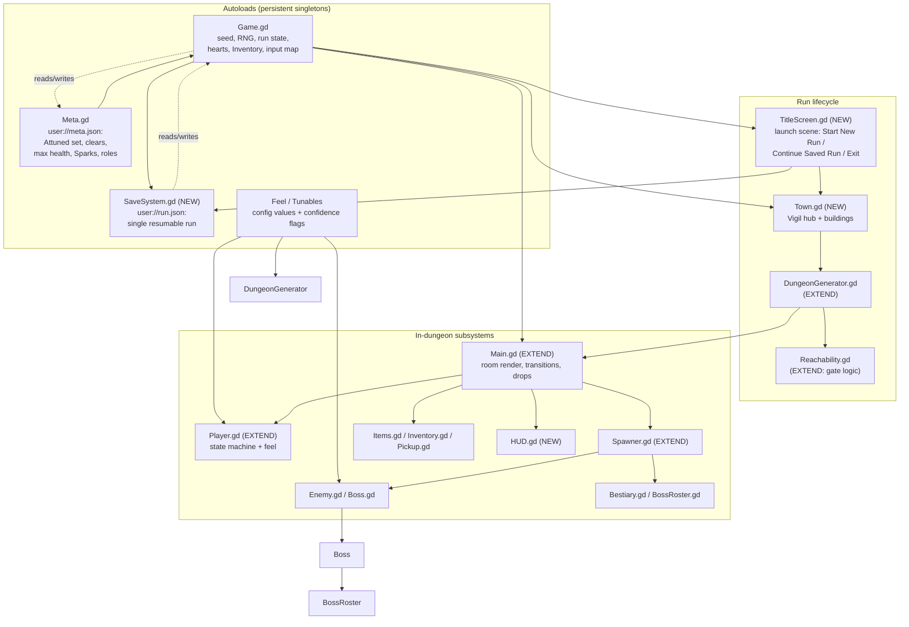
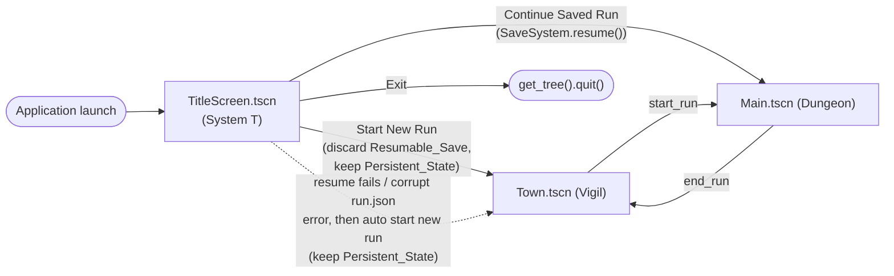
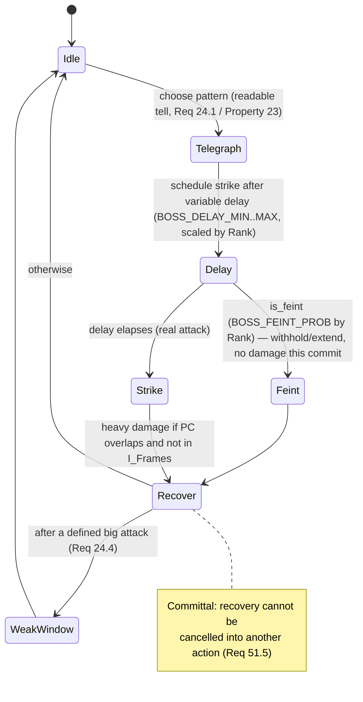
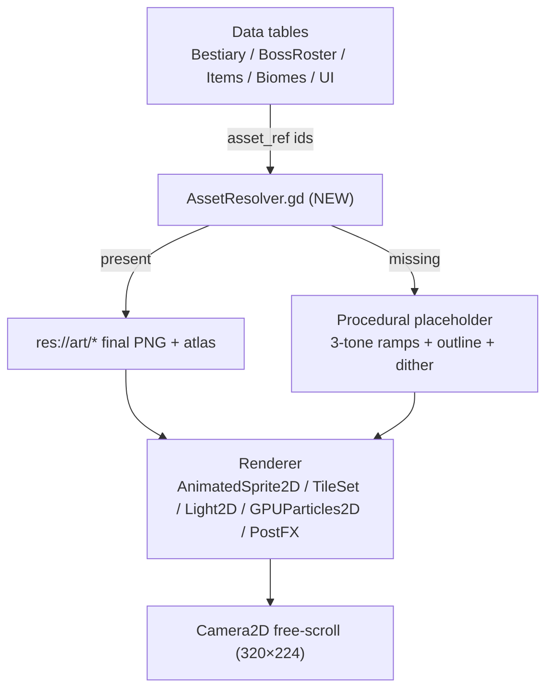
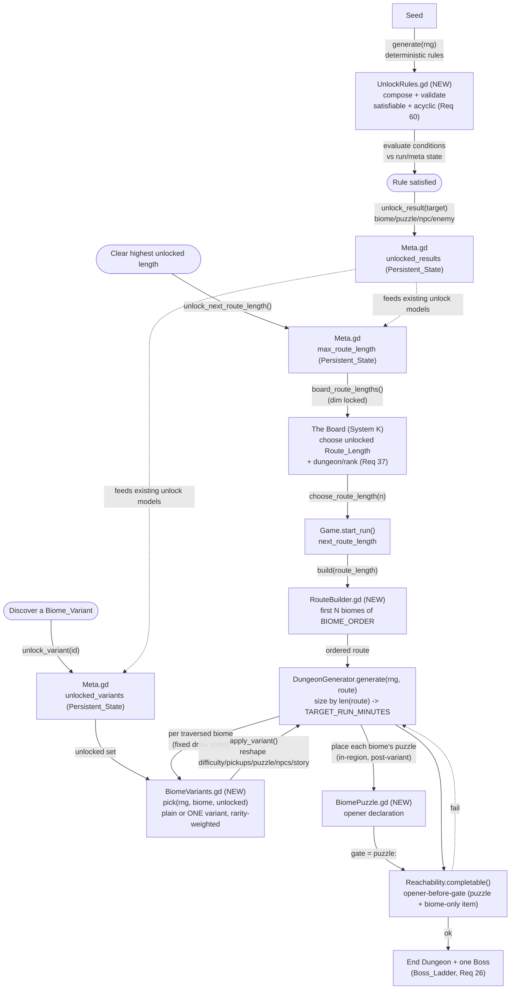

# Design Document

## Overview

This design describes a top-down, *A Link to the Past*-style action-adventure **roguelike** built in
**Godot 4 (GDScript)**. It realizes the requirements (Systems A–U) by extending an existing,
reviewed-but-unvalidated Godot 4 scaffold under `_incoming/godot/` rather than starting fresh. The
scaffold already proves out the hardest "feel" problems — a seeded run, a BFS reachability gate, a
player state machine with LTTP damage feel (knockback + i-frames + passive facing shield), a
data-driven bestiary of ~40 enemies across 7 biomes and 9 archetypes, a 100-boss ladder with a phase
machine, and the Attunement persistence loop. The design's job is to grow that slice into the full
game described by the requirements while keeping its conventions intact.

The game is framed around two places and one loop:

- **Vigil** — the last warm town, the persistent hub where every **Run** begins and ends. It holds
  the bar (*The Last Call*), the restaurant (*The Warm Machine*), *The Board*, *The Chapel*, the
  Forge, the Apothecary, and the Pawnbroker, and is populated mostly by **simulacra** whose reality
  is never confirmed.
- **Dungeon** — the one seeded, procedurally generated descent at the end of a **Route**. A Route is
  the ordered sequence of Biomes a single Run traverses — the first `Route_Length` biomes of the fixed
  ordered progression (Hollow Crypts → Silkfall Warrens → Thornwild → Emberdeep → Glacier Barrow →
  Sunken Ruins → The Arcanum) — and it ends in exactly **one** end Dungeon holding exactly one **Boss**
  drawn from the 100-rung ladder. A Route of N biomes is N biomes in sequence leading to one Dungeon,
  **not** one Dungeon per biome (System V, Requirement 55). Rooms built from `20×14`-tile grids are the
  generation/collision/reachability unit; the camera **free-scrolls** across stitched contiguous rooms
  (see System S), so there are no hard room-to-room screen snaps.

**Phased content / iteration-1 scope.** The full **Biome_Library** is kept in the project even though
only a subset is fully authored. For **iteration 1**, exactly **one** biome plus the first Dungeon is
fully built and tested as a playable, end-to-end **Route_Length 1** run; the remaining biomes exist as
defined structure (content stubs resolved to placeholders via `AssetResolver`) to be authored later,
without the generator changing (System V, Requirement 56.7). The Route system and the per-biome
`Biome_Content` schema are designed up front so later biomes are authored by adding data and resources,
not by editing the central generator. Beyond the **core seven** biomes of the fixed first-iteration
route, the `Biome_Library` also catalogues three further base biomes as stubs — **Graveyard, Noir City,
and Temple** (Req 56.9) — whose ruined/corrupted forms come via the Biome_Variant system (Req 58), not
as separate entries; these are authored later and do not change the first-iteration route order (System
H, System S).

Three pillars drive the whole architecture, and all three are already seeded in the scaffold:

1. **Attunement as progression** (`Meta.gd`, `Inventory.gd`, `Game.gd`). The player starts poor with
   only the bare sword swing. ATTACK/UTILITY items found in a dungeon work for that run; carried
   through a **Clear**, they Attune and become permanent (`user://meta.json`). Deviating from the
   source, **maximum-health upgrades also persist on a Clear**. Death loses the run's finds.
2. **Determinism from a single seeded RNG** (`Game.rng`). Layout, loot, and enemy placement are all
   drawn from one `RandomNumberGenerator`, so a Seed plus the Attuned_Set reproduces an entire
   dungeon and is shareable.
3. **Guaranteed completability** (`Reachability.gd`). The generator plans gates so each gate's opener
   is reachable before it, then runs a reachability check and re-rolls on failure — no impossible
   seeds.

Every feel number is a named **Tunable** carrying the reference's `exact` / `[approx]` / `[verify]`
confidence flag, held in `Feel.gd`-style data (Requirement 48), never a scattered constant.

Graphics is a first-class system (**System S — Graphics & Art Direction**), not an afterthought. The
look is **modern HD pixel art — "16-bit, but more advanced"**: a real 16×16 pixel grid, integer
positions, nearest-neighbour sampling, strong silhouettes and limited ramps (16-bit honesty), lit and
composited with modern 2D techniques (dynamic lighting, particles, shader water/fire, selective bloom,
parallax, animated tiles, optional CRT filter). The base pixel canvas is **320×224 (20×14 tiles)**
with integer scaling only, and the camera **free-scrolls** across the dungeon. All art is referenced
as **data** so hand-authored sheets swap in for procedural placeholders without touching gameplay
code. The art-direction reference is `_incoming/06-graphics.md`.

This is a documentation pass only; no implementation is included. GDScript signatures appear
throughout to pin down interfaces and to show how new systems bind to the existing scaffold.

## Architecture

### High-level architecture

The game is organized into autoload singletons that hold cross-scene state, and per-scene subsystems
(the player, rooms, enemies, bosses, items, town) that read from them. The seeded RNG lives in the
`Game` autoload and is threaded into every generation subsystem.



### Scene / node structure

The scaffold uses `CharacterBody2D` for the player, `Node2D` roots for rooms/containers, and plain
`RefCounted` classes for data and generation. Combat currently uses direct geometry tests
(`attack_box()` as a `Rect2`, distance checks) rather than physics bodies; this design keeps that for
movement/room collision but introduces `Area2D` hitbox/hurtbox nodes where the requirements call for
arc-based blocking, blast radii, and projectile overlap, so that collision reads cleanly in generated
rooms.

```mermaid
graph TD
    Root["Main (Node2D) — Main.gd"]
    Root --> Parallax["ParallaxBackground — NEW\nbiome parallax layers"]
    Root --> TileW["TileMapLayer(s) — NEW\nstitched room tilesets"]
    Root --> Enemies["Enemies (Node2D)"]
    Root --> ItemsN["Items (Node2D)"]
    Root --> PlayerN["Player (CharacterBody2D)"]
    Root --> VFX["VFX (Node2D) — NEW\nGPUParticles2D, shader water/fire"]
    Root --> Overlay["Overlay (Node2D) — NEW\nper-biome ambient overlay\n(fireflies/bugs/ash/...),\nabove tilemap+VFX, below HUD"]
    Root --> Lights["Lighting (Node2D) — NEW\nLight2D per biome + emissive"]
    Root --> Post["PostFX (CanvasLayer) — NEW\nselective bloom, optional CRT"]
    Root --> HUDN["HUD (CanvasLayer) — NEW"]
    Root --> MapN["MapView (CanvasLayer) — NEW"]

    PlayerN --> Sprite["AnimatedSprite2D (SpriteFrames) — NEW\nplaceholder Polygon2D until art swaps in"]
    PlayerN --> Hurtbox["Hurtbox (Area2D) — NEW"]
    PlayerN --> SwordHit["SwordHitbox (Area2D) — NEW"]
    PlayerN --> ShieldArc["ShieldArc (facing test) — NEW"]
    PlayerN --> Cam["Camera2D rig — NEW\nfree-scroll: smoothing + limits"]

    Enemies --> E1["Enemy (CharacterBody2D)"]
    E1 --> EBody["Body (Polygon2D)"]
    E1 --> EHurt["Hurtbox (Area2D) — NEW"]
    Enemies --> BossN["Boss (CharacterBody2D) extends Enemy"]

    ItemsN --> Pick["Pickup (Node2D/Area2D)"]

    TownRoot["Town (Node2D) — Town.gd NEW"]
    TownRoot --> Buildings["Bar / Restaurant / Board / Chapel /\nForge / Apothecary / Pawnbroker"]
    TownRoot --> NPCs["Simulacrum / HumanNPC nodes — NEW"]
```



The application **boots to `TitleScreen.tscn` first** (System T), then swaps between two in-game
top-level scenes the `Game` autoload manages: `Town.tscn` (Vigil) and `Main.tscn` (the active
Dungeon). `Game._boot()` shows the Title Screen at launch; from there **Start New Run** discards any
Resumable_Save and enters Vigil, **Continue Saved Run** calls `SaveSystem.resume()` back into the
Dungeon, and **Exit** quits. Once in-game, `Game.start_run()` enters the Dungeon and `Game.end_run()`
returns to Vigil, as before. The boot flow:



The base pixel canvas is **320×224 (20×14 tiles @ 16 px)** with integer scaling only (nearest,
`canvas_items` stretch, keep aspect, `integer` scale mode; target 1440p ×6 = 1920×1344, ×5 fallback).
A **`Camera2D` rig childed to the Player free-scrolls** across the dungeon with position smoothing and
limits; contiguous rooms are stitched into one continuous space, so the 320×224 canvas is the viewport
rather than a per-room screen lock (Requirement 46; see System S). This **supersedes the hard
room-to-room snap transition described by Requirement 27.3** — rooms remain the
generation/collision/reachability unit but are not individually screen-locked; the requirement should
be updated to reflect free-scroll.

### Node-type decisions

| Concern | Node type | Rationale |
|---|---|---|
| Player | `CharacterBody2D` | Already in scaffold; `move_and_slide` not used — custom per-axis slide against the Room tile grid stays for edge-alignment control (Req 3). |
| Player hurtbox / sword hit | `Area2D` (NEW) | Requirements 5, 8, 9, 16 need arc-blocking, blast radius, and projectile overlap; `Area2D` reads these cleanly vs. the current `Rect2.has_point` test. |
| Rooms | `RefCounted` data (`Room.gd`) rendered into stitched `TileMapLayer`s | Rooms are generated data, not persistent nodes; contiguous rooms are stitched into one continuous world so the camera free-scrolls between them (System S). Generation/collision/reachability still operate per-room. |
| Camera | `Camera2D` rig (NEW), child of Player | Free-scroll with position smoothing + limits clamped to the stitched active bounds; replaces per-room screen locking (System S, supersedes Req 27.3). |
| Enemies / Boss | `CharacterBody2D` (`Enemy.gd`, `Boss.gd`) | Archetype AI + contact-damage contract already implemented. |
| Projectiles | `Projectile` (RefCounted + draw) in scaffold | Keep; extend with `Area2D` overlap for shield/blast interactions. |
| Town, NPCs | `Node2D` scenes (NEW) | Vigil is an interactive hub scene, not generated data. |
| HUD / Map / menus | `CanvasLayer` (NEW) | Pause-the-world menus (Req 47) and screen-space HUD (Req 46). |

### Determinism and ordering (critical architectural rule)

Because determinism (Req 31) and reachability (Req 30) are the two prime correctness properties, the
architecture fixes a **single, ordered draw sequence** from `Game.rng`:

0. Route: build the ordered Biome Route of the chosen `Route_Length` — the first `Route_Length`
   biomes of the fixed progression (`RouteBuilder.build`, NEW; System V) — before any layout draw.
0.5. Variants: for each traversed biome **in route order**, draw its plain-or-single Biome_Variant from
   `Game.rng` via `BiomeVariants.pick(rng, biome, unlocked_variants)` (NEW; System V), drawing only
   from the persistent unlocked set — before layout, so the variant's reshaped difficulty/pickups/
   puzzle feed the steps below.
1. Layout: room cells scattered and connected (`DungeonGenerator.generate`), sized by the Route.
2. Route/depth: biome assigned per room by depth along the built Route (`Bestiary.biome_for_depth`).
2.5. Object assembly: for each room interior/structure slot, the generator **decides** a Semantic_Object
   (house, bridge, shrine, river, landmark, settlement) for the location, then **assembles** it from the
   data-driven `Tile_Library` scoped to that object type — placing a pre-authored `Prefab_Chunk` or
   per-slot tiles via seeded `Assembly_Rules` (`ObjectAssembler.assemble`, NEW; System H). This runs
   after layout+terrain and biome assignment but **before** the gate plan and enemies, so an assembled
   object's footprint is known to the gate planner and the reachability check (System F / System I).
3. Gate plan + opener placement (NEW gate planner in the generator), **including each traversed
   biome's `Biome_Puzzle` as a puzzle-gate whose opener is placed before it** (System V / System I).
4. Loot: pedestal pool shuffled and placed, filtered against the Attuned_Set (incl. biome-only Items).
5. Enemies: per-room spawns (`Spawner.spawn_room`).

No subsystem may draw from `Game.rng` out of this order, and no subsystem may use `randi()` /
`randf()` globally. Any sub-stream (e.g. a boss's internal `rng`) is seeded from `Game.rng.randi()`
so the whole tree remains a pure function of `(seed, Attuned_Set, Route_Length)` — the chosen
`Route_Length` is folded into the deterministic generation inputs (System J, System V, Property 1).
**Object assembly (step 2.5) draws from the same single `Game.rng` in this fixed order**: the
Semantic_Object decision, the prefab-chunk-vs-per-tile choice, every per-slot interchangeable-tile
pick, and every seeded Assembly_Rule size/shape/layout draw happen in a fixed sub-order per room, so
assembled structures are part of the deterministic result and never a separate RNG source (System H,
Property 1).
The **per-biome variant assignment** (step 0.5) is likewise a pure function of these inputs: the
persistent **unlocked-variant set** parameterizes determinism the same way the Attuned_Set does, so
the same `(seed, Attuned_Set, Route_Length)` under the same unlocked set yields the same variant
assignment (System V, Req 58.5; Property 1).

## Keep / Extend / Replace: scaffold mapping

The scaffold's "What is stubbed / next" list in `_incoming/godot/README.md` is the starting backlog.
This table maps every scaffold script and names the new ones.

| Script / scene | Disposition | Work needed |
|---|---|---|
| `Game.gd` (autoload) | **KEEP + EXTEND** | Add Sparks balance + banking, `has_pegasus_boots`/dash gating, equipped-item binding, resumable-save hooks, return-to-town instead of auto-`_new_run`; **boot to the Title Screen at launch (`_boot()`) and expose `start_new_run()` / `continue_saved_run()` / `quit_game()` helpers** (System T). |
| `Meta.gd` | **KEEP + EXTEND** | Persist max-health count, banked Sparks, recruited NPC roles alongside `attuned`/`clears`; **add `max_route_length` (highest unlocked Route_Length, Persistent_State, default 1) with `unlock_next_route_length()` on clearing the highest unlocked length (System V, Req 55.4, 55.5)**; **add `unlocked_variants` (Array of unlocked Biome_Variant ids, Persistent_State, default `[]`) with an `unlock_variant(id)` / `unlocked_variants()` hook for variant discovery (System V, Req 58.7, 58.8)**; **add `unlocked_results` (the set of things a generated `Unlock_Rule` has unlocked — biomes/puzzles/NPCs/enemies — Persistent_State, default `{}`) with an `unlock_result(target)` / `is_unlocked(target)` hook, written by `UnlockRules` when a rule's conditions are met (System V, Req 60); the RULES themselves are regenerated from seed, only the RESULTS persist**; keep JSON format + migration. |
| `Feel.gd` | **KEEP + EXTEND** | Add the missing Tunables (dodge-dash, hold-threshold, dash/run speed usage, mail factors, bomb radius, Weak_Window, boss formulas, authentic-diagonal default = authentic-fast, target run duration) with confidence flags. |
| `Player.gd` | **KEEP + EXTEND** | Implement `_interact()` context verbs; add dodge-dash/run states; add `Area2D` hurtbox/sword hitbox; per-type i-frames; mail reduction; sword-tier multipliers; spin facing-lock; **`take_damage`/`_mail_reduction()` compose worn-gear defense + Armor_Type (`Inventory.gear_defense()`) with the mail/tunic reduction via the data-driven `GEAR_MAIL_STACKING` rule (System C / System E, Req 10, 63.8)**. |
| `Room.gd` | **KEEP + EXTEND** | Add real interior layout (not just a wall border), gate tiles, hazard tiles, door-type (locked/key) metadata; **call `ObjectAssembler` during room-interior/structure generation so Semantic_Objects (houses/bridges/shrines/rivers/landmarks/settlements) are assembled from the `Tile_Library` into the 20×14 grid, folded into the fixed draw order (step 2.5) (System H, Req 59)**; **carry a `base_level` (int) anchoring Tier rolls for content generated in this area/Room (System E, Req 61.1)**. |
| `DungeonGenerator.gd` | **EXTEND** | Consume the ordered Route from `RouteBuilder`; size rooms by `Route_Length` (biome count); gate planning + opener-before-gate placement **including each traversed biome's Biome_Puzzle as a puzzle-gate and required biome-only Items on reachable pre-gate paths (System V, Req 56.3, 57)**; **per traversed biome call `BiomeVariants.pick()` (step 0.5) then `apply_variant()` to reshape that instance's difficulty/pickups/puzzle/NPCs/story before layout, declaring the variant's puzzle/required-items to the gate planner so reachability runs post-variant (System V, Req 58.4, 58.11)**; **invoke `ObjectAssembler` at step 2.5 to decide + assemble Semantic_Objects from the `Tile_Library` after layout/terrain and before the gate plan, so assembled footprints are declared to the gate planner and run through the same reachability check + re-roll (System H, Req 59)**; depth-scaled composition; re-roll loop on reachability failure. |
| `Reachability.gd` | **KEEP + EXTEND** | `completable()` already models item gates; wire it into generation as the pre-play gate and the re-roll trigger; **extend `GATE_ITEMS` with a `puzzle:<id>` gate kind so a Biome_Puzzle's opener is checked opener-before-gate like any item gate (System I, System V, Req 57)**. **No variant-specific change: the same check runs on the post-variant Route, so it already enforces validity after `apply_variant` reshapes an instance's puzzle/pickups (System V, Req 58.11).** |
| `Bestiary.gd` / Biome data | **KEEP + EXTEND** | Data already covers 9 archetypes, 7 biomes, hazards-by-tag; add hazard-tile effects + telegraph data if missing; **extend each Biome with data-driven `Biome_Content` — `npcs`, `secrets`, `biome_only_items`, `puzzle` — with content-stub/placeholder fallback for unauthored biomes so the generator still runs (System V, Req 56)**; **a generated Biome instance also carries a runtime-only `variant` field (plain `""` or one unlocked Biome_Variant id) reshaped by `BiomeVariants.apply_variant` — the authored biome definition is unchanged (System V, Req 58)**. |
| `Enemy.gd` | **KEEP + EXTEND** | Telegraph-first on every harmful action; weakness-by-tag resolution; honor spawn-rule context from Spawner; **on `died`, roll `DropTable` for Death_Drops (Req 52)**. |
| `Boss.gd` | **KEEP + EXTEND** | 7 patterns + phase machine + weak window already present; bind Weak_Window/double-damage to Tunables; **add per-attack variable strike delay + feint flag + heavy damage + committal recovery for Souls difficulty (Req 51), params from Feel/Tunables scaled by Rank**. |
| `BossRoster.gd` | **KEEP** | 100-rung ladder + HP/speed/phase formulas present; expose formulas as Tunables (Req 26.5). |
| `Spawner.gd` | **KEEP + EXTEND** | Add room-shape-aware weighting (SWARM/CHASE wide, TURRET/LOBBER cover, CHARGER corridor); keep elite leak + one-summoner + no-summoner-first-room rules; **pass enemy rarity/depth context into the death-drop roll (Req 52)**; **attach a `TierScale.roll_tier(rng, room.base_level)` Tier to each spawned enemy, anchored to the Room's `Base_Level` (System E, Req 61.5)**. |
| `Items.gd` | **KEEP + EXTEND** | Catalogue is data-driven; add `biome`/`tier`/`desc` coverage and depth-weighting metadata for pedestals; **attach a `TierScale.roll_tier(rng, base_level)` Tier to generated items anchored to the area `Base_Level` (System E, Req 61.5)**; **flag `cursed` (derived `tier < 0`) and carry a data-driven `curse_penalty`; expose the deferred `uncurse(item)` hook (cost/location TBD/[verify]) (System E, Req 62)**; **add a `slot` field (helmet/body/shoes/none) and `armor_type` where relevant for worn gear (System E, Req 63)**. |
| `Inventory.gd` | **KEEP + EXTEND** | Add single Equipped_Item binding; CONSUMABLE/ammo/magic resource tracking; **add `bullets` ammo type and a `notes` collection alongside arrows/bomb ammo and keys (Req 52)**; **apply/remove a held-or-equipped Cursed_Item's `curse_penalty` and expose the deferred `uncurse()` hook (System E, Req 62)**; **add the three Worn_Gear slots (Helmet/Body/Shoes) + `armor_type` (Tactical/Armor), `equip_gear`/`unequip_gear`/`set_armor_type` with slot-type matching, and `gear_defense()`/`gear_modifiers()` — all Run-Scoped, PASSIVE-like, never Attuned (System E, Req 63)**. |
| `Pickup.gd` | **KEEP + EXTEND** | Walk-into pickup; reuse for pedestal + boss drop + claim-to-clear; **route Death_Drops to their pool (ammo/bullets/keys/health/Notes/weapon/EXP/chevron/sparks) and play pickup VFX (Req 52.6, 52.7)**. |
| `Projectile.gd` | **KEEP + EXTEND** | Straight/lob/laser/spread present; add shield-block and blast-radius interactions. |
| `Main.gd` | **EXTEND** | Replace auto-`_new_run` clear loop with return-to-Vigil; add HUD/Map; claim-to-clear already modeled; **extend `_on_enemy_died`/`_reward_item` to roll `DropTable` and spawn Death_Drops for every enemy (Req 52)**. |
| **`TitleScreen.gd`** + `TitleScreen.tscn` | **NEW** | Launch scene (System T): title/logo + three-entry menu (Start New Run / Continue Saved Run / Exit); enables/dims Continue from `SaveSystem.has_resumable()`; a `CanvasLayer`/`Control` rendered at the 320×224 integer-scaled canvas with art per System S. |
| **`Town.gd`** (incl. The Board) | **NEW** | Vigil hub scene, buildings, return-to-town flow, per-visit purchase reset; **The Board EXTEND: route-length selection — show lengths 1..`MAX_ROUTE_LENGTH`, dim locked ones (affordability-dimming), set the next Run's `Route_Length` composed with the Req 37 dungeon/rank choice (System K, System V, Req 55.6, 55.7)**. |
| **`Buff.gd`** | **NEW** | Timed/run-scoped buff (`stat`, `amount`, `duration_rooms` or `run_long`); never attuned. |
| **`TownStock.gd`** | **NEW** | Data tables for drinks + meals, mirroring `Items.gd`'s style; price scaling. |
| **`Rumors.gd`** | **NEW** | Reads the already-generated next dungeon; emits a truthful, partial hint. |
| **`Wallet.gd`** | **NEW** (or fold into `Game.gd`) | Sparks balance, banking on clear, affordability checks. |
| **`DropTable.gd`** | **NEW** | Data-driven rarity-weighted enemy Death_Drop table keyed by Enemy rarity + Room Depth; `roll(rng, rarity, depth)` returns 0..N drop descriptors drawn in fixed order from `Game.rng` (Req 52). **EXTEND to attach a `TierScale.roll_tier(rng, base_level)` Tier to each generated drop/item, anchored to the area `Base_Level` (System E, Req 61.5); a drop whose Tier is negative is Cursed (Req 62)**. |
| **`TierScale.gd`** | **NEW** | Reusable level-anchored Tier roll (System E, Req 61): data-driven rarity-by-distance ladder/curve; `roll_tier(rng, base_level) -> int` returns a Tier in `[base−5, base+5]` rarity-weighted by distance from `Base_Level` (near-base common, extremes rarest), drawn only from `Game.rng` in the fixed draw order (Property 1). Shared helper called by `DropTable`/`Items`/`Spawner`/pedestal-boss loot; defensive clamp back into the window. |
| **`Chevrons.gd`** | **NEW** (or fold into the economy) | Per-color Chevron balances for the 8 colors; persistence split (shiny light purple / rainbow / black persist via `Meta`; gold / silver / blue / brown / pink run-scoped via `SaveSystem`); spend hooks for trade / chevron-doors / environment (Req 53, 54). |
| **`SaveSystem.gd`** | **NEW** | Single resumable in-progress run (`user://run.json`); discard on new game / run end; **record the Run's chosen `route_length` and ordered `route` so resume reproduces the same Route (System O, System V, Req 55)**; **persist the Run-Scoped worn gear (helmet/body/shoes slots + `armor_type`) in `run.json` so a resumed run restores equipped gear — NOT in `meta.json` (worn gear is run-scoped, never persistent; System E / System O, Req 63.9)**. |
| **`RouteBuilder.gd`** | **NEW** | Build the ordered Biome Route of the chosen length — the first `Route_Length` biomes of `Bestiary.BIOME_ORDER` — and feed it to `DungeonGenerator`; clamp to `[1, min(MAX_ROUTE_LENGTH, Biome_Library size)]` (System V, Req 55). **Per traversed biome, invoke `BiomeVariants.pick()` / `apply_variant()` as the variant-assignment step folded into the biome-region build (System V, Req 58).** |
| **`BiomeVariants.gd`** | **NEW** | Data-driven, OPEN set of Biome_Variant modifier descriptors (`VARIANTS` keyed by variant id: difficulty mult, pickup overrides, puzzle override/ref, NPC override/set, story/flavor ref, art/overlay ref, rarity weight); `pick(rng, biome_id, unlocked)` returns a variant id or `""` (plain), deterministic + rarity-weighted drawn only from the unlocked set; `apply_variant(biome_inst, id)` overlays the descriptor onto a copy of that instance's `Biome_Content` and declares puzzle/required-items to the gate planner (System V, Req 58). |
| **`BiomePuzzle.gd`** | **NEW** | Biome puzzle placement within each traversed biome's region + opener declaration; emits a `puzzle:<id>` gate entry for the generator so `Reachability` enforces opener-before-gate solvability (System V, System I, Req 57). |
| **`TileLibrary.gd`** | **NEW** | Data-driven, per-Semantic_Object-type tile sets **and** `Prefab_Chunk` sets, keyed by object type (house/bridge/shrine/river/landmark/settlement): each type maps slots → large interchangeable tile libraries, plus prefab-chunk descriptors for complex structures and seeded `Assembly_Rules` size/shape/layout ranges. Tiles/prefabs are **art assets resolved as data** via `AssetResolver` with placeholder fallback (System S); consistent with the per-tile Room grid + `TileMapLayer` autotiling. The whole library is a Tunable (Req 48, 59). |
| **`ObjectAssembler.gd`** | **NEW** | **Decides** a Semantic_Object for a location, then **assembles** it from the `TileLibrary` scoped to that type — placing a `Prefab_Chunk` for complex structures or per-slot interchangeable tiles for terrain/paths/filler via seeded `Assembly_Rules` that vary size/shape/layout. All decision + selection + assembly draws come from the single `Game.rng` in the fixed draw order (step 2.5, Property 1). Called by `Room.gd`/`DungeonGenerator.gd`; declares assembled footprints to the gate planner so placement runs through the same reachability check + re-roll and never blocks a required path (System H, System I, Req 30, 57, 59). |
| **`UnlockRules.gd`** | **NEW** | Generates `Unlock_Rule`s **deterministically from the Seed** — composing unlock CONDITIONS for biomes/puzzles/NPCs/enemies from a data-driven, open condition-type catalogue (defeat boss, solve puzzle, find item in biome, collect N chevrons/sparks, clear route length L, discover secret, recruit NPC). Validates each rule for **satisfiability + acyclicity** (no soft-lock / circular dependency) with a generate/repair/re-roll loop mirroring `Reachability`'s validity approach (System I / Req 30). Evaluates a rule's condition tree against run/meta state and, when satisfied, writes the unlocked result to `Meta.unlocked_results`. Ties into existing discovery/unlock systems: biome discovery, Biome_Variants (Req 58), and Route_Length (Req 55) — the RULES are regenerated from seed like the Route, the RESULTS persist in `meta.json` (System V, System M, Req 60). POC/first iteration keeps generated rules minimal (Req 56.7–56.8, 58.10). |
| **`HUD.gd`** + `HUD.tscn` | **NEW** | Hearts (evolving icon), equipped item, seed, depth, boss HP bar. |
| **`InventoryScreen.gd`** + `InventoryScreen.tscn` | **NEW** | Paused inventory sub-screen (System P, Req 2/47/63): a `CanvasLayer`/`Control` at the 320×224 integer-scaled canvas (System S) that pauses the world like other menus; shows the three Worn_Gear slots (Helmet/Body/Shoes) + Armor_Type with each item's Tier/modifiers, consumables/potions with modifier+heal values, ammo (arrows/bombs/bullets), and the single active Equipped_Item (Y) shown separately; equip/unequip routes through `Inventory.equip_gear`/`set_armor_type` with slot-type matching (Req 63.1, 63.10–63.15). |
| **`MapView.gd`** + scene | **NEW** | Door-graph map; pauses the world. |
| **`HealthContainer.gd`** | **NEW** | Max/current in containers, evolving leaf→star→rainbow icon by progression. |
| **`NpcDensity.gd`** | **NEW** | Simulacra/Human density gradient peaking at Vigil, thinning with distance. |
| **`Simulacrum.gd` / `HumanNPC.gd`** | **NEW** | Mechanical glitch vs. emotional glitch; recruiting a human to a town role. |
| **`RuinedVigil.gd`** | **NEW** | Mirror-dungeon variant reusing the Crypts undead roster, reskinned. |
| **`DodgeDash` (Player sub-state)** | **NEW** | Tap-dodge / hold-run gated on Pegasus Boots; i-frames; contact damage/break. |
| **`AssetResolver.gd`** | **NEW** | Data-driven art swap-in (System S): resolves sprite/tileset/palette/icon ids to real `res://art/...` resources or procedural placeholders; graceful fallback on missing art. **Also resolves a Biome_Variant's optional `overlay_ref` / palette swap (System V, Req 58) — e.g. a corrupted/rainbow visual treatment — reusing the System S overlay/palette path with the same no-overlay/placeholder fallback (Property 36).** |
| **`BiomeOverlay.gd`** | **NEW** | Data-driven ambient environmental overlay layer (System S): selects the active biome's signature overlay (fireflies in Thornwild, swarming bugs in Sunken Ruins, drifting ash in the Ruined City / Ruined_Vigil, etc.), resolved via `AssetResolver` from the Biome `overlay_ref`; drives `GPUParticles2D`/`CPUParticles2D` and/or a scrolling shader layer tinted to the biome palette; graceful no-overlay fallback when none is defined or `OVERLAYS_ENABLED` is off. |
| **Camera2D rig (Player child)** | **NEW** | Free-scroll camera (System S): position smoothing + look-ahead + limits clamped to the stitched active bounds; replaces per-room screen lock. |
| **Procedural placeholder generator** | **EXTEND** | Upgrade scaffold's flat `Polygon2D` placeholders to pixel-arty 3-tone ramps + outlines + dithered gradients + one signature prop per biome (System S), behind `AssetResolver`. |

## Components and Interfaces

### System A — Input & Control

**Responsibilities.** Own the fixed six-input map and resolve attack/context/item/map/pause. The
scaffold already builds the six actions at runtime in `Game._setup_input_map()`
(`move_*`, `attack`, `interact`, `item`, `map`, `inventory`, plus a debug `F1`). No seventh
player-facing combat/interaction input is added (Req 1.9).

**Key interfaces** (extensions in bold):
```gdscript
# Game.gd — unchanged action set; add helpers
func _setup_input_map() -> void              # existing: six actions + debug
func equipped_item() -> String               # NEW: id bound to the Item (Y) button, or ""
func set_equipped(id: String) -> bool        # NEW: single-equip rule (Req 2)
func has_pegasus_boots() -> bool             # NEW: gates dodge/run (Req 12)
```
Tap-vs-hold on the Context_Action (A) is resolved in `Player` using the `HOLD_THRESHOLD` Tunable
(§System D). Map (X) and Inventory/Start pause the world (Req 47) by setting
`get_tree().paused = true` on the relevant `CanvasLayer`.

### System B — Movement

**Responsibilities.** 8-directional continuous movement, per-axis wall slide, 4-cardinal facing,
edge alignment at doorways, and the authentic fast-diagonal quirk — all driven by Tunables.

The scaffold's `Player._walk()`, `_input_dir()`, `_snap_facing()`, and `_move()` already implement
continuous movement, per-axis slide against `Room.is_world_walkable`, and cardinal facing from the
dominant axis. Two deltas:

- **Authentic fast diagonals (Req 4).** `Feel.DIAGONAL_IS_FASTER` exists but currently defaults to
  `false`. The requirement makes **authentic-fast the default**, so the Tunable default flips to
  `true`; when `true`, each axis advances at full `WALK_SPEED` (≈1.41× diagonal), when `false`
  (`normalized`) the vector is normalized.
- **Edge alignment (Req 3.3).** Add a nudge in `_move()` when the character pushes a wall adjacent to
  a one-tile doorway, snapping toward the door cell (`Room.door_cell(dir)`), so doorways enter
  cleanly.

Collision bounds smaller than the sprite (Req 3.2) is a config on the player's collision shape; walk
and dash speeds come from `Feel.WALK_SPEED` / `Feel.DASH_SPEED` (Req 3.5).

### System C — Combat

**Responsibilities.** Melee sword with reach + tier multipliers, charged spin, sword beams at full
health, contact damage with knockback + i-frames, passive facing shield, and mail reduction.

The scaffold implements the spine: `Player` state machine (`IDLE/WALK/CHARGE/ATTACK/SPIN/HURT`),
`attack_box()` footprint (enlarged for `SPIN`), `_maybe_fire_beam()` (Master Sword + full health),
`take_damage()` (i-frames + knockback + hit-stun via `_is_blocked()` facing dot), and the enemy side
(`Enemy._take_hit`, `_contact_damage`). Deltas:

```gdscript
# Player.gd additions
func attack_box() -> Rect2                    # existing; move to Area2D SwordHitbox
func attack_damage() -> int                   # EXTEND: × current sword tier (Req 5.2)
func _is_blocked(from_pos) -> bool            # existing facing-arc block; extend for beam/laser tiers (Req 9.2)
func take_damage(hp, from_pos, type := "")    # EXTEND: per-type i-frames + mail reduction + worn-gear defense (Req 8.4, 10, 63.8)
func _mail_reduction() -> float               # EXTEND: mail 0% / 50% / 75% composed with Inventory.gear_defense() (Req 10, 63.8)
```
- **Sword tiers (Req 5.2).** `attack_damage()` multiplies base swing by the tier of the held sword
  passive (`sword`/`tempered_sword`/`golden_sword` ×1/×2/×3/×4 Tunable).
- **Spin facing lock (Req 6.2).** The `SPIN` state locks `facing` for `Feel.SPIN_DURATION`.
- **Per-type i-frames (Req 8.4).** `take_damage()` takes a `type` and consults a small per-type
  i-frame map; sources flagged to ignore i-frames bypass the guard (the scaffold's `apply_freeze`
  already models a control effect that ignores i-frames).
- **Mail reduction + worn-gear defense (Req 10, 63.8).** Damage_Units are reduced before applying by
  the equipped mail factor **composed with** the worn-gear defense (`Inventory.gear_defense()`, System
  E) and the chosen Armor_Type emphasis. The composition is a **data-driven stacking rule**
  (`GEAR_MAIL_STACKING` Tunable, Req 48) — e.g. multiplicative composition of the two reduction factors
  — so gear defense and mail stack rather than one overriding the other. `_mail_reduction()` therefore
  returns the combined reduction factor, keeping System C the single damage-reduction authority.

### System D — Interaction

**Responsibilities.** The single Context_Action (A) resolves exactly one verb from the faced
tile/entity and capabilities: lift/throw, pull/push, talk/read, open chest, swim, dash/run.

The scaffold's `Player._interact()` is an explicit stub. This design makes it a dispatcher:
```gdscript
func _interact() -> void                      # EXTEND: resolve one verb by facing + capability
func _context_verb() -> String                # NEW: inspect faced tile/entity -> verb
func _carry_or_throw() -> void                # NEW: lift/throw lifecycle (Req 11.3)
```
Talk/read lock movement for the text's duration (Req 11.2); chest open suspends play for the item-get
(Req 11.4); push moves a block one tile per push, pull on away-press while adjacent (Req 11.5); deep
water + Flippers enters swim (Req 11.6).

**Dodge-dash / run (Req 12).** Gated on `Game.has_pegasus_boots()`. A new sub-state machine inside
`Player`:
```gdscript
# Tap A, released before HOLD_THRESHOLD -> DODGE: short fast burst in move/facing dir,
#   grants dodge i-frames (DODGE_IFRAME_TIME), damages/breaks on contact.
# Hold A past HOLD_THRESHOLD -> RUN: sustained dash at DASH_SPEED in facing dir,
#   cannot turn; any new direction ends the run; contact damages/breaks.
enum Dash { NONE, DODGE, RUN }
func _resolve_dash(pressed_time: float) -> void   # NEW
```
When the player lacks Pegasus Boots, A performs neither dodge nor run and falls through to the other
context verbs (Req 12.7).

### System E — Items & Attunement

**Responsibilities.** Classify every item (ATTACK/UTILITY/PASSIVE/CONSUMABLE); read a data-driven
catalogue; enable found verbs for the run; gate verbs behind items; items double as gate keys;
pedestals + boss loot as sources; Attune ATTACK/UTILITY on Clear; max-health is the persisting
exception.

The scaffold's `Items.gd` already keys items by id with `name`/`kind`/`verb`/`mp`/`gate`/`tier`/
`attune`, exposes `pedestal_pool()` (ATTACK+UTILITY only), and classifies via `Kind`. `Inventory.gd`
holds two layers (`attuned` permanent, `run_items` per-run), `has()` over both, `attunable_now()` for
the clear reward, and `has_verb()` for verb gating. `Game.acquire()` bumps hearts on
`heart_container` and emits `item_acquired`. `Meta.attune()` persists.

Deltas:
```gdscript
# Inventory.gd additions
var equipped: String                          # NEW: single Equipped_Item (Req 2)
func consume(id, n := 1) -> bool              # NEW: ammo/consumable spend (Req 14.3)
func can_use(id) -> bool                      # NEW: magic/ammo sufficiency check (Req 14.3)
# Items.gd additions
# add "biome", "tier", "desc", and depth-weight metadata to pedestal entries (Req 13.2, 17.1)
```
- **Attunement on Clear (Req 18).** `Game.complete_run()` already calls `inventory.attunable_now()`
  then `Meta.attune()` and `Meta.record_clear()`. PASSIVE/CONSUMABLE excluded by `can_attune`.
- **Max-health exception (Req 42).** `heart_container` is a PASSIVE but its container count persists
  via `Meta` (see System M), overriding the general passive-reset rule.
- **Insufficient resource (Req 14.3).** `Game` checks `Inventory.can_use()` before activating a
  verb; if insufficient, no action and the resource is unchanged.

#### Level-anchored Tier scaling (`TierScale.gd`, NEW — Req 61)

Most seeded random content — Death_Drops (System F / Req 52), pedestal and boss loot (Req 17), enemies,
and pickups — carries a **Tier** that scales its power to the area it was generated in. Tier scaling is
a **reusable, data-driven mechanic** owned by a new small `TierScale.gd` so the drop/loot/spawn
generators share one ladder rather than each inventing its own.

- **Base_Level per area (Req 61.1).** Every generated area — a level, a Dungeon region, or a Biome
  instance / Room — carries a `Base_Level`, an integer anchoring that area's expected Tier (added to
  the Room/Biome model in Data Models). `Base_Level` is itself derived deterministically from Depth and
  the Route (so deeper areas anchor higher), threaded in during generation.
- **Window and rarity curve (Req 61.2, 61.3, 61.4).** When a generator rolls a Tier for content in an
  area, it draws from the window **`[Base_Level − 5, Base_Level + 5]`** — up to 5 above and 5 below —
  weighting each candidate so probability **decreases with distance from `Base_Level`**: Tiers at or
  near the base are the most common and the extremes (`Base_Level ± 5`) the rarest. The per-distance
  weighting is a **data-driven ladder/rarity curve Tunable** (`TIER_RARITY_CURVE`, Req 48), not a
  hardcoded distribution.
- **Shared helper (Req 61.5).** `TierScale.roll_tier(rng, base_level)` is the single entry point the
  `DropTable`, pedestal/boss-loot, enemy, and pickup generators call to attach a Tier. An item/enemy's
  stats then scale by its resulting Tier through its own data-driven tier modifiers (consistent with the
  existing `tier` field on items / sword-mail tiers).
- **Determinism (Req 61.6, Property 1).** Every Tier roll is drawn from the **single seeded
  `Game.rng`** inside the fixed draw order (Architecture → Determinism and ordering): a Tier roll
  happens at the point its content is generated (loot during step 4, enemies during step 5, Death_Drops
  during the per-enemy defeat roll), in a fixed sub-order, never from a global `randi()`/`randf()`. The
  Tier window and rarity curve are therefore **folded into the deterministic result** — same
  `(seed, Attuned_Set, Route_Length, unlocked_variants)` ⇒ same Tiers (Property 1, extended; Property 46
  below pins the window/rarity law itself).

```gdscript
# TierScale.gd (NEW) — reusable level-anchored Tier roll; data-driven rarity-by-distance ladder
func roll_tier(rng: RandomNumberGenerator, base_level: int) -> int
#   -> an int Tier in [base_level - TIER_WINDOW, base_level + TIER_WINDOW] (TIER_WINDOW = 5, Tunable),
#      rarity-weighted by |Tier - base_level| via TIER_RARITY_CURVE (Tunable, Req 48): near-base common,
#      extremes rarest. Drawn ONLY from `rng` (Game.rng) in the fixed draw order (Property 1, Req 61.6).
#   Defensive clamp: a result outside the window is clamped back into it (should never occur).
```

`DropTable.gd` / `Items.gd` / `Spawner.gd` **EXTEND** to call `TierScale.roll_tier(rng, area.base_level)`
and attach the rolled Tier to each generated item/drop/enemy instance (the `tier` field in the Data
Models), anchored to that area/Room's `Base_Level`.

#### Cursed items (Req 62)

A generated Item (or any Tiered drop/gear) is **Cursed** when its **resulting absolute Tier is negative
(`tier < 0`)**, regardless of the area's `Base_Level` (Req 62.1). Because the Tier window is
`[Base_Level − 5, Base_Level + 5]`, a **low-enough-`Base_Level`** area's window dips below 0, so that
band of the same rarity curve *is* the cursed band — negative Tiers are rare and special, falling on the
far-from-base tail of `TIER_RARITY_CURVE` (Req 62.2, 62.3). Cursed status is thus a **deterministic
function of the seeded Tier roll** (Req 62.7): the same seed reproduces the same cursed outcomes
(Property 47 below).

- **Curse penalty while held/equipped (Req 62.4).** While a Cursed_Item is held or equipped, the Game
  applies that item's **data-driven `curse_penalty`** (a stat/behavior malus) to the Player_Character;
  the specific penalty is per-item data, not hardcoded. `Items.gd`/`Inventory.gd` **EXTEND** to flag an
  item `cursed` (derived: `tier < 0`) and to apply/remove its `curse_penalty` as it is held/equipped and
  dropped/unequipped.
- **Uncurse is deferred (Req 62.5, 62.6).** Uncursing exists at a **great tradeoff** to the
  Player_Character, but the **exact cost and location/method are a deferred decision (TBD / `[verify]`)**
  — not pinned here. The design models it only as a **deferred hook** `Inventory.uncurse(item)` whose
  cost/location are left `[verify]`; a candidate home is a Vigil shrine (e.g. *The Chapel* / a Vigil's
  Chapel shrine), noted but **not** committed. Calling the hook while the cost is undefined is a
  deferred no-op (Error Handling), never a crash.

```gdscript
# Items.gd / Inventory.gd additions (Req 62)
func is_cursed(item) -> bool                   # NEW: derived == (item.tier < 0); no separate stored flag needed
func curse_penalty(item) -> Dictionary         # NEW: data-driven penalty descriptor applied while held/equipped
func uncurse(item) -> bool                     # NEW: DEFERRED hook — cost/location TBD/[verify] (Req 62.6);
                                               #      no-op while undefined (returns false), never crashes
```

Cursed items stay consistent with the item taxonomy (Req 13) — curse is an orthogonal flag on an
otherwise ordinary item — and with determinism (Req 31): because the Tier roll is deterministic, so is
every cursed outcome.

#### Worn-gear equipment (`Inventory.gd` worn-gear slots, NEW — Req 63 data/model)

Beyond the single **Equipped_Item** (the Y-button active item, Req 2), the Player_Character wears
**gear** in three slots and chooses an **Armor_Type**. The gear data/model lives in `Inventory.gd`
(**EXTEND**); the paused screen that shows/edits it lives in `InventoryScreen.gd` (System P below).

- **Three Gear_Slots (Req 63.2).** `Helmet`, `Body/Clothes`, and `Shoes/Footwear`, each holding **at
  most one** gear Item.
- **Armor_Type (Req 63.3).** Exactly one of **`Tactical`** (emphasizes mobility/utility modifiers) or
  **`Armor`** (emphasizes defense / damage reduction); the per-type emphasis is a data-driven Tunable
  (Req 48).
- **Separate from the Equipped_Item (Req 63.4).** Worn_Gear and Armor_Type are **independent** of the
  single Equipped_Item of Req 2 — equipping/unequipping/changing gear never touches the Equipped_Item
  and never violates the one-active-item rule. `equipped` (Y item) and the gear slots are distinct
  fields.
- **Modifiers (Req 63.5).** While a gear Item or the chosen Armor_Type is equipped, its data-driven
  **defense (damage reduction) and/or stat modifiers** apply to the Player_Character (values per item
  and per Armor_Type).
- **Tiered (Req 63.6, ties Req 61).** Each gear Item is assigned a **Tier** anchored to the area's
  `Base_Level` via `TierScale.roll_tier` (System E Tier scaling); its modifiers scale along the
  data-driven tier ladder.
- **Can be Cursed (Req 63.7, ties Req 62).** A gear Item whose absolute Tier is negative is a
  Cursed_Item: its `curse_penalty` applies while equipped, and it is uncursable at the same deferred
  great-tradeoff hook (cost/location TBD/`[verify]`).
- **Run-scoped, PASSIVE-like (Req 63.9, ties Req 13/44/42).** Worn_Gear is **Run-Scoped_State** that is
  **PASSIVE_Item-like**: it does **not** Attune and is **discarded when the Run ends** (lost on death,
  Req 44), exactly like the mail/shield PASSIVE handling of Req 10/13 — and it does **not** change the
  maximum-health persistence exception of Req 42. Gear therefore lives in `run.json`, never `meta.json`
  (Data Models / System O).

```gdscript
# Inventory.gd additions (Req 63) — worn gear + armor type, separate from the single Equipped_Item
enum Gear_Slot { HELMET, BODY, SHOES }
var worn: Dictionary = { "helmet": "", "body": "", "shoes": "" }   # slot -> gear item id ("" = empty)
var armor_type: String = "tactical"                                 # "tactical" | "armor" (Req 63.3)
func equip_gear(item_id: String) -> bool       # NEW: equip into the slot MATCHING the item's `slot`;
                                               #      unequip any prior item there; apply modifiers (Req 63.14).
                                               #      Returns false if the item's slot type does not match (Req 63.15).
func unequip_gear(slot: String) -> void        # NEW: clear a gear slot, removing its modifiers
func set_armor_type(t: String) -> bool         # NEW: "tactical" | "armor"; applies that type's emphasis (Req 63.3)
func gear_defense() -> float                   # NEW: summed worn-gear + Armor_Type defense (Req 63.5, 63.8)
func gear_modifiers() -> Dictionary            # NEW: aggregated stat modifiers from worn gear + Armor_Type
```

**Slot-matching equip rule (Req 63.14, 63.15).** `equip_gear(item_id)` reads the item's `slot` field
(`helmet`/`body`/`shoes`); it equips **only** into the matching slot (unequipping any prior occupant and
applying the new item's modifiers), and **rejects** an item whose slot type does not match the target
slot — a mismatched equip is a no-op (Error Handling). A gear Item therefore only ever occupies its one
matching slot (Property 48).

**Gear defense composes with mail reduction (Req 63.8, reconciles System C).** The worn-gear defense
and Armor_Type emphasis fold into the existing damage-reduction computation of System C: `Player.take_damage`
→ `_mail_reduction()` now also consults `Inventory.gear_defense()`, so **gear defense stacks with the
mail/tunic reduction** by a **data-driven stacking rule** (`GEAR_MAIL_STACKING` Tunable, Req 48) rather
than either overriding the other. See the System C delta below.

### System F — Enemies

**Responsibilities.** Data-driven bestiary, 9 archetypes, telegraph-first fairness, no off-screen
first-contact, spawn rules, biomes + hazards, corrupted-elite leak.

`Bestiary.gd` is fully data-driven (no hardcoded enum in the spawner), covers the 9 archetypes, 7
biome rosters with per-biome colors/hazard tags, `GLOBAL`/`RARE` pools, and weakness tags
(`splits_on_fire`, `weak_ice`, `armored`, `freezes`). `Enemy.gd` dispatches behavior by archetype and
already telegraphs the charger wind-up (`"windup"` tint flash). `Spawner.gd` enforces one-summoner,
no-summoner-first-room, elite leak at depth ≥ 5, and seeds each enemy from `Game.rng`.

Deltas:
```gdscript
# Enemy.gd additions
func _telegraph(kind) -> void                 # EXTEND: every harmful action flashes/winds first (Req 20.1)
func _weakness_from_tags(dmg_type) -> float   # NEW: tag-driven weakness multiplier (Req 19.4)
# Spawner.gd additions
func _room_shape(room) -> String              # NEW: "wide"/"cover"/"corridor" for weighting (Req 22.1)
```
Off-screen first-contact is prevented because enemy simulation/aggro is gated to the room the player
occupies and its stitched neighbours currently on-camera; because the free-scroll camera is clamped to
the stitched active bounds (System S), no enemy outside the visible region deals a first hit, and
telegraphs still apply to anything entering view (Req 20.2).

#### Enemy death drops (Req 52)

When an Enemy dies it may spawn one or more **Death_Drops** at its position. A new data-driven
**`DropTable.gd`** owns a rarity-weighted drop table keyed by **Enemy rarity + Room Depth**; the
drop-spawn path reuses the existing `Enemy.died` signal and `Main._on_enemy_died` / `_reward_item`
hook (today used only for boss ATTACK/UTILITY loot), extending them to roll ordinary drops for every
enemy. Collection reuses the existing walk-into `Pickup.gd`.

```gdscript
# DropTable.gd (NEW) — data-driven, rarity + depth weighted
func roll(rng: RandomNumberGenerator, rarity: String, depth: int) -> Array[Dictionary]
#   returns 0..N Death_Drop descriptors: { "kind": String, "color": String?, "amount": int }
#   kind ∈ bomb|arrow|bullet|key|note|weapon|health|exp|chevron|sparks
WEIGHTS: Dictionary   # [rarity][depth-band] -> weighted kind table; higher rarity/depth => more + better
```

- **Deterministic draw order (Req 52.5).** The roll is drawn from **`Game.rng`** inside the existing
  fixed per-room/enemy draw sequence (Architecture → Determinism and ordering), **in a fixed order**:
  each defeated enemy's drop roll happens in the enemy's spawn/defeat order, and within a single roll
  the kind, color, and amount are drawn in a fixed sub-order. Same `(seed, Attuned_Set)` ⇒ identical
  defeat order ⇒ identical drops. This is covered by the determinism guarantee of **Property 1**
  rather than a new property.
- **Rarity + depth scaling (Req 52.1, 52.4).** Common enemies roll fewer and lower-quality drops;
  rarer/elite enemies and bosses roll more and higher-quality drops, and weights shift upward with
  Room Depth consistent with the depth scaling of Req 28. The whole table is a Tunable (Req 48).
- **Drop pool (Req 52.2, 52.3).** bombs, arrows, **bullets** (a NEW ammo type added alongside
  arrows/bomb ammo in the ammo model / `Inventory`), keys, **Notes** (a NEW collectible, lore-flavored,
  tradeable drop), sometimes **weapons** (routed to `Inventory` per the existing item rules of Req 17),
  sometimes **health** pickups (restore current health via `HealthContainer`/`Game.hearts`), and —
  **only WHERE an EXP/leveling system exists** — **EXP** pickups. No EXP/leveling system is otherwise
  specified in this document; EXP is a **conditional hook only** (a `kind:"exp"` entry gated off by
  default), not a full leveling system (Req 52.3).
- **Collection routing (Req 52.7).** On overlap, `Pickup.gd` routes each drop to the right pool:
  ammo → its ammo count (arrows/bombs/**bullets**), keys → key count, health → current health,
  **Notes** → the Notes collection, weapons → `Inventory` (per Req 17), EXP → the EXP total (where
  applicable), and chevron/sparks drops into their respective balances (System K).
- **Run-scoped (Req 52.8).** Collected consumables/ammo/bullets/keys/Notes are **Run-Scoped_State**,
  discarded on death per Req 44 — unless a drop type is otherwise defined as Persistent_State (the
  persistent chevron colors are the exception; System K / System M).

Chevron and Sparks drops are produced by this same table (as `kind:"chevron"`/`kind:"sparks"`
entries) but accounted into the two separate economies described in **System K**. Pickup/spawn VFX for
all three (drops, chevrons, Sparks) are defined in **System S** (Req 52.6).

### System G — Bosses

**Responsibilities.** Telegraphed, phased boss cycle over the 7 patterns; weak window after a big
attack; guaranteed loot required to count a Clear; the 100-rung ladder with monotonic scaling.

`Boss.gd` runs `idle → telegraph → act → recover` over `{breath, volley, stomp, ring, charge, laser,
summon}`, swaps pattern sets at HP phase thresholds (`_apply_phase`), and enters a 1.5 s weak window
(`_winded`) after a breath, doubling damage in `_take_hit`. `BossRoster.gd` defines all 100 bosses in
fixed order with per-rank `hp = 12 + rank×2`, `speed = 48 + rank×0.8`, and phase count growing at
ranks 20/60/85. `Spawner` places exactly one boss in the exit room via `BossRoster.for_clear(Meta.clears())`,
so clears 0 → the tutorial dragon Gloamwing (rank 1).

Deltas: bind `Weak_Window` duration, double-damage multiplier, and the HP/speed formulas to Tunables
(Req 24.5, 26.5); guarantee 1–2 unowned ATTACK/UTILITY drops not duplicating an Attuned_Item (Req 25.1,
already partly in `Main._on_enemy_died` + `_reward_item`); count the Clear only when loot is claimed
(Req 25.2 — `Main._check_clear` already requires `items_root` empty).

#### Souls-style difficulty (Req 51)

The scaffold's `idle → telegraph → act → recover` cycle is **pre-Souls**: the strike lands at a fixed
beat after the telegraph, every attack is honest, and damage is light. Req 51 upgrades the *timing and
commitment* of that cycle **without weakening the fairness guarantees** (telegraph-first, Property 23;
no off-screen first contact, System F). The phase machine, the 7 patterns, and the Weak_Window are all
kept — each attack simply carries two new per-attack parameters pulled from `Feel`/Tunables and scaled
by Rank from `BossRoster`.

```gdscript
# Boss.gd additions — per-attack Souls parameters, all data-driven from Feel + Rank
func _begin_attack(pattern: String) -> void   # EXTEND: telegraph, then schedule the strike
func _strike_delay(pattern: String) -> float  # NEW: randf_range(BOSS_DELAY_MIN, BOSS_DELAY_MAX) scaled by Rank;
                                               #      drawn from the boss sub-rng (seeded from Game.rng)
func _is_feint(pattern: String) -> bool        # NEW: true with BOSS_FEINT_PROB(rank); feint withholds/delays the strike
func _attack_damage(rank: int) -> int          # NEW: heavy damage from BOSS_DMG_PER_HIT scaling + BOSS_HITS_TO_KILL target
func _in_recovery() -> bool                    # NEW: committal, non-cancelable recovery gate (Req 51.5)
```

The attack cycle becomes `idle → telegraph → (variable-delay | feint) → strike → committal recovery`:



- **Variable-timing strikes (Req 51.1).** After the telegraph, the strike resolves after a delay
  drawn `randf_range(BOSS_DELAY_MIN, BOSS_DELAY_MAX)` (Rank-scaled) from the boss's sub-rng, so the
  telegraph never resolves at one predictable beat. The telegraph frame still plays first and stays
  readable, so Property 23 holds — the delay lives *between* a shown telegraph and the strike.
- **Feint attacks (Req 51.2).** With probability `BOSS_FEINT_PROB(rank)`, an attack plays its
  telegraph but withholds the strike entirely (or extends the delay) on the first commit, punishing a
  Player who dodge-dashes early. A feint flag rides on the per-attack schedule (Data Models).
- **Heavy damage (Req 51.3).** A connecting strike on a Player not in I_Frames deals damage from
  `BOSS_DMG_PER_HIT` scaling and a `BOSS_HITS_TO_KILL` target (hits-to-kill at full health per Rank),
  so a small, configurable number of unavoided strikes ends a full-health run — without hardcoding an
  exact kill count.
- **Dodge-dash as the counter (Req 51.4, ties System D / Req 12.2).** The intended answer is the
  dodge-dash's `DODGE_IFRAME_TIME` window from System D; a strike landing inside that window passes
  through, but if the i-frames elapse before the delayed strike lands the Player is left vulnerable —
  this is exactly what the variable delay and feints exploit.
- **Committal recovery (Req 51.5).** Both boss and Player attack/dodge recovery are non-cancelable
  (`_in_recovery()` blocks new actions), so spacing and patience are required and the Weak_Window
  (Req 24.4) stays the primary punish.
- **Phase transitions add behavior (Req 51.6).** Crossing an HP phase threshold introduces at least
  `BOSS_PHASE_NEW_MOVES` new pattern(s) or a new delayed/feint variant for the later phase (not just
  more HP/speed), with a readable phase-transition moment. This extends `_apply_phase`.
- **Rank-scaled intensity (Req 51.7).** Delay spread, feint probability, and damage-per-hit all scale
  upward with the boss's Rank from `BossRoster.for_clear`.
- **Gloamwing stays gentle (Req 51.8).** When `Meta.clears() == 0` (the tutorial dragon Gloamwing),
  the boss uses slow, honest timing, **no feints** (`BOSS_FEINT_PROB` floored to 0 at rank 1), and
  reduced damage, so a new player learns the telegraph → dodge-dash → Weak_Window loop before
  Souls-level timing applies.
- **No auto-easing (Req 51.9).** The design never reduces delay difficulty, feint frequency, or
  damage after repeated deaths — there is no death counter feeding the Tunables.
- **Fairness preserved (Req 51.10, 51.11).** A boss strike reducing health to 0 ends the Run as a
  death (System N / Req 44). Every strike is still telegraph-first and gated to on-camera stitched
  bounds, so no off-screen first-contact hit is possible (System F) — Souls-level difficulty stays
  tight-but-fair.

### System H — Dungeon Generation

**Responsibilities.** `20×14`-tile rooms on a door graph; start + far exit; locked doors with keys;
depth-based difficulty; run length scaling with the chosen Route_Length (biome count). Rooms are the
generation/collision/reachability unit; adjacent rooms are stitched into one continuous world for the
free-scroll camera (System S) — there are **no hard room-to-room screen snaps**. (This supersedes the
locked-screen scroll transition of Requirement 27.3; see System S and the Architecture note.)

**Route model and the Route_Length reconciliation (Req 55).** The ordered biome progression (Hollow
Crypts → Silkfall Warrens → Thornwild → Emberdeep → Glacier Barrow → Sunken Ruins → The Arcanum) is
**kept**, but a Run no longer traverses all 7 biomes by default. Instead a Run traverses the **first
`Route_Length` biomes of that ordered progression**, then its one end Dungeon with its single Boss:

- Route_Length 1 → just Hollow Crypts, then the end Dungeon.
- Route_Length 2 → Hollow Crypts → Silkfall Warrens, then the end Dungeon.
- … up to Route_Length 7 → the full ordered progression, then the end Dungeon.

The ordered sequence is a prefix: a Route of length N is the first N biomes in that fixed order. There
is still exactly **one** end Dungeon with **one** Boss per Run (the Boss_Ladder model of Requirement 26
is unchanged) — the Route is **not** one dungeon per biome.

**Catalogued base biomes beyond the core seven (Req 56.9).** The `Biome_Library` also includes three
**additional catalogued base biomes** — **Graveyard**, **Noir City** (a 16-bit *noir* treatment; see
System S), and **Temple** — carried as **catalogued structure / content stubs** (the incremental-
authoring model of Req 56.4/56.5), authored later. Their ruined/corrupted forms — **Ruined Graveyard**,
**Corrupted Noir City**, **Ruined/Corrupted Temple** — are **not** standalone biome entries; they are
produced by applying the **Biome_Variant system (Req 58)** to the base biome (e.g. the `corrupted`
variant over Noir City). These three are **not** in the fixed first-iteration route and do **not** change
its order — the core seven remain the first-iteration ordered progression, and `BIOME_ORDER` /
`RouteBuilder` are unchanged; the three stubs extend the `Biome_Library` for later authoring and longer
future routes. The ordered Route of length `Route_Length`
is built up front by the NEW `RouteBuilder.build(route_length)` (System V) and threaded into generation
as the biome plan. The maximum `Route_Length` is a Tunable (`MAX_ROUTE_LENGTH`, first-iteration 7),
architected to extend up to the `Biome_Library` size — not a hard 7-biome limit.

`DungeonGenerator.generate(rng, route)` scatters rooms on a cell grid sized by the Route, connects
orthogonal neighbors bidirectionally, assigns depth (`cell.length()`) and biome by depth **along the
built Route**, places each traversed biome's `Biome_Puzzle` within that biome's region, tags start +
farthest exit, and asserts full reachability. Deltas:
```gdscript
func generate(rng, route: Array) -> void       # EXTEND: route = ordered biomes of length Route_Length;
                                               #   room count sized from len(route) -> target run duration (Req 29, 55)
func _plan_gates(rng) -> Array                 # NEW: choose gate plan + place openers before gates,
                                               #   including each biome's Biome_Puzzle as a puzzle-gate (Req 30, 57)
func _place_loot(rng) -> void                  # NEW: shuffled unattuned pool, depth/biome weighted,
                                               #   including biome-only Items on reachable pre-gate paths (Req 17, 28, 56)
func _place_biome_puzzles(rng, route) -> void  # NEW: place each traversed biome's puzzle in its region (Req 57)
func _generate_room_interior(room, rng) -> void# NEW: real tile layout, not just a border (README #1)
```
- **Run length (Req 29, 55).** Room count derives from a `TARGET_RUN_MINUTES` Tunable scaled by the
  chosen `Route_Length` (the number of biomes the Run traverses): the shortest unlocked routes
  (Route_Length 1) target the 15–25 min first-world window, and longer routes scale up proportionally.
  `TARGET_RUN_MINUTES` grows with the available biome count only insofar as a larger `Route_Length`
  can be chosen.
- **Depth scaling (Req 28).** Composition adds archetype combinations with depth (via Spawner) rather
  than only inflating HP; pedestal quality weights upward with depth and biome rarity.
- **Locked doors/keys (Req 27.4).** Door edges carry a `locked`/`key` type in the graph; the gate
  planner places the matching key before the locked door.

#### Tile-based "decide-then-assemble" generation (`TileLibrary.gd` / `ObjectAssembler.gd`, NEW — Req 59)

Room interiors and structures are not drawn one tile at a time by the generator. Generation is
**two-level** — the generator first **decides**, then **assembles**:

1. **Decide a Semantic_Object (Req 59.1).** For a given location (a room interior, or a structure slot
   within a biome region), the generator decides *what the place is* — a **Semantic_Object** drawn from
   an open, data-driven set: `house`, `bridge`, `shrine`, `river`, `landmark`, `settlement`. The
   decision is a `Game.rng` draw in the fixed order (Architecture step 2.5), weighted by biome and
   depth, so *what* gets built is deterministic from the seed.
2. **Assemble it from a scoped Tile_Library (Req 59.2, 59.3).** Having decided an object type, the
   generator assembles the concrete object from a **curated, data-driven `Tile_Library` scoped to that
   object type**. `TileLibrary.gd` keys each Semantic_Object type to its own content: for each **slot**
   of the object (e.g. a house's walls / roof / door / floor; a bridge's deck / rail / pylon) it holds a
   **large set of interchangeable tiles**, plus a set of **`Prefab_Chunk`** descriptors for complex
   structures, plus seeded **`Assembly_Rules`** describing the allowed size/shape/layout ranges.

**Maximum variation from two independent axes (Req 59.4).** The design deliberately varies an object in
two orthogonal ways so the same object type reads differently every time:

- **(a) Interchangeable tiles per slot** — each slot pulls from a *large* per-slot tile library, so two
  houses with identical layout still differ tile by tile.
- **(b) Seeded Assembly_Rules** — the object's *size, shape, and layout* vary within authored ranges
  (a house is 4×4..7×6, a river meanders along a seeded path, a settlement scatters N buildings), so two
  houses differ structurally, not just cosmetically.

**Hybrid: prefab chunks + per-tile assembly (Req 59.5).** Complex structures are stitched from
**pre-authored `Prefab_Chunk`s** (a hand-made shrine core, a boss antechamber, a multi-tile landmark)
placed as a unit, while terrain, paths, and filler are assembled **per-tile with autotiling** (Godot
TileSet **terrains**, consistent with System S) around and between the prefab chunks. `ObjectAssembler`
chooses, per object, whether a slot is realized by a prefab chunk or by per-slot tiles, from the
`Tile_Library` for that type.

```gdscript
# ObjectAssembler.gd (NEW) — decide, then assemble; all draws from Game.rng in fixed order (step 2.5)
func decide_object(biome: String, depth: int, rng: RandomNumberGenerator) -> String
#   -> a Semantic_Object type id: "house"|"bridge"|"shrine"|"river"|"landmark"|"settlement"
func assemble(object_type: String, region: Rect2i, rng: RandomNumberGenerator) -> Dictionary
#   -> { "footprint": Array[Vector2i], "tiles": Dictionary, "prefab_chunks": Array, "blocking": Array[Vector2i] }
#   draws, in a FIXED sub-order: Assembly_Rules size/shape/layout, then per-slot prefab-vs-tiles choice,
#   then each slot's interchangeable-tile pick. "blocking" cells are declared to the gate planner.

# TileLibrary.gd (NEW) — data-driven, keyed by Semantic_Object type
func slots(object_type: String) -> Dictionary          # slot id -> interchangeable tile set (asset ids)
func prefab_chunks(object_type: String) -> Array        # Prefab_Chunk descriptors for complex structures
func assembly_rules(object_type: String) -> Dictionary  # size/shape/layout ranges for the object type
```

**Determinism (Req 59.6, Property 1).** Every decision and selection above is a `Game.rng` draw taken
in the single fixed draw order (step 2.5), so a seed reproduces identical Semantic_Objects, identical
prefab-chunk placements, and identical per-slot tiles. No `ObjectAssembler` draw uses a global
`randi()`/`randf()`.

**Completability (Req 59.7, ties System I / Req 30, 57).** An assembled object must never break
traversal or puzzle solvability. `ObjectAssembler.assemble` reports the object's **blocking footprint**
(impassable cells) to the generator's gate planner, so the **same** `Reachability.completable()` check
and re-roll loop run on the room *after* assembly: a structure or placement that would wall off a
required path (or an opener, or a Biome_Puzzle) simply fails the check and is re-rolled, exactly like a
bad gate plan. Assembled objects therefore sit inside the existing validity loop (System I) and cannot
produce an uncompletable Route.

**Art as data (System S).** Tiles and prefab chunks are referenced as **asset ids** and resolved by
`AssetResolver` with the usual placeholder fallback (Property 36), so hand-authored tiles/prefabs swap
in for procedural placeholders without touching the assembler — the same swap-in guarantee as every
other asset. Per-slot tiles render into the existing stitched `TileMapLayer`s with autotiling; prefab
chunks are stamped as pre-authored tile patterns into the same grid.

### System I — Reachability & Validity

**Responsibilities.** Guarantee completability; place each gate's opener in a room reachable before
the gate without the gated item; treat each traversed biome's `Biome_Puzzle` as a gate whose opener
must precede it; guarantee any required biome-only Item sits on a reachable pre-gate path; re-roll on
failure.

`Reachability.completable(rooms, start, exit, have_ids)` already does a gated BFS: a room with a
`gate` is only entered if the opener (`GATE_ITEMS[gate]`) is held, mapping cracked→bombs,
water→flippers, gap→hookshot, web→fire_rod, boulder→titans_mitt, peg→hammer. `all_reachable` /
`farthest` support start/exit tagging. The generator wraps this as a validity gate:

**Biome_Puzzle as a gate (Req 57).** A placed `Biome_Puzzle` folds into exactly this machinery as a
**puzzle-gate**: the puzzle's required ability/item is its opener, and `Reachability.completable`
treats a puzzle-gated room (or the progression blocked behind an unsolved puzzle) the same way it
treats an item gate — it is only passable once the opener is reachable. `GATE_ITEMS` is extended with a
`puzzle:<id>` gate kind keyed to that puzzle's required opener, so the **opener-before-gate** rule
(Property 3) and the re-roll loop guarantee that every traversed biome's puzzle is solvable with
something obtainable **earlier in the same Run** — a puzzle can never soft-lock a Route (Req 57.2,
57.3). Puzzle logic itself lives in a NEW small `BiomePuzzle.gd` (placement + opener declaration), and
the puzzle's gate entry is produced by the generator's gate planner (System H) so the solvability check
runs inside the existing validity loop below. Puzzle placement keeps each biome's puzzle **within that
biome's region** of the Route (Req 57.1).

**Biome-only Items on the critical path (Req 56.3).** When a biome-only Item (an Item/Key_Item/
power-up obtainable only in a given biome) is **required to complete the Route** — e.g. it is a gate
opener, or an earlier biome's puzzle opener — the generator must place it on a Room reachable **before**
that gate without already holding it, under the same opener-before-gate rule. If a required biome-only
Item cannot be placed on a reachable pre-gate path, the layout fails the check and is re-rolled, so a
required biome-only Item never produces an uncompletable Route (Property 2/Property 3 unchanged in
spirit, extended to cover biome-only openers).

**Assembled Semantic_Objects on the critical path (Req 59.7).** An `ObjectAssembler`-assembled
Semantic_Object (house, bridge, shrine, river, landmark, settlement — System H) is placed **before**
this validity loop's reachability check and reports its **blocking footprint** (impassable cells) to the
generator. The **same** `Reachability.completable()` check and re-roll loop therefore run on the
post-assembly room: a structure or placement that would wall off a required path, an opener, or a
Biome_Puzzle fails the check and is re-rolled, so an assembled object can never make a Route
uncompletable (Property 2/Property 3 unchanged in spirit, extended to cover assembled footprints). A
`river` or `bridge` in particular is assembled so the required crossing stays reachable — the bridge's
walkable deck or a seeded ford is part of the assembly, validated here.

**Biome_Variant validity (Req 58.11).** A Biome_Variant reshapes an instance's pickups, Biome_Puzzle,
and difficulty **before** this validity loop runs (Architecture step 0.5 / System V). The variant's
`apply_variant` **declares** its puzzle override and any changed required biome-only Items to the gate
planner, so the **same** `Reachability.completable()` check and the **same** re-roll loop run on the
**post-variant** Route exactly as for a plain biome. A variant can therefore never make a Route
uncompletable: a variant puzzle whose opener is unreachable, or a variant pickup change that strands a
required opener, simply fails the check and is re-rolled (falling back to the ungated layout in the
worst case). Opener-before-gate (Property 3) and completability (Property 2) hold on the variant-
modified Route without any new machinery.

```gdscript
# DungeonGenerator (EXTEND)
var MAX_REROLLS := 32
for attempt in MAX_REROLLS:
    _build_layout(rng, route)                                 # route = ordered biomes of chosen Route_Length
    _assemble_objects(rng)                                    # decide + assemble Semantic_Objects (step 2.5), declare blocking footprints (Req 59.7)
    _plan_gates(rng)                                          # item gates + each biome's Biome_Puzzle as a puzzle-gate
    _place_biome_puzzles(rng, route)                          # puzzle placed in its biome's region (Req 57.1)
    _place_loot(rng)                                          # incl. biome-only Items on reachable pre-gate paths (Req 56.3)
    var openers := _openers_before_each_gate()                # Attuned_Set + openers (item + puzzle) placed pre-gate
    if Reachability.completable(rooms, start_cell, far, openers):
        return
# else: fall back to an ungated layout (always completable) — never hand over a broken dungeon
```
The check uses the Attuned_Set plus openers reachable before each gate (Req 30.4). On failure the
generator re-rolls from the same seed stream; it never hands an uncompletable dungeon to the player
(Req 30.5).

### System J — Seeding

**Responsibilities.** One seeded RNG threaded through route, layout, loot, and enemy placement; same
Seed + same Attuned_Set + same Route_Length ⇒ identical dungeon; seed visible and shareable.

`Game.rng` is a single `RandomNumberGenerator` seeded in `start_run()` and passed into
`RouteBuilder.build(route_length)` → `DungeonGenerator.generate(Game.rng, route)` and
`Spawner.spawn_room(…, Game.rng, …)`. The design forbids global `randi()`/`randf()` and fixes the draw
order (see Architecture) so output is a pure function of `(seed, Attuned_Set, Route_Length)` — the
chosen `Route_Length` is a deterministic generation input alongside the seed and Attuned_Set (System V,
Property 1). The ordered Route itself (which biomes, in order, up to `Route_Length`) is derived
deterministically from these inputs. Each traversed biome's **Biome_Variant** (plain or one id) is
drawn from `Game.rng` in the fixed order (step 0.5) from the persistent **unlocked-variant set**, so
the variant assignment is part of the deterministic result; like the Attuned_Set, the unlocked set is
a persistent input that parameterizes determinism — same seed + same unlocked set ⇒ same variant
assignment (System V, Req 58.5). `Game.seed_value` is displayed in the HUD (Req 46) and readable for
sharing (Req 31.3); a shared seed reproduces the same dungeon only at the same Route_Length **and the
same unlocked-variant set**.

### System K — Town / Vigil & Economy

**Responsibilities.** Vigil as run boundary; buildings; one drink + one meal per visit; run-scoped
buffs; Sparks economy with banking, price scaling, pawnbroker, affordability dimming; Board + Chapel.

New scene + scripts (code hooks from `05-town-bar-restaurant.md`):
```gdscript
# Town.gd (NEW)
func enter_town(outcome: String) -> void       # "clear" | "death": reset visit purchases
func enter_building(id: String) -> void        # bar/restaurant/board/chapel/forge/apothecary/pawn
# Buff.gd (NEW)
var stat: String; var amount: float; var duration_rooms: int; var run_long: bool
# TownStock.gd (NEW) — data-driven like Items.gd
const DRINKS := { ... }   # short buff + optional rumor
const MEALS  := { ... }   # full heal + run-long buff
# Rumors.gd (NEW)
func for_dungeon(dungeon) -> String             # truthful-but-partial, from real generation
# Wallet.gd (NEW, or fold into Game.gd)
func balance() -> int
func can_afford(price: int) -> bool
func bank(amount: int) -> void                  # on Clear only
```
- **Run boundary (Req 32).** `Game.complete_run()` → bank Sparks → `Town.enter_town("clear")`;
  `Game.damage_player()` reaching 0 → `Town.enter_town("death")` (unbanked Sparks lost). Visit
  purchases reset; Attuned_Set intact.
- **Bar (Req 33).** At most one drink per visit; applies a short run-scoped `Buff`; may present a
  `Rumor` drawn from the next dungeon's real generation.
- **Restaurant (Req 34).** At most one meal per visit; full heal + run-long `Buff`; only one drink
  buff and one meal buff active at once.
- **Sparks (Req 36).** Enemies/bosses drop Sparks scaled by Rank × Depth; banked on Clear, lost on
  death; prices scale by `(1 + Rank × 0.05)`; the Pawnbroker converts unclaimed loot to Sparks;
  unaffordable options are shown with price and dimmed.
- **Board + Chapel (Req 37).** The Board shows the next dungeon's Rank + one hint and sets the next
  run's dungeon; the Chapel displays the Attuned_Set (from `Meta.load_attuned()`).
- **Board route-length selection (Req 55.6, 55.7).** The Board is also where the Player chooses an
  **unlocked `Route_Length`** for the next Run, composed with — but distinct from — the dungeon/rank
  selection above. The Board reads `Meta.max_route_length()` and shows every `Route_Length` from 1 to
  `MAX_ROUTE_LENGTH`; those at or below the highest unlocked length are selectable, and locked ones are
  **dimmed via the same affordability-dimming pattern** used for unaffordable shop options (System K /
  Property 33) — shown but not confirmable. Choosing a shorter unlocked length is always allowed once a
  longer one is unlocked (Req 55.6). The chosen length sets the next Run's `Route_Length`, which
  `Game.start_run()` threads into `RouteBuilder.build` → `DungeonGenerator.generate` (System H, System
  V). GDScript hooks:
  ```gdscript
  # Meta.gd (EXTEND)
  func max_route_length() -> int                 # highest unlocked Route_Length (Persistent_State; default 1)
  func unlock_next_route_length() -> void        # on clearing the highest unlocked length, +1 up to MAX_ROUTE_LENGTH
  # Town.gd / The Board (EXTEND)
  func board_route_lengths() -> Array            # [{len:int, unlocked:bool}] for 1..MAX_ROUTE_LENGTH (dim locked)
  func choose_route_length(n: int) -> bool       # set next run's Route_Length iff 1 <= n <= max_route_length()
  # Game.gd (EXTEND)
  var next_route_length: int                     # chosen at the Board; defaults to 1
  func start_run() -> void                       # builds route = RouteBuilder.build(next_route_length)
  ```

#### Dual economy — Sparks and Chevrons (Req 53, 54)

Vigil runs **two independent economies** with independent accounting: **Sparks** (money) and
**Chevrons** (tokens). They never cross: spending or losing one never changes the other (Req 54.4).

**Sparks — shop money (Req 54.1, Req 36).** Sparks are the primary spendable currency at the Forge,
Apothecary, bar (*The Last Call*), restaurant (*The Warm Machine*), and Pawnbroker; banked on a Clear,
and unbanked Sparks are lost on death. Unchanged from System K above — handled by `Wallet.gd` /
`Meta.sparks`.

**Chevrons — trade / door / environment tokens (Req 53, 54.2).** Chevrons are a token economy, **not
shop money**. A new `Chevrons.gd` (or a fold into the economy) tracks a **per-color balance** for the
eight colors — gold, silver, black, blue, rainbow, brown, pink, and the ever-rarest **shiny light
purple**:

```gdscript
# Chevrons.gd (NEW, or fold into Wallet/Game)
const COLORS := ["gold","silver","black","blue","rainbow","brown","pink","shiny_light_purple"]
const PERSISTENT := ["shiny_light_purple","rainbow","black"]   # saved to meta.json (Req 53.5, 54.3)
const RUN_SCOPED := ["gold","silver","blue","brown","pink"]    # lost on run end (Req 53.6, 54.3)
func balance(color: String) -> int
func add(color: String, n := 1) -> void          # on pickup overlap (Req 53.7)
func spend(color: String, n: int) -> bool         # trade / chevron-door / environment; false if insufficient
func on_run_end() -> void                          # keep PERSISTENT, clear RUN_SCOPED (Req 53.5, 53.6)
```

- **Sources (Req 53.1, 53.3).** Chevrons drop from defeated enemies via the same rarity-weighted
  `DropTable` (as `kind:"chevron", color:<c>` entries), with **per-color drop weights** as Tunables
  (shiny light purple the rarest), and MAY also spawn from the environment (an environment emitter in
  `Room`/`Main` adds `chevron` pickups outside the enemy-death path, still drawn from `Game.rng` in
  draw order so determinism holds).
- **Uses (Req 53.4).** Chevrons are spent to **trade** (vendors/NPCs in Vigil or dungeon NPCs), to
  **open certain doors** (a new **chevron-door** gate type), and to **alter the environment**
  (chevron-cost environment interactions/puzzles in `Room`). These hooks call `Chevrons.spend()`.
- **Chevron-doors vs. completability (critical).** Chevron-doors are **cosmetic/economy gates and are
  NOT part of the reachability/completability logic** (`Reachability.gd`). **Default stance:
  chevron-doors are OPTIONAL / side-content only**, so they can never threaten the Req 30
  completability guarantee or the item-gate reachability model (System I). If a chevron-door is ever
  placed on a **critical path**, it falls under the same **opener-before-gate** reachability rule as
  item gates — the generator must guarantee the required chevrons are obtainable in a Room reachable
  before that door — otherwise it stays off critical paths entirely. The default keeps them off
  critical paths, so Property 2/Property 3 are unaffected.
- **Persistence split (Req 53.5, 53.6, 54.3).** **shiny light purple, rainbow, black PERSIST** across
  runs (Persistent_State, saved to `user://meta.json` via `Meta`); **gold, silver, blue, brown, pink
  are Run-Scoped_State**, lost on death/run-end exactly like unbanked Sparks. See System M / System N
  and the save schema.
- **Independence (Req 54.4).** `Wallet` (Sparks) and `Chevrons` (per-color counts) are separate
  totals updated by separate paths; no spend/loss on one touches the other.

### System L — NPCs & Ruined Vigil

**Responsibilities.** Simulacra populate the town (mechanical glitch, never confirmed real); rare
Human_NPCs in dungeons (emotional glitch) recruited to persistent town roles; the Ruined Vigil mirror
dungeon reusing Crypts undead reskinned.

```gdscript
# NpcDensity.gd (NEW)
func simulacra_count(distance_from_vigil: float) -> int   # peaks at Vigil, decays with distance
func human_chance(distance_from_vigil: float) -> float    # rare; also peaks near Vigil
# Simulacrum.gd (NEW): mechanical glitch — loops, dropped frames, repeated lines
# HumanNPC.gd (NEW): emotional glitch — panic, mistimed jokes, tears; recruit -> Meta role
# RuinedVigil.gd (NEW): mirror layout of Vigil; enemies = Crypts undead reskinned to town NPCs
```
Density gradients (Req 38.5–38.6, 39.2) use `distance_from_vigil` (0 in town, growing with Depth).
Recruiting a human (`led back to Vigil`) writes a persistent role to `Meta` (Req 39.3). The Ruined
Vigil reuses `Bestiary.BIOMES["crypts"]` undead reskinned and never resolves its nature (Req 40).

### System M — Health & Persistence

**Responsibilities.** Containers (8 Damage_Units each) with an evolving leaf → yellow star → rainbow
star icon; persistent max-health on Clear.

`Game.hearts` tracks current health in Damage_Units; `Feel.MAX_HEARTS` × `DAMAGE_UNIT_PER_HEART`
seeds full. New `HealthContainer.gd` owns max/current in containers and the icon form:
```gdscript
# HealthContainer.gd (NEW)
func max_containers() -> int                   # from Meta persisted count (Req 42.2)
func icon_form() -> String                     # "leaf" | "yellow_star" | "rainbow_star" by progression (Req 41.2)
```
`Meta` persists the container count on Clear and restores it at run start (Req 42); death retains the
previously persisted count (Req 42.4).

**Unlocked Biome_Variants (Req 58.7).** Alongside the container count, banked Sparks, NPC roles, the
highest unlocked `Route_Length`, and the persistent chevrons, `Meta` also persists `unlocked_variants`
— the set of discovered Biome_Variant ids — in `user://meta.json`. These survive both Clear and death
and seed `BiomeVariants.pick()` each Run (System V / System J); a fresh or corrupt save defaults to the
empty set, so early builds see plain biomes only (Req 58.9, 58.10).

**Persistent chevrons (Req 53.5, 54.3).** Alongside the container count, banked Sparks, and NPC roles,
`Meta` also persists the three ultra-rare chevron colors — **shiny light purple, rainbow, black** — in
`user://meta.json`. These survive both Clear and death, in contrast to the five run-scoped colors
(System N / System O). See the save schema in Data Models.

### System N — Run & Death

**Responsibilities.** Town → dungeon → town lifecycle; death ends the run, discards run-scoped state,
keeps persistent state, no save-based recovery.

`Game.start_run()` grants the Attuned_Set + persisted max health, clears run-scoped finds, and builds
the Run's Route from the chosen `next_route_length` via `RouteBuilder.build` (System V);
`complete_run()` attunes + banks + records the clear **and, on clearing the currently highest unlocked
Route_Length, calls `Meta.unlock_next_route_length()` (Req 55.4)**; `end_run(won)` emits `run_ended`. The delta
replaces `Main`'s auto-`_new_run()` with a return to `Town` (Req 43.3) and ensures death discards all
Run-Scoped_State and the Resumable_Save (Req 44), with no recovery path (Req 44.4).

**Run-scoped vs. persistent on run end (Req 52.8, 53.5, 53.6, 54.3).** Ending a Run (Clear or death)
calls `Chevrons.on_run_end()`, which **keeps** the persistent colors (shiny light purple, rainbow,
black) and **clears** the five run-scoped colors (gold, silver, blue, brown, pink). Collected
Death_Drop consumables/ammo/bullets/keys/Notes are Run-Scoped_State discarded the same way (Req 52.8),
exactly like unbanked Sparks — unless a drop type is explicitly Persistent_State.

### System O — Save / Resume

**Responsibilities.** A single resumable in-progress run; restore exactly; discard on new game or run
end; never a death-recovery mechanism.

```gdscript
# SaveSystem.gd (NEW) — user://run.json
func save_run() -> void        # seed, dungeon state, player pos, run-scoped state (Req 45.2)
func has_resumable() -> bool
func resume() -> void          # restore exactly (Req 45.3)
func discard() -> void         # on new game or run end (Req 45.4, 45.5)
```
Because generation is deterministic from `(seed, Attuned_Set, Route_Length)` (System V), the resumable
save stores the seed, **the Run's `route_length` and ordered `route`**, plus mutable progress (cleared
rooms, player position, run items, keys, buffs, unbanked Sparks) rather than the whole generated graph;
resume rebuilds the same Route from `route_length` and regenerates the dungeon, then replays recorded
progress — reproducing the identical dungeon (Property 1, Property 4).

**Resume-failure handling.** If a resume is attempted against a **missing or corrupt** `run.json`,
`SaveSystem` reports the failure (consistent with the Req 45 corrupt/missing-save handling) rather
than entering a broken run. The caller (`Game.continue_saved_run()`, System T) then **surfaces an
error indication and automatically starts a new Run from Vigil** — discarding any unusable
`Resumable_Save` while retaining `Persistent_State` (Req 45, Req 50.5). A failed resume never crashes
and never dead-ends; it recovers into a fresh run.

### System P — UI / HUD

**Responsibilities.** In-dungeon HUD (hearts with evolving icon, equipped item, seed, depth); boss HP
bar; pause-the-world menus.

`Main._draw()` already draws the boss HP bar top-center. New `HUD.tscn` (`CanvasLayer`) renders
hearts via `HealthContainer.icon_form()` (the evolving leaf → yellow-star → rainbow-star icon), the
equipped item, `Game.seed_value`, and `Game.depth` (Req 46). The HUD is a screen-space `CanvasLayer`
over the **320×224** canvas, so it is unaffected by the free-scroll `Camera2D` and renders at integer
scale (System S). The HUD MAY also surface the two economies (System K): the **Sparks** balance and
the **Chevron** per-color balances — at least the three persistent colors (shiny light purple,
rainbow, black) — shown as distinct readouts so money and tokens read as separate systems (Req 54). `MapView` and the inventory sub-screen set `get_tree().paused = true` while open
(Req 47). All HUD/UI art (hearts/health icon, magic meter, item box, map, boss HP bar, menus,
dialogue, pixel font) is referenced as data and sourced from `res://art/ui/` (System S).

#### Inventory_Screen — paused inventory sub-screen (`InventoryScreen.gd`, NEW — Req 63)

The **Inventory_Screen** is the detailed **paused** inventory sub-screen referenced by Req 2/47 —
**distinct from** the lightweight in-dungeon HUD above. Opening the Inventory/Pause input (Req 1, Req 2)
presents it and **pauses the world** (`get_tree().paused = true`) exactly like `MapView` and the other
pause-the-world menus (Req 47, Req 63.1). It is a new `InventoryScreen.gd` + `InventoryScreen.tscn`, a
`CanvasLayer`/`Control` rendered at the **320×224** integer-scaled canvas (System S), screen-space and
unaffected by the free-scroll camera — the same treatment as the HUD, MapView, and Title Screen.

The screen displays, reading from `Inventory` (System E worn-gear model):

- **Worn_Gear slots + Armor_Type (Req 63.10).** The three Gear_Slots — **Helmet**, **Body/Clothes**,
  **Shoes** — and the current **Armor_Type** (Tactical or Armor), each showing the equipped Item plus
  that Item's **Tier** and **modifiers** (and a cursed marker when `tier < 0`, System E).
- **Consumables & potions (Req 63.11).** The CONSUMABLE_Items and potions, each with its **modifier
  and/or healing values**, so the Player can read what each does.
- **Ammo (Req 63.12).** The counts for **arrows, bombs, and bullets** (bullets per Req 52).
- **Active Equipped_Item (Req 63.13).** The current Y-button Equipped_Item (Req 2), shown **separately**
  from the worn gear to reinforce that gear and the single active item are independent (Req 63.4).

Equipping gear from the screen routes through `Inventory.equip_gear(item_id)` / `set_armor_type(t)`
(System E): selecting a gear Item for its **matching** slot equips it, unequips any prior occupant, and
applies its modifiers (Req 63.14); selecting it for a **non-matching** slot is rejected and does nothing
(Req 63.15, Error Handling). Changing worn gear never alters the Equipped_Item (Req 63.4).

```gdscript
# InventoryScreen.gd (NEW) — CanvasLayer/Control, 320×224 integer-scaled, pauses the world (Req 47, 63.1)
func open() -> void                    # get_tree().paused = true; build the panels from Inventory state
func close() -> void                   # get_tree().paused = false
func _build_gear_panel() -> void       # Helmet/Body/Shoes slots + Armor_Type, each with Tier + modifiers (Req 63.10)
func _build_consumables_panel() -> void# CONSUMABLE_Items/potions with modifier/heal values (Req 63.11)
func _build_ammo_panel() -> void       # arrows / bombs / bullets counts (Req 63.12)
func _build_equipped_panel() -> void   # the single active Equipped_Item (Y), shown separately (Req 63.13, 63.4)
func _on_select_gear(item_id: String, slot: String) -> void  # -> Inventory.equip_gear / rejected on mismatch (Req 63.14, 63.15)
func _on_select_armor_type(t: String) -> void                # -> Inventory.set_armor_type (Req 63.3)
```

### System Q — Tunables

**Responsibilities.** Every feel number is named config data with a confidence flag; changeable in
data without touching the systems that read it.

`Feel.gd` already holds movement/combat/health/world constants with `[exact]`/`[approx]` comments.
The design extends it to cover the full Requirement 48 list (dodge-dash distance, dodge i-frame
duration, hold-threshold, dash/run speed reuse, mail factors, bomb radius + knockback, Weak_Window,
double-damage, boss HP/speed formulas, authentic-diagonal default = authentic-fast, target run
duration), each carrying its flag; the i-frame and dodge-i-frame durations are flagged `[approx]` and
marked tune-first (Req 48.2). See the Tunables table in Data Models.

### System R — Out of Scope

No fixed LTTP overworld/story/item-gate progression; no Nintendo assets (original placeholders only);
no Black Room hub, figure-eight overworld, or discovery-expands-the-generator meta model
(Req 49). The design intentionally omits all three.

### System S — Graphics & Art Direction

**Responsibilities.** Own the whole visual layer as a first-class system: art direction and the
"16-bit but more advanced" style; the 320×224 pixel canvas, integer scaling, and the free-scroll
camera rig; the rendering feature set (dynamic lighting, particles, shader water/fire, selective
bloom, parallax); sprite/tile sizes and animation sets; the per-biome tileset and palette plan; VFX
and lighting; the per-biome ambient environmental overlays (fireflies/bugs/ash/...); UI art including
the evolving health icon; the asset pipeline (tools, export, Godot
import, folder layout); the upgraded procedural placeholder generator; and the **data-driven
asset-reference layer** that lets final hand-authored art swap in without code changes. The full
art-direction reference is `_incoming/06-graphics.md`.

#### Art direction and style

**Modern HD pixel art — "16-bit, but more advanced."** It keeps 16-bit honesty (a real 16×16 pixel
grid, integer world positions, nearest-neighbour sampling, **no runtime rotation/scaling of sprites**
— rotation is faked with authored frames, strong readable silhouettes, deliberate limited colour
ramps) and adds modern features on top: unlimited colours per sprite with smooth ramps and selective
dithering, dynamic 2D lighting, particles, parallax, animated tiles, shader-driven water and fire,
selective bloom, and an optional CRT filter. **Aesthetic:** sad fantasy fused with techno-future —
cold neon against warm decay; every biome reads simultaneously beautiful and grieving.

#### Canvas, scaling, and the free-scroll camera

| Concern | Decision | Notes |
|---|---|---|
| Base pixel canvas | **320×224 (20×14 tiles @ 16 px)** | LOCKED by the art spec; supersedes the 256×224 / 16×14 of Requirement 27.1 — the requirement is recommended for update. |
| Tile size | 16×16 | LOCKED. |
| Scaling | Integer only — nearest, `canvas_items` stretch, keep aspect, `integer` scale mode | No fractional scaling, ever. |
| Scale targets | 1440p ×6 = 1920×1344 (primary); ×5 = 1600×1120 (fallback) | Letter/pillar-box inside the window. |
| Camera | `Camera2D` rig childed to the Player, **free-scroll** | Position smoothing + optional facing look-ahead; limits clamp to the stitched active bounds. |

```gdscript
# Camera rig (NEW, child of Player) — free-scroll everywhere
# Project settings: window/stretch/mode = "canvas_items", aspect = "keep",
#   scale_mode = "integer"; default base viewport 320x224.
@onready var cam: Camera2D = $Camera2D
func _ready() -> void:
    cam.position_smoothing_enabled = true
    cam.position_smoothing_speed   = Feel.CAMERA_SMOOTH         # Tunable
    _set_camera_limits(Main.stitched_bounds())                 # clamp to explored/active bounds
func _set_camera_limits(bounds: Rect2i) -> void:
    cam.limit_left = bounds.position.x;  cam.limit_top    = bounds.position.y
    cam.limit_right = bounds.end.x;      cam.limit_bottom = bounds.end.y
```

**Rooms vs. camera.** Rooms stay the generation/collision/reachability unit (door graph, biome route,
gates, keys unchanged). `Main` stitches contiguous rooms into continuous `TileMapLayer`s and reports
`stitched_bounds()`; the camera smoothly follows the Player across that space. There are **no hard
room-to-room screen snaps** — this is a deliberate deviation from Requirement 27.3 (which calls for a
locked-screen scroll transition), and the requirement is recommended for update. Enemy
simulation/aggro is still gated per-room so off-screen entities never land a first hit (System F).

#### Rendering feature set (v1 scope)

- **In v1:** dynamic 2D lighting, particles, shader water + fire, selective bloom, parallax
  backgrounds, animated tiles.
- **Deferred / parked:** **normal maps** and **HD-2D**. Explicitly out of v1 scope.

Selective bloom reads an emissive mask so only neon/lava/magic pixels bloom while base art stays
crisp. The optional CRT filter is a `PostFX` `CanvasLayer` shader, **off by default**.

#### Sprite / tile sizes and animation sets

| Asset | Size (px) | Animation clips |
|---|---|---|
| Player | 16×24 | idle, walk, attack, charge, spin, hurt, dash, lift-carry, swim, death, push-pull (4-dir) |
| Enemies | 16 / 24 / 32 / 48 | idle, walk, attack, hurt, death; **chargers add a distinct telegraph frame**; raver punks add a dance/wobble idle |
| Bosses | 64 / 96 / 128+ | idle, telegraph, 1–3 attacks, hurt, phase-transition, death; optional name-card portrait |
| UI | 8 / 16 | static + evolving health icon states |
| Font | 8×8 or 16×16 | — |

**Binding animation to gameplay.** Player clips bind one-to-one to the existing `Player` state machine
(`IDLE→idle`, `WALK→walk`, `CHARGE→charge`, `ATTACK→attack`, `SPIN→spin`, `HURT→hurt`, plus the NEW
`DODGE`/`RUN` dash sub-states → `dash`, and context verbs → `lift-carry`/`swim`/`push-pull`). The
`AnimatedSprite2D` plays the clip named for the current state and 4-way `facing`; `death` plays on
the final `HURT`. The **charger telegraph frame is gameplay-critical**: `Enemy._telegraph("windup")`
(System F) plays the enemy's dedicated telegraph clip before the first damaging frame, so the visual
tell *is* the fairness guarantee behind Property 23 (Req 20).

#### Per-biome tilesets and palettes

Each of the 7 biomes gets a tileset: **floor** (3–5 variants), **wall** (2–3 + a top face), autotile
corners/edges (Godot TileSet **terrains**), door/threshold, animated hazards, decorations (4–8), lights
(2–4), biome-to-biome floor transitions, and **one signature prop**.

| Biome | Palette | Lighting / notes |
|---|---|---|
| Hollow Crypts | desaturated blue-grey | torch warm vs. dead cold |
| Silkfall Warrens | muted violet/brown | dim, web-filtered |
| Thornwild | warm green/ochre | dappled, overgrown |
| Emberdeep | black/orange | lava red-orange; **strong bloom** |
| Glacier Barrow | cyan/white, **low contrast** | frost cyan light; **keep enemies warm-toned so they pop** |
| Sunken Ruins | teal/verdant | drowned tech; home of the frogfolk creature family (§provided refs) |
| The Arcanum | deep violet + cyan/magenta **neon** | synthetic neon; heaviest bloom |
| Graveyard *(catalogued stub, Req 56.9)* | cold grey-green, moonlit | not in the first-iteration route; authored later |
| Noir City *(catalogued stub, Req 56.9)* | **high-contrast monochrome / 16-bit noir** — near-black and bone-white with one restrained accent (rain-slick neon), hard key light + deep shadow | distinct noir art treatment; not in the first-iteration route; authored later |
| Temple *(catalogued stub, Req 56.9)* | warm sandstone/gold, shafted light | not in the first-iteration route; authored later |

The **core seven** biomes above are the fully-planned first-iteration ordered progression; the last
three — **Graveyard, Noir City, Temple** — are **catalogued base biomes carried as content stubs**
(Req 56.9), not part of the fixed first-iteration route and authored later. Each gets its own
`palette_ref` and tileset when authored, resolved through `AssetResolver` with placeholder fallback
like every other biome. **Noir City** is the one with a deliberately distinct treatment: a
**high-contrast monochrome 16-bit noir** palette (near-black / bone-white with a single restrained
accent, hard key-light-and-deep-shadow), reinforced by its ambient overlay (drifting rain / neon haze,
see the overlay table below) — still inside the System S "16-bit but more advanced" rules (real pixel
grid, limited ramp, selective bloom on the lone neon accent). The **ruined/corrupted** forms of all
three (Ruined Graveyard, Corrupted Noir City, Ruined/Corrupted Temple) are produced by the
**Biome_Variant** system (Req 58) layering a `corrupted`/ruined descriptor — with its own
`overlay_ref`/palette swap — over the base biome, **not** as separate palette rows here.

#### Per-biome environmental overlays

Every biome (and the ruined variants) gets a **signature ambient overlay** — a drifting
particle/atmosphere layer that expresses the place and sells "this is a real place," not a tiled
backdrop. It is a **data-driven ambient layer** rendered per biome: a `GPUParticles2D`/`CPUParticles2D`
atmospheric emitter (and/or a scrolling shader layer) drawn in the dedicated **`Overlay` (Node2D)**
node of the Main scene — **above** the tilemap and VFX but **below** the HUD/UI `CanvasLayer`s — tinted
to the active biome palette (`palette_ref`) so it reads as part of the world. The overlay is driven by
`BiomeOverlay.gd`, which selects the active biome's overlay from the Biome `overlay_ref` and resolves it
through `AssetResolver` exactly like other art; a biome with no overlay (or when `OVERLAYS_ENABLED` is
off) degrades gracefully to **no overlay** rather than crashing.

Overlays are purely **atmospheric / cosmetic — they carry no gameplay or collision effect** and do not
read from or write to the room grid, so they never influence reachability, spawns, or determinism. The
only exception is when a biome's overlay is **explicitly tied to a hazard** (e.g. an overlay authored to
sit over an existing hazard tile); in that case the hazard remains owned by the room/VFX/hazard
`Area2D` layer, and the overlay merely decorates it.

The user specified **fireflies (Thornwild), swarming bugs/insects (the swamp/wetland → Sunken Ruins,
the game's wet biome), and drifting/laying ash (the Ruined City and Ruined_Vigil)** as the signature
examples; every other biome also gets its own overlay:

| Biome | Signature overlay | Notes |
|---|---|---|
| Hollow Crypts | drifting dust motes / faint drifting spores | slow, sparse; cold-tinted |
| Silkfall Warrens | floating silk strands / small crawling bugs on webs | drifts with the web-filtered dim light |
| Thornwild (the woods) | drifting **FIREFLIES** | soft emissive, **feeds the selective-bloom mask** (user-specified) |
| Emberdeep | rising embers + heat-shimmer | embers are **emissive → bloom mask**; shimmer is a scrolling shader layer |
| Glacier Barrow | falling snow / frost particles | low-contrast, keep subtle so warm-toned enemies still pop |
| Sunken Ruins (the swamp/wetland) | swarming **BUGS / insects**, plus occasional rising bubbles / caustics (user-specified) | the game's wet biome; bubbles/caustics tie to the drowned-tech look |
| The Arcanum | holographic glitch flecks / scanline shimmer | **emissive → bloom mask**; synthetic neon mood |
| Graveyard *(catalogued stub)* | drifting mist / falling leaves | cold moonlit atmosphere; authored later |
| Noir City *(catalogued stub)* | drifting **rain** + faint neon haze | the lone neon accent is **emissive → bloom mask**; sells the high-contrast noir mood; authored later |
| Temple *(catalogued stub)* | floating dust in light shafts / drifting incense | warm shafted light; authored later |
| Ruined City / Ruined_Vigil | drifting and settling **ASH** (user-specified) | reinforces that the Ruined_Vigil (System L) mirrors Vigil gone to rot |

**Emissive overlays feed the selective-bloom mask.** Consistent with the lighting/bloom notes below and
in *Rendering feature set*, the emissive overlays — **fireflies (Thornwild), rising embers (Emberdeep),
and the Arcanum glitch flecks** — write into the same emissive mask that drives selective bloom, so they
glow while base art stays crisp. Non-emissive overlays (dust, snow, silk, ash, bugs) do not bloom.

The **Ruined_Vigil** variant (System L) uses the **ash** overlay to reinforce that it is Vigil gone to
rot — the drifting/settling ash reads as the same place decayed, pairing with its reskinned-Crypts
undead roster. Overlays are referenced as **data** (`overlay_ref` + an overlay descriptor on the Biome
schema; see Data Models) and resolve through `AssetResolver`, so hand-authored overlay art swaps in for
procedural placeholders without touching gameplay code — the same swap-in guarantee as every other asset
(Property 36). The overlay system is an **original design concept**: all overlay art is first-party, with
no third-party or commercial asset packs referenced or incorporated.

#### VFX and lighting

VFX set: sword arc, spin ring, hit spark, **per-biome ichor** (blood/sap/coolant), projectile trails,
bomb burst, magic, dust, splash, frost, laser impact — authored as sheets under `res://art/vfx/` and
driven by `GPUParticles2D`/shaders. Per-biome lighting uses dynamic `Light2D`: torch (warm), lava
red-orange (Emberdeep), frost cyan (Glacier), neon magenta/cyan (Arcanum); emissive pixels feed the
selective-bloom mask.

**Pickup VFX (Req 52.6).** Death_Drops, Chevrons, and Sparks pickups all share a defined
pickup-feedback effect played **both on spawn and on collect**: **multi-colored clouds with purple and
sparkles**, and **green leaves**. These are two named first-party `GPUParticles2D` effects in the VFX
set:

| Effect id | Look | Trigger |
|---|---|---|
| `vfx/pickup_cloud` | multi-colored puff cloud tinted toward **purple**, with bright **sparkles** (the sparkle layer is **emissive → feeds the selective-bloom mask**) | drop/chevron/Sparks **spawn** and **collect** |
| `vfx/pickup_leaves` | drifting **green leaves** burst | drop/chevron/Sparks **spawn** and **collect** |

Both are authored under `res://art/vfx/` (first-party art, no third-party packs) and resolve through
`AssetResolver` like every other asset, so missing art degrades to the procedural placeholder rather
than crashing (Property 36). `Pickup.gd` plays both on spawn and again on overlap/collect.

#### UI art

Hearts render through `HealthContainer.icon_form()` as the **evolving health icon** (leaf → yellow
star → rainbow star by progression; Req 41). Plus magic meter, item box (equipped item), map, boss HP
bar, paused menus, dialogue box, and **one pixel font**. All sourced from `res://art/ui/` via the
asset-reference layer.

#### Asset pipeline

- **Tools:** Aseprite / LibreSprite / **Pixelorama** (Godot-native).
- **Export:** PNG sprite sheets (+ optional JSON atlas).
- **Godot import:** nearest filter; `AnimatedSprite2D` + `SpriteFrames` for characters; `TileSet` with
  terrains for tilesets; wall collision shapes; hazard `Area2D`.
- **Folder layout:**

```
res://art/
  characters/              # player, human NPCs (npc_stout, npc_flannel), simulacra
  enemies/<biome>/         # per-biome enemy sheets (e.g. enemies/sunken/frogfolk.png)
  bosses/                  # boss sheets + name-card portraits
  tilesets/<biome>/        # floor/wall/door/hazard/deco/light/transition
  vfx/                     # sword arc, sparks, ichor, bursts, trails, frost, splash,
                           #   pickup_cloud (purple+sparkles), pickup_leaves (green) — Req 52.6
  overlays/<biome>/        # per-biome ambient overlay art (System S): ash, fireflies, bugs,
                           #   snow, embers, dust, silk, glitch (first-party; no third-party packs)
  ui/                      # hearts/health icon, magic meter, item box, map, boss bar, font
```

#### Placeholder generator and swap-in architecture

Until final art lands, an upgraded **procedural placeholder generator** makes placeholders look
genuinely pixel-arty: **3-tone shading ramps** (base + highlight + shadow), **outlines**, **dithered
gradients**, and **one signature prop per biome**.

The swap-in is **data-driven**. Every sprite, tileset, palette, and animation clip is named by an
**asset-reference id** in a data table (see the Art-asset reference schema in Data Models), never
hardcoded in a system. At load time `AssetResolver` resolves an id to a real resource under
`res://art/...` if it exists, otherwise to the procedural placeholder. Dropping a final PNG + atlas at
the referenced path therefore replaces the placeholder **without touching gameplay code**, and a
missing/unresolved asset degrades gracefully to the placeholder rather than crashing (see Error
Handling and Property 36).

```gdscript
# AssetResolver.gd (NEW)
func resolve_sprite(ref_id: String) -> SpriteFrames    # real sheet if present, else placeholder
func resolve_tileset(biome: String) -> TileSet         # biome tileset or generated placeholder set
func resolve_palette(biome: String) -> PackedColorArray # authored palette or placeholder ramp
func has_real_asset(ref_id: String) -> bool            # false => placeholder in use
```

#### Art-asset organization



#### Provided sprite references (art set seeds)

Three reference sprites seed the NPC/enemy art set. The image files are **not yet in the workspace**;
place them under `res://art/` at the paths below when available.

- **Green frog/toad humanoid in red shorts** (clear outline, ~2 shading steps, mid-size) — a **Sunken
  Ruins enemy**, treated as a **frog/toad creature family** sharing one silhouette and reused across
  the JUMPER / CHASE / LOBBER / SWARM archetypes via the data-driven bestiary (one base sheet backing
  several variants). Reference: `res://art/enemies/sunken/frogfolk.png`.
- **Stout, bare-chested muscular man** (orange/tan, torn trousers) — a **Vigil townsperson / human
  NPC**; town role left open (sim-vs-human ambiguity intentional). Reference:
  `res://art/characters/npc_stout.png`.
- **Lean bearded man in a red/brown plaid flannel shirt, dark trousers** — another **Vigil townsperson
  / human NPC**; role left open. Reference: `res://art/characters/npc_flannel.png`.

Human NPC sprites follow the **"emotional glitch"** tell (Req 39); simulacra follow the **"mechanical
glitch"** tell (Req 38). These three sprites seed the NPC/enemy art set (System L).

### System T — Title / Start Screen

**Responsibilities.** Own the launch experience: present a Title Screen at application start with the
game title/logo and a three-entry menu — **Start New Run**, **Continue Saved Run**, **Exit** (Req 50.1)
— and route each choice into the existing run lifecycle. The Title Screen is the application's entry
scene; the `Game` autoload boots into it instead of dropping straight into Town/Main.

**Scene.** A new `TitleScreen.tscn` is a `CanvasLayer`/`Control` rendered over the **320×224** base
pixel canvas with integer scaling only, so it matches the HUD/menu treatment of System S (screen-space
`CanvasLayer`, unaffected by any camera, nearest-filter pixel art). The title/logo and the three menu
entries draw from `res://art/ui/` via the asset-reference layer (`AssetResolver`), with procedural
placeholders until final art lands. The menu reuses the **affordability-dimming pattern** used for town
options (System K): an unavailable entry is dimmed/disabled rather than silently inert.

**Boot flow.** `Game._boot()` runs at launch and shows `TitleScreen.tscn` (Req 50.1). The three entries map to:

- **Start New Run** → `Game.start_new_run()` (Req 50.2): discard any `Resumable_Save` via `SaveSystem.discard()`
  (consistent with System O and Req 45.4, "starting a new game discards the saved run"), then enter
  **Vigil** (`Town.tscn`) to begin a fresh run. **Persistent_State is not wiped** — only the in-progress
  `Resumable_Save` is discarded; the `Attuned_Set`, clears, persisted max health, banked Sparks, and NPC
  roles in `user://meta.json` are preserved. "New Run" here means a fresh run starting from the town,
  **not** an erasure of permanent Attunement/meta-progression. *(Interpretation note: the requirements
  are silent on whether "Start New Run" should also hard-reset persistent progress. This design treats
  it as discard-the-Resumable_Save-and-start-fresh-from-Vigil-while-keeping-Persistent_State. If a hard
  reset of meta-progression is desired, it should be a separate, explicitly confirmed action — e.g. a
  distinct "Erase Save Data" affordance — and would need its own requirement.)*
- **Continue Saved Run** → `Game.continue_saved_run()`: enabled **only** when
  `SaveSystem.has_resumable()` is true (Req 50.3). It calls `SaveSystem.resume()` to restore the saved
  in-progress Run exactly (Req 50.4, 45.3) and places the player back into the Dungeon (`Main.tscn`).
  When no resumable save exists, the entry is **hidden or disabled/dimmed** (affordability-dimming
  pattern), so it can never be selected with nothing to resume.
- **Exit** → `Game.quit_game()`: quits the application cleanly via `get_tree().quit()` (Req 50.6).

**Key interfaces.**
```gdscript
# Game.gd additions (System T)
func _boot() -> void                 # show TitleScreen.tscn at launch (entry point)
func start_new_run() -> void         # SaveSystem.discard(); enter Vigil (keep Persistent_State)
func continue_saved_run() -> void    # SaveSystem.resume(); enter Dungeon; on failure surface error + auto start_new_run() into Vigil
func quit_game() -> void             # get_tree().quit()

# TitleScreen.gd (NEW) — CanvasLayer/Control, 320×224 integer-scaled
func _ready() -> void                # build the three menu entries; wire selection signals
func _refresh_continue_state() -> void   # enable/dim "Continue Saved Run" from SaveSystem.has_resumable()
func _on_start_new_run() -> void     # -> Game.start_new_run()
func _on_continue_saved_run() -> void# -> Game.continue_saved_run()  (only when enabled)
func _on_exit() -> void              # -> Game.quit_game()
```

**Boot flow summary:** `launch → TitleScreen` → (**Start New Run** → discard `Resumable_Save` →
Town/Vigil) | (**Continue Saved Run** → `SaveSystem.resume()` → Dungeon run) | (**Exit** → quit). See
the boot-flow diagram in the Architecture section.

**Graceful fallback.** If **Continue Saved Run** is somehow selected but the resumable save is
missing or corrupt (a race, or `run.json` damaged between `has_resumable()` and `resume()`),
`continue_saved_run()` reuses the existing missing/corrupt `run.json` detection (Error Handling table,
Req 45): rather than crashing or entering a broken run, it **surfaces an error indication** and then
**automatically starts a new Run** — invoking the Start New Run flow (`start_new_run()`: discard any
`Resumable_Save`, keep `Persistent_State`) to drop the player into **Vigil** and begin a fresh run
(Req 50.5). A failed resume therefore never dead-ends at the Title Screen; it recovers straight into a
new run from Vigil.

**Requirements note.** This System T realizes **Requirement 50 (Title / Start Screen)**: launch
presents a Title Screen with Start New Run / Continue Saved Run / Exit (50.1); Start New Run discards
the Resumable_Save while keeping Persistent_State (50.2); Continue Saved Run is selectable iff a
resumable save exists (50.3) and resumes the saved Run when it does (50.4); a missing/corrupt save on
a resume attempt surfaces an error indication and then automatically starts a new Run from Vigil,
retaining Persistent_State (50.5); and Exit quits the application (50.6). The two
documents are in sync.

### System V — Route Progression & Biome Content

**Responsibilities.** Own the **Route** concept and its progression: build the ordered Biome Route of
the chosen length, let the Player choose an unlocked `Route_Length` at The Board, carry the required
per-biome `Biome_Content` as data-driven structure (NPCs, secrets, biome-only Items, a Biome_Puzzle),
place each traversed biome's puzzle so it is always solvable, assign each traversed biome a plain or
single **Biome_Variant** deterministically from the unlocked set, generate deterministic, satisfiable,
acyclic **Unlock_Rules** for biomes/puzzles/NPCs/enemies, and define the phased authoring model
and iteration-1 scope. This system binds the new behavior to existing systems — generation (System H),
reachability (System I), seeding (System J), the economy/Board (System K), biome NPCs (System L),
persistence (System M / Meta.gd), run lifecycle (System N), save/resume (System O), and art (System S)
— without changing their conventions.

**Realizes Requirements 55 (Route-Length Progression), 56 (Per-Biome Required Content), 57 (Biome
Puzzle Placement and Solvability), 58 (Biome Variants), and 60 (Procedurally Generated Unlock Rules).**

#### Route builder (`RouteBuilder.gd`, NEW)

A Route is the ordered sequence of biomes a Run traverses before its one end Dungeon. `RouteBuilder`
takes a `Route_Length` and returns the **first `Route_Length` biomes of the fixed ordered progression**
(`Bestiary.BIOME_ORDER`); the end Dungeon with its single Boss (Boss_Ladder, System G / Req 26) sits at
the end of that route. A Route of length N is N biomes in sequence leading to one Dungeon — not one
dungeon per biome (Req 55.1, 55.2).

```gdscript
# RouteBuilder.gd (NEW)
func build(route_length: int) -> Array        # ordered biome ids = BIOME_ORDER.slice(0, route_length)
#   e.g. build(1) -> ["crypts"]; build(3) -> ["crypts","warrens","thornwild"]
#   route_length is clamped to [1, min(MAX_ROUTE_LENGTH, Biome_Library size)]
func end_dungeon_rank() -> int                 # unchanged Boss_Ladder selection: BossRoster.for_clear(Meta.clears())
```

`DungeonGenerator.generate(rng, route)` consumes this ordered list: room count is sized from `len(route)`
toward `TARGET_RUN_MINUTES` (System H / Req 29), and biome-by-depth assignment walks the route in order.
Determinism (Property 1) ranges over `(seed, Attuned_Set, Route_Length, unlocked_variants)` because the
route is a pure function of the chosen length and the fixed order, and each traversed biome's variant is
a pure function of the seed and the persistent unlocked set (Biome variants subsection below).

#### Route-length unlock and persistence (Req 55.3–55.5, 55.8)

Progression is a monotonic unlock ladder stored in `Meta` as Persistent_State:

- First launch: only `Route_Length` **1** is unlocked (Req 55.3).
- Clearing the currently highest unlocked length N unlocks N+1 (Req 55.4), up to the
  `MAX_ROUTE_LENGTH` Tunable (first-iteration **7**, architected to extend up to the `Biome_Library`
  size — Req 55.8). The unlock happens in `Game.complete_run()` after a Clear, alongside the existing
  attune/bank/record-clear steps, calling `Meta.unlock_next_route_length()`.
- The highest unlocked length is `max_route_length` in `user://meta.json`; it survives death and
  persists across Runs, next to the Attuned_Set, clears, max health, Sparks, NPC roles, persistent
  chevrons, and the unlocked Biome_Variants (Req 55.5, 44.3). Unlocks never decrease.

```gdscript
# Meta.gd (EXTEND)
func max_route_length() -> int                 # Persistent_State; default 1 on a fresh/corrupt save
func unlock_next_route_length() -> void        # min(max_route_length()+1, MAX_ROUTE_LENGTH); never decreases
```

#### Board route-length selection (Req 55.6, 55.7)

The Board (System K) presents every length 1..`MAX_ROUTE_LENGTH`; lengths ≤ `max_route_length()` are
selectable, higher ones are **dimmed** (affordability-dimming pattern). The Route_Length choice is a
selection **distinct from, and composed with**, the dungeon/rank selection of Req 37 — two parts of one
Board decision for the next Run. The Player MAY pick any unlocked length, including a shorter one than
the highest unlocked (Req 55.6). The chosen length is stored on `Game.next_route_length` and threaded
into `start_run()` → `RouteBuilder.build`. (Interfaces listed under System K.)

#### Biome content schema and incremental authoring (Req 56)

Each biome definition carries required, data-driven **`Biome_Content`**: multiple `npcs`, multiple
`secrets`, one or more `biome_only_items`, and at least one `puzzle` (a Biome_Puzzle descriptor). These
are new fields on the Biome dictionary (Data Models → Enemy / Bestiary schema). Because they are data,
a biome is fully authored by adding its data and resources — no change to the central generator (Req
56.6), consistent with the data-driven bestiary (System F) and the `AssetResolver` swap-in (System S).

- **Biome-only Items (Req 56.2).** Certain Items/keys/power-ups come **only** from their defining
  biome, reinforcing the biome-weighted sourcing of Req 17 and the taxonomy of Req 13. If a biome-only
  Item is required to complete a Route, the generator must place it on a reachable pre-gate path so
  Reachability (System I / Req 30) still holds (Req 56.3).
- **Biome NPCs vs. the Vigil simulacra (Req 56.1, ties System L).** The biome `npcs` are the NPCs
  encounterable **within a biome's dungeon region**, distinct from but coherent with the Vigil
  simulacra/`Human_NPC` system (System L). They MAY include rare `Human_NPC`s encounterable in dungeons
  (Req 39) — recruitable back to a persistent Vigil role via `Meta.npc_roles` — and biome-flavored
  simulacra/creatures from that biome's roster. `NpcDensity.gd` and the `Simulacrum.gd`/`HumanNPC.gd`
  tells (System L) are reused unchanged; `Biome_Content.npcs` is simply the data list of who can appear
  in that biome.
- **Content stubs / incremental authoring (Req 56.4, 56.5).** The full `Biome_Library` is retained in
  the project even when only a subset of biomes is fully authored. A biome always has defined content
  **structure** (the schema slots), which may be **populated incrementally**. An unauthored biome's
  content slots resolve to **placeholders** — a "content stub" built the same way `AssetResolver`
  resolves missing art (System S): missing NPCs/secrets/puzzle/items degrade to generated placeholder
  content so the generator still runs and still produces a completable Route, never an error (see Error
  Handling). Adding real content later never reduces the `Biome_Library`.

#### Biome puzzle placement and solvability (`BiomePuzzle.gd`, NEW — Req 57)

Each traversed biome's `Biome_Puzzle` is placed **within that biome's region** of the Route (Req 57.1).
The puzzle is handled as a **puzzle-gate** in the reachability model (System I): its required ability/
item is its opener, and the generator's gate planner emits a `puzzle:<id>` gate whose opener must be
placed in a Room reachable **before** the puzzle, within the same Run (Req 57.2). The generator never
places a puzzle whose opener is only reachable **after** it (Req 57.3), enforced by the same
opener-before-gate rule and re-roll loop that guarantee item-gate completability (Property 2/Property
3). A new small `BiomePuzzle.gd` owns puzzle placement and declares each puzzle's opener; the actual
gate entry and solvability check run inside `DungeonGenerator._plan_gates` + `Reachability.completable`
so a puzzle can never soft-lock a Route.

```gdscript
# BiomePuzzle.gd (NEW)
func place_in_biome(route, biome: String, rng) -> Dictionary  # puzzle instance within the biome's region
#   -> { "id": String, "biome": String, "opener": String, "cell": Vector2i }   # opener = required ability/item id
func gate_entry(puzzle: Dictionary) -> Dictionary             # { gate = "puzzle:<id>", opener = <ability/item id> }
```

#### Biome variants (`BiomeVariants.gd`, NEW — Req 58)

A **Biome_Variant** is a **data-driven, open set of modifiers** layered on top of a base Biome. When
the Generator builds a Biome instance for a Route, that instance is either **plain** (no variant) or
carries **exactly one** Biome_Variant — variants never stack (Req 58.2, 58.3). The base Biome's
identity and place are unchanged; the variant **reshapes that instance's** difficulty, possible
pickups (Death_Drops, Items, and biome-only Items), Biome_Puzzle, NPCs, and story/flavor, overriding
or augmenting the `Biome_Content` of Req 56 for that one instance (Req 58.4). Because the set is open,
new variants — the user's examples are **Corrupted/Infected, Negative, Rainbow**, with more to follow —
are added purely as data in the catalogue, exactly like adding a biome (System F) or an art asset
(System S); the central generator never changes (Req 58.1).

**Catalogue + selector.** A new `BiomeVariants.gd` holds a `VARIANTS` dict keyed by variant id, each a
**modifier descriptor**, plus a deterministic rarity-weighted selector that draws **only from the
unlocked set**:

```gdscript
# BiomeVariants.gd (NEW) — data-driven, open set of biome modifiers (Req 58.1)
VARIANTS: Dictionary = {
  <variant_id: String>: {                 # e.g. "corrupted" | "negative" | "rainbow" (open set)
    "name":        String,                # display name
    "difficulty":  float,                 # difficulty multiplier applied to the instance (Req 58.4)
    "pickups":     Dictionary,            # overrides/augments to Death_Drops / Items / biome_only_items
                                          #   (DropTable weight deltas + biome_only_item add/replace) (Req 58.4)
    "puzzle":      Dictionary,            # override/ref for the instance's Biome_Puzzle descriptor; must
                                          #   still declare a solvable opener (Req 58.11, 57) — {} => keep base
    "npcs":        Array,                 # override/added biome NPCs for the instance (Req 58.4; System L)
    "story_ref":   String,                # story/flavor id (dialogue/lore overlay); resolved as data
    "overlay_ref": String,                # OPTIONAL variant art/overlay/palette id (System S); "" => keep base
    "weight":      float,                 # per-variant rarity/selection weight (Tunable; Req 58.6, 48)
  }
}
# Deterministic, rarity-weighted selection drawn ONLY from the unlocked set:
func pick(rng: RandomNumberGenerator, biome_id: String, unlocked: Array) -> String
#   -> a variant id present in `unlocked`, or "" for plain.
#   Draw order: first a plain-vs-variant roll (PLAIN_VS_VARIANT_WEIGHT Tunable), then — if "variant" —
#   a rarity-weighted choice over the unlocked variants' `weight`s. Draws from `rng` (Game.rng) only,
#   in this fixed sub-order, so the result is a pure function of (seed, unlocked set) at that draw point.
#   unlocked == [] => always "" (every biome plain, Req 58.9).
```

- **Deterministic selection from the Seed (Req 58.5, 58.6).** `pick()` is driven entirely by
  `Game.rng` in the fixed draw order (see Architecture → Determinism and ordering and System J), so the
  variant assignment is **folded into the deterministic generation inputs**: the per-biome variant is
  part of what `(seed, Attuned_Set, Route_Length)` — parameterized by the persistent unlocked-variant
  set — determines. The plain-vs-variant weighting and the per-variant rarity weights are **Tunables**
  (Req 48; see the Tunables table). Same seed + same unlocked set ⇒ same variant assignment, so
  Property 1 still holds.
- **Unlock, discovery, and persistence (Req 58.7, 58.8, 58.9).** The set of **unlocked**
  Biome_Variants is **Persistent_State** in `user://meta.json` (`unlocked_variants`), discovered over
  time and surviving death, next to the Attuned_Set, clears, max health, Sparks, NPC roles, persistent
  chevrons, and `max_route_length`. `pick()` draws **only** from the unlocked set, so an undiscovered
  variant never appears in a Route; with **nothing unlocked**, every biome is plain (Req 58.9).
- **Application (Req 58.4).** The chosen variant id is applied as a **modifier when the biome region is
  built** — folded into the generation pass, not a second generator. `DungeonGenerator.generate`
  (via `RouteBuilder`) asks `BiomeVariants.pick()` per traversed biome, then applies the descriptor:
  scaling the instance's difficulty, merging its `pickups` deltas into the depth/biome-weighted loot
  and `DropTable`, swapping/augmenting its `Biome_Puzzle` and `npcs`, and binding its `story_ref` /
  `overlay_ref`. The base Biome identity (which place it is, its position on the Route) is untouched.

```gdscript
# BiomeVariant application — folded into the biome-region build (RouteBuilder / DungeonGenerator)
func apply_variant(biome_inst: Dictionary, variant_id: String) -> Dictionary
#   variant_id == "" -> return biome_inst unchanged (plain).
#   else overlay VARIANTS[variant_id] onto a COPY of the instance's Biome_Content:
#     difficulty *= descriptor.difficulty; merge pickups; override puzzle/npcs if present;
#     bind story_ref + overlay_ref. Base biome id/place unchanged (Req 58.2, 58.4).
#   The resulting puzzle/opener and required biome-only items are declared to the gate planner
#     so opener-before-gate + reachability still run on the modified instance (Req 58.11; System I).
```

- **Validity (Req 58.11).** After a variant modifies an instance's pickups/puzzle/difficulty, the
  **same** Reachability check (System I, Property 2/Property 3) runs on the resulting Route, and the
  re-roll loop (System H / System I) applies unchanged. The variant must **declare** its puzzle override
  and any required biome-only-item changes to the gate planner so the opener-before-gate rule still
  holds, so a variant can **never** make a Route uncompletable.
- **Iteration-1 is plain (Req 58.10).** The first iteration / proof-of-concept build uses **plain
  biomes only** — `unlocked_variants` is empty, so `pick()` always returns `""` — consistent with the
  iteration-1 scope of Req 56.7–56.8. Variants come online later by unlocking them as data, with no
  generator change.
- **Variant art (System S).** A variant MAY carry an `overlay_ref` (and/or palette swap) so a
  Corrupted/Rainbow instance *looks* reshaped; these resolve through `AssetResolver` and tie into the
  System S overlay/palette layer exactly like a biome's own `overlay_ref` — a graceful,
  placeholder/no-overlay fallback when absent (Property 36). The look change is cosmetic; the gameplay
  reshape is the descriptor above.

#### Procedurally generated unlock rules (`UnlockRules.gd`, NEW — Req 60)

Beyond the fixed Route-Length ladder (Req 55) and variant discovery (Req 58), the generator composes
**`Unlock_Rule`s** — the *conditions* under which a biome, puzzle, NPC, or enemy becomes available.
Like the Route and the per-biome variant assignment, the rules are **deterministic from the Seed**: the
same seed composes the same unlock conditions, so a shared seed reproduces the same unlock structure
(System J). What **persists** is only the *result* — what a satisfied rule has unlocked — written to
`Meta.unlocked_results` in `meta.json`; the rules themselves are regenerated each Run from the seed,
exactly like the dungeon layout is regenerated rather than stored raw (System O / Property 4 pattern).

**Open, data-driven condition-type catalogue (Req 60.1).** A rule's conditions are composed from an
open set of **condition types**, added purely as data (like a biome, an item, or a Biome_Variant):

- `defeat_boss` — defeat a specific/any boss (ties the Boss_Ladder, System G).
- `solve_puzzle` — solve a specific Biome_Puzzle (ties System I / Req 57).
- `find_item_in_biome` — find a given biome-only Item in its biome (ties Req 56.2).
- `collect_chevrons` / `collect_sparks` — accrue N of a currency/token (ties System K).
- `clear_route_length` — clear a Route of length L (ties Req 55).
- `discover_secret` — find a biome secret (ties Req 56).
- `recruit_npc` — recruit a Human_NPC to a Vigil role (ties System L / Req 39).

**Composition + target (Req 60.1, 60.2).** Each `Unlock_Rule` has a **target** (what it unlocks — a
biome, puzzle, NPC, or enemy) and a **condition tree** composed of these condition-type nodes under
`AND`/`OR`, drawn deterministically from `Game.rng` (seed) with a `MAX_UNLOCK_CONDITIONS` cap and
condition-type weights, both Tunables (Req 48).

**Satisfiability + acyclicity validation (Req 60.3, mirrors Reachability / Req 30).** A generated rule
must be **satisfiable** (its conditions are all achievable within the game's progression — no condition
that can never be met) and **acyclic** (no rule depends, directly or transitively, on its own target —
no circular dependency, so no soft-lock). `UnlockRules` runs a **generate → repair → re-roll** loop
that mirrors the generation validity loop of System I: a rule failing satisfiability or acyclicity is
repaired (drop/replace the offending condition) or re-rolled from the same seed stream, up to a
`UNLOCK_GEN_RETRY_LIMIT` Tunable; a soft-locking rule is **never shipped** (see Error Handling).
Acyclicity is checked by a dependency-graph topological-sort over all generated rules' targets and the
targets their conditions reference.

```gdscript
# UnlockRules.gd (NEW) — deterministic from seed; data-driven condition-type catalogue (Req 60)
CONDITION_TYPES := ["defeat_boss","solve_puzzle","find_item_in_biome","collect_chevrons",
                    "collect_sparks","clear_route_length","discover_secret","recruit_npc"]  # open set
func generate(rng: RandomNumberGenerator) -> Array        # -> Array[Unlock_Rule], deterministic from seed
#   composes each rule's target + condition tree (<= MAX_UNLOCK_CONDITIONS, weighted by CONDITION_TYPE_WEIGHTS),
#   then validates satisfiability + acyclicity, repairing/re-rolling up to UNLOCK_GEN_RETRY_LIMIT (Req 60.3)
func is_valid(rules: Array) -> bool                        # all satisfiable AND the dependency graph is acyclic
func evaluate(rule: Dictionary, run_state, meta) -> bool  # true when the condition tree is satisfied
func apply_unlocks(rules: Array, run_state, meta) -> void # for each satisfied rule, Meta.unlock_result(target)
```

**Persistence + ties to existing unlock models (Req 60.4, ties Req 55 / 58).** When a rule's conditions
are met, `apply_unlocks` writes the unlocked target into `Meta.unlocked_results` (Persistent_State),
alongside — and consistent with — the two existing unlock models: the Route_Length ladder
(`max_route_length`, Req 55) and the discovered Biome_Variants (`unlocked_variants`, Req 58). A rule may
*target* a Biome_Variant unlock or a longer-Route-Length unlock, in which case satisfying it feeds the
same persistent sets those systems already read (so the three unlock paths compose rather than
conflict). Unlocked results survive both Clear and death (like all Persistent_State); the rules are
regenerated from seed each Run.

**POC / iteration-1 minimality (Req 60.5, ties Req 56.7–56.8, 58.10).** The first iteration keeps
generated unlock rules **minimal** — a small number of short, obviously-satisfiable rules (or none) —
consistent with the plain-biome, Route_Length-1 iteration-1 scope. Richer generated unlock structures
come online later by adding condition-type data and raising the Tunable caps, with no generator change.

#### Iteration-1 scope (Req 56.7, 58.10)

For **iteration 1**, exactly **one** biome (the first, Hollow Crypts) plus the first Dungeon is fully
built and tested as a playable, end-to-end **Route_Length 1** run — one biome's authored
`Biome_Content` (NPCs, secrets, biome-only Items, one solvable Biome_Puzzle) leading to the first
Dungeon and its single Boss. All biomes are **plain** in this build (`unlocked_variants` empty, Req
58.10). The remaining biomes of the `Biome_Library` are present as **defined structure / content
stubs** to be authored later. The Route system, the Board selection, the `Biome_Content` schema, the
`Biome_Variant` catalogue, and the puzzle-gate reachability are all designed up front so later biomes,
longer Route_Lengths, and unlocked variants are enabled by adding data — not by rewriting the
generator.

#### Flow



## Data Models

### Item catalogue schema (`Items.gd`)

```gdscript
ITEMS: Dictionary = {
  <id: String>: {
    "name":   String,          # display name
    "kind":   Kind,            # ATTACK | UTILITY | PASSIVE | CONSUMABLE
    "verb":   String,          # ability granted (checked by attack_unlocked / Player)
    "mp":     int,             # magic cost (0 = none)
    "ammo":   bool,            # consumes ammo when used (optional)
    "gate":   String,          # world obstacle this opens: cracked/water/gap/web/boulder/peg (optional)
    "biome":  String,          # biome bias for pedestal weighting (optional)
    "tier":   int,             # NOTE: historically the authored sword/shield/mail tier (optional). For
                               #   SEEDED generated instances this is the LEVEL-ANCHORED Tier rolled by
                               #   TierScale.roll_tier(rng, area.base_level) in [base−5, base+5] (System E,
                               #   Req 61); CAN be negative => Cursed (see cursed below). Scales the item's
                               #   data-driven tier modifiers.
    "cursed": bool,            # NEW: DERIVED == (tier < 0); the resulting-absolute-Tier-negative cursed band
                               #   (System E, Req 62.1, 62.7); not an independent authored flag
    "curse_penalty": Dictionary, # NEW: data-driven penalty applied WHILE held/equipped when cursed (Req 62.4);
                               #   {} when not cursed. Uncurse is a deferred great-tradeoff hook (cost/location
                               #   TBD/[verify], Req 62.5, 62.6)
    "slot":   String,          # NEW: worn-gear slot type for gear items: "helmet"|"body"|"shoes"|"none"
                               #   ("none" => not worn gear). Drives slot-type matching on equip (Req 63.2, 63.14, 63.15)
    "armor_type": String,      # NEW: for gear items where relevant: "tactical"|"armor"|"" (Armor_Type emphasis, Req 63.3)
    "attune": bool,            # ATTACK/UTILITY true; PASSIVE/CONSUMABLE false (worn gear is PASSIVE-like: false, Req 63.9)
    "hearts": int,             # heart_container: +1 container (persists on clear)
    "reduction": float,        # mail: damage reduction factor
    "defense": float,          # NEW: worn-gear base defense (damage reduction) contribution (Req 63.5, 63.8);
                               #   composes with mail via GEAR_MAIL_STACKING (System C)
    "modifiers": Dictionary,   # NEW: worn-gear stat modifiers (scaled by Tier along the data-driven ladder, Req 63.5, 63.6)
    "desc":   String,          # tooltip
  }
}
STARTING := ["sword"]          # the only starting verb
# Worn gear (slot != "none") is Run-Scoped_State, PASSIVE-like, never Attuned, discarded on death (Req 63.9).
```

### Tier scaling ladder / rarity-curve schema (`TierScale.gd`, System E / Req 61)

The level-anchored Tier roll is backed by a **data-driven ladder/rarity curve** keyed by distance from
`Base_Level`. The curve is a Tunable (`TIER_RARITY_CURVE`, Req 48) so the common-near-base,
rare-at-the-extremes distribution is configured in data, not hardcoded.

```gdscript
TIER_WINDOW := 5                 # window half-width: Tier ∈ [Base_Level − 5, Base_Level + 5] (Req 61.2; Tunable)

# TIER_RARITY_CURVE: distance-from-Base_Level -> relative selection weight (Req 61.3, 61.4).
#   Index d = |Tier − Base_Level| in [0, TIER_WINDOW]; higher weight = more common. Monotonically
#   NON-INCREASING in d, so near-base Tiers are the most common and ±TIER_WINDOW the rarest.
TIER_RARITY_CURVE: Array[float] = [ w0, w1, w2, w3, w4, w5 ]   # len == TIER_WINDOW + 1; w0 ≥ w1 ≥ … ≥ w5 > 0

# roll_tier(rng, base_level):
#   1) draw a distance d in [0, TIER_WINDOW] weighted by TIER_RARITY_CURVE;
#   2) draw a sign (±) for d != 0;
#   3) Tier = base_level + sign*d, clamped defensively into [base_level−TIER_WINDOW, base_level+TIER_WINDOW].
#   All draws from Game.rng in the fixed draw order (Property 1, Req 61.6). A resulting Tier < 0 => Cursed
#   (System E / Req 62); because a low Base_Level's window dips below 0, the cursed band is just the
#   negative tail of this same curve (Req 62.2, 62.3).
```

### Enemy / Bestiary schema (`Bestiary.gd`)

```gdscript
BIOMES: Dictionary = {
  <biome: String>: {
    "name":  String, "floor": Color, "wall": Color,  # placeholder colors until a tileset resolves
    "base_level": int,              # NEW: this biome instance's Base_Level anchoring Tier rolls for its
                                    #      content (System E, Req 61.1); a RUNTIME value derived from the
                                    #      biome's position on the Route + depth (deeper/later biomes anchor
                                    #      higher), not an authored constant. Feeds TierScale.roll_tier.
    "tileset_ref": String,          # NEW: TileSet id resolved by AssetResolver (e.g. "tilesets/glacier")
    "palette_ref": String,          # NEW: palette id (System S); drives placeholder ramps + bloom mask
    "overlay_ref": String,          # NEW: ambient overlay art id resolved by AssetResolver (System S),
                                    #      e.g. "overlays/thornwild/fireflies"; "" => no overlay
    "overlay": {                    # NEW: data-driven overlay descriptor (System S); omit/null => none
      "kind": String,               #   particle kind: fireflies|bugs|ash|snow|embers|dust|spores|silk|glitch|shimmer
      "density": float,             #   base particle budget scalar (× OVERLAY_DENSITY Tunable)
      "tint": Color,                #   usually derived from palette_ref
      "emissive": bool,             #   true => feeds the selective-bloom mask (fireflies/embers/glitch)
      "drift": Vector2,             #   drift direction (normalized)
      "drift_speed": float },       #   drift speed px/s
    # --- NEW: Biome_Content (System V / Req 56), data-driven; unauthored biomes resolve to content stubs ---
    "npcs": Array[Dictionary],      # NEW: biome NPCs encounterable in this biome's dungeon region (Req 56.1);
                                    #      MAY include rare Human_NPCs (Req 39) + biome-flavored simulacra (System L);
                                    #      min count = MIN_NPCS_PER_BIOME Tunable; [] => stub (placeholder NPCs)
    "secrets": Array[Dictionary],   # NEW: biome secrets (hidden rooms/caches/passages); min = MIN_SECRETS_PER_BIOME;
                                    #      [] => stub (placeholder secrets)
    "biome_only_items": Array[String], # NEW: Items/keys/power-ups obtainable ONLY in this biome (Req 56.2);
                                    #      count = BIOME_ONLY_ITEM_COUNT Tunable; required ones placed on a
                                    #      reachable pre-gate path by the generator (Req 56.3)
    "puzzle": {                     # NEW: at least one Biome_Puzzle descriptor (Req 56.1, 57); omit => stub puzzle
      "id": String,                 #   puzzle id (gate kind becomes "puzzle:<id>")
      "opener": String,             #   ability/item id required to solve; must be obtainable earlier in the Run (Req 57.2)
      "kind": String },             #   puzzle flavor (block-push, switch, light, etc.)
    "authored": bool,               # NEW: true => fully authored Biome_Content; false => content stub (Req 56.4, 56.5)
    "variant": String,              # NEW: RUNTIME-ONLY resolved Biome_Variant for THIS generated instance
                                    #      (Req 58) — "" => plain, else a variant id present in unlocked_variants;
                                    #      NOT part of the authored biome definition — set per-run by
                                    #      BiomeVariants.pick() (step 0.5) and consumed by apply_variant();
                                    #      see the BiomeVariants catalogue schema below
    "enemies": Array[Dictionary],   # see enemy entry below
    "boss":    Dictionary,          # boss entry (shares enemy fields + boss extras)
  }
}
# Content stub: when "authored" is false (or a content slot is empty), the generator substitutes
#   placeholder NPCs/secrets/biome-only Items/puzzle (the AssetResolver placeholder philosophy, System S),
#   so an unauthored biome still produces a completable Route rather than erroring (Error Handling, Req 56.4).
# enemy entry:
{ "id": String, "name": String, "arch": Arch,  # one of 9 archetypes
  "hp": int,            # base sword hits (spin counts as 2)
  "dmg": int,           # Damage_Units (8 = 1 container)
  "speed": float,       # px/s, tuned around WALK_SPEED
  "tier": int,          # NEW: level-anchored Tier for a SPAWNED instance, rolled by
                        #   TierScale.roll_tier(rng, room.base_level) in [base−5, base+5] (System E, Req 61.5);
                        #   scales the instance's data-driven stat modifiers. Authored entries omit it (set per-spawn).
  "color": Color,       # placeholder tint until a real sheet resolves
  "asset_ref": String,  # NEW: sprite sheet id resolved by AssetResolver (System S);
                        #      a creature family shares one id across variants, e.g.
                        #      "enemies/sunken/frogfolk" backs JUMPER/CHASE/LOBBER/SWARM
  "tags": Array,        # weakness/behavior tags (undead, weak_ice, splits, armored, elite, ...)
  "aggro": float,                       # optional
  "ranged": { "interval","pspeed","pdmg","pcolor","kind","count","spread","freeze" }, # optional
  "ring":   { "interval","count","speed","dmg","color" },                             # optional
  "summon_id": String, "summon_count": int, "summon_interval": float }                # optional
BIOME_ORDER := ["crypts","warrens","thornwild","emberdeep","glacier","sunken","arcanum"]
# BIOME_ORDER is the fixed first-iteration ordered progression (the core seven) — UNCHANGED.
# The Biome_Library (the BIOMES dict) ALSO includes three additional CATALOGUED base biomes carried as
#   content stubs (Req 56.9): "graveyard", "noir_city" (16-bit noir, System S), "temple". These are NOT
#   in BIOME_ORDER and do NOT change the fixed route; they are authored later. Their ruined/corrupted
#   forms (Ruined Graveyard, Corrupted Noir City, Ruined/Corrupted Temple) are produced by the
#   Biome_Variant system (Req 58) applied to the base biome, NOT as standalone BIOMES entries.
GLOBAL: Array   # any-biome enemies;  RARE: Array  # low-chance anywhere
```

### Biome_Variant catalogue schema (`BiomeVariants.gd`, System V / Req 58)

Biome_Variants are a **data-driven, open set** of modifier descriptors keyed by variant id. Adding a
variant is adding a `VARIANTS` entry (plus any art refs) — the central generator never changes (Req
58.1). A generated Biome instance carries at most one variant id in its runtime `variant` field (""
= plain); `apply_variant` overlays the descriptor onto a copy of that instance's `Biome_Content`.

```gdscript
VARIANTS: Dictionary = {
  <variant_id: String>: {          # e.g. "corrupted" | "negative" | "rainbow" (OPEN set — examples)
    "name":        String,         # display name
    "difficulty":  float,          # multiplier applied to the instance's difficulty (Req 58.4)
    "pickups": {                   # overrides/augments to the instance's possible pickups (Req 58.4):
      "drop_weight_deltas": Dictionary,  #   deltas merged into DropTable weights (Death_Drops / Items)
      "biome_only_add":     Array,       #   extra biome-only Item ids this variant adds
      "biome_only_replace": Dictionary } ,#   id -> id substitutions for the instance's biome-only Items
    "puzzle":      Dictionary,     # override Biome_Puzzle descriptor ({} => keep base); if present it MUST
                                   #   declare a solvable "opener" so Reachability still holds (Req 58.11, 57)
    "npcs":        Array,          # overridden/added biome NPCs for the instance (Req 58.4; System L)
    "story_ref":   String,         # story/flavor id (dialogue/lore overlay) — resolved as data
    "overlay_ref": String,         # OPTIONAL variant art/overlay/palette id (System S); "" => keep base look
    "weight":      float,          # per-variant rarity/selection weight (Tunable; Req 58.6, 48)
  }
}
# Selection (deterministic, unlocked-only; drawn from Game.rng in fixed order — Architecture step 0.5):
func pick(rng: RandomNumberGenerator, biome_id: String, unlocked: Array) -> String
#   -> variant id in `unlocked`, or "" (plain). unlocked == [] => always "" (Req 58.9).
#   plain-vs-variant roll uses PLAIN_VS_VARIANT_WEIGHT (Tunable); the variant choice is rarity-weighted
#   by each unlocked variant's `weight` (Tunable). Pure function of (seed, unlocked set) at that draw.
func apply_variant(biome_inst: Dictionary, variant_id: String) -> Dictionary
#   "" -> unchanged (plain). else overlay the descriptor onto a COPY of the instance's Biome_Content
#   (scale difficulty, merge pickups, override puzzle/npcs, bind story_ref/overlay_ref); base biome
#   id/place unchanged (Req 58.2). Declares the resulting puzzle/required-items to the gate planner so
#   opener-before-gate + reachability run on the modified instance (Req 58.11; System I).
# The set of UNLOCKED variant ids is Persistent_State (Meta.unlocked_variants, user://meta.json);
#   discovered over time, surviving death (Req 58.7, 58.8). Iteration-1 build: empty => all plain (Req 58.10).
```

### Unlock_Rule schema (`UnlockRules.gd`, System V / Req 60)

An `Unlock_Rule` is **generated deterministically from the Seed** (regenerated each Run, like the Route
and the variant assignment — not stored raw). It has a **target** (what it unlocks) and a **condition
tree** composed of nodes from the open, data-driven condition-type catalogue. Every generated rule is
validated **satisfiable + acyclic** before use; only the UNLOCKED RESULTS persist in `meta.json`.

```gdscript
# A condition-tree node: a leaf condition OR an AND/OR of child nodes
Unlock_Condition = {
  "op":   String,                 # "leaf" | "and" | "or"
  # leaf fields (op == "leaf"):
  "type": String,                 # one of CONDITION_TYPES (open set, Req 60.1):
                                  #   defeat_boss|solve_puzzle|find_item_in_biome|collect_chevrons|
                                  #   collect_sparks|clear_route_length|discover_secret|recruit_npc
  "param": Dictionary,            #   type-specific params (boss id, puzzle id, item+biome, N+color,
                                  #   route length L, secret id, npc id/role)
  # branch field (op == "and"|"or"):
  "children": Array,              #   Array[Unlock_Condition]
}

Unlock_Rule = {
  "id":      String,              # rule id
  "target":  { "kind": String,    # what this rule unlocks: "biome" | "puzzle" | "npc" | "enemy"
               "ref":  String },  #   id of the biome/puzzle/npc/enemy unlocked
  "condition": Unlock_Condition,  # the composed condition tree (<= MAX_UNLOCK_CONDITIONS leaves, Req 60.2)
}
# Generation + validity (deterministic from seed; mirrors Reachability's validity loop, Req 60.3):
#   generate(rng) composes rules, then re-rolls/repairs until is_valid(rules):
#     - SATISFIABLE: every leaf condition is achievable within the progression (no impossible condition);
#     - ACYCLIC: the dependency graph over (rule.target.ref) and the targets its conditions reference has
#       no cycle (topological sort succeeds) — so no rule can soft-lock by depending on its own unlock.
#   A rule failing either check is NEVER shipped (Error Handling); retries capped at UNLOCK_GEN_RETRY_LIMIT.
#
# PERSISTENCE split (Req 60.4): the RULES are regenerated from the seed each Run (not stored); only the
#   UNLOCKED RESULTS persist in Meta.unlocked_results (user://meta.json), consistent with the Route_Length
#   ladder (max_route_length, Req 55) and the unlocked Biome_Variants (unlocked_variants, Req 58). A rule may
#   target a variant or a route-length unlock, feeding those same persistent sets.
```

### Boss ladder entry schema (`BossRoster.gd`)

```gdscript
ROSTER: Array[Dictionary] = [
  { "name": String, "patterns": Array[String],  # subset of the 7 patterns
    "loot": Array[String], "tags": Array[String], "gimmick": String }, ... # 100 entries, fixed order
]
# for_clear(clears) builds the runtime boss:
{ "id","rank","name","arch","hp"=12+rank*2,"dmg"=8+floor(r/20)*2,
  "speed"=48+rank*0.8,"aggro","color","tags"+["boss"],"boss":true,
  "loot","gimmick","phases": Array }   # phase count 2→3→4 at ranks 20/60/85, later phases faster

# Souls per-attack schedule (Req 51) — carried on each pattern as it is scheduled at runtime,
#   with params resolved from Feel/Tunables and scaled by Rank (not stored in the fixed ROSTER):
{ "pattern": String,          # one of the 7 patterns
  "delay": float,             # strike delay after telegraph, randf_range(BOSS_DELAY_MIN,MAX) scaled by Rank (Req 51.1)
  "is_feint": bool,           # true with BOSS_FEINT_PROB(rank); withhold/extend strike on first commit (Req 51.2)
  "damage": int }             # heavy damage from BOSS_DMG_PER_HIT scaling + BOSS_HITS_TO_KILL target (Req 51.3)
# At rank 1 (Gloamwing, clears==0): delay uses the gentle end of the window, is_feint is forced false,
#   and damage is reduced (Req 51.8). Delay spread, feint prob, and damage scale up with Rank (Req 51.7).
```

### Room / door-graph model (`Room.gd`, `DungeonGenerator.gd`)

```gdscript
# Room (RefCounted)
id: int; depth: int
base_level: int                # NEW: area Base_Level anchoring Tier rolls for content generated here
                               #   (System E, Req 61.1); derived deterministically from depth + Route, so
                               #   deeper areas anchor higher. TierScale.roll_tier(rng, base_level) draws
                               #   Tiers in [base_level−5, base_level+5] (Req 61.2).
grid: Array[Array[int]]        # 14 rows × 20 cols, 0 floor / 1 wall  (320×224 px @ 16 px tiles)
doors: Dictionary              # Vector2i(dir) -> Room  (+ NEW: door type locked/key)
tags: Array                    # "start" | "exit" | "key" | "boss"
biome: String                  # drives colors + enemy pool
gate: String                   # "" | cracked/water/gap/web/boulder/peg
# Door_Graph: rooms keyed by Vector2i cell; edges = orthogonal door connections
# Reachability.GATE_ITEMS maps gate tag -> opener item id
# Rooms are stitched into continuous TileMapLayer(s) for the free-scroll camera (System S);
#   generation/collision/reachability still operate per-room on these 20×14 grids.
```

### Tile_Library / Semantic_Object / Prefab_Chunk / Assembly_Rule schema (`TileLibrary.gd`, System H / Req 59)

The two-level "decide-then-assemble" generator (System H) is backed by a **data-driven `Tile_Library`
keyed by Semantic_Object type**. Each object type maps its slots to large interchangeable tile sets,
its complex structures to pre-authored `Prefab_Chunk`s, and its size/shape/layout freedom to seeded
`Assembly_Rules`. Adding or expanding an object type is adding data — the central generator /
`ObjectAssembler` never changes (consistent with the data-driven bestiary, System F, and the
`AssetResolver` swap-in, System S). All tile/prefab ids are **asset-reference ids** resolved by
`AssetResolver` with placeholder fallback (Property 36).

```gdscript
# Semantic_Object: WHAT the generator decides to build at a location (open, data-driven set)
Semantic_Object = String   # "house" | "bridge" | "shrine" | "river" | "landmark" | "settlement" (open set)

# TILE_LIBRARY: object type -> { slots, prefab_chunks, assembly }
TILE_LIBRARY: Dictionary = {
  <object_type: Semantic_Object>: {
    "slots": {                      # per-slot large INTERCHANGEABLE tile sets (variation axis (a), Req 59.4)
      <slot_id: String>: Array[String]   # asset-reference tile ids; the assembler picks one per cell/slot
    },
    "prefab_chunks": Array[Prefab_Chunk], # pre-authored complex structures stitched in as a unit (Req 59.5)
    "assembly": Assembly_Rule,            # seeded size/shape/layout ranges (variation axis (b), Req 59.4)
  }
}

# Prefab_Chunk: a hand-authored multi-tile pattern placed as one unit (hybrid, Req 59.5)
Prefab_Chunk = {
  "id":        String,           # asset-reference id (resolved by AssetResolver; placeholder fallback)
  "size":      Vector2i,         # footprint in tiles
  "tiles":     Array,            # authored tile grid (asset ids) stamped into the room grid
  "blocking":  Array[Vector2i],  # impassable cells contributed to the gate planner (Req 59.7)
  "weight":    float,            # selection weight among this type's chunks (Tunable; Req 48)
}

# Assembly_Rule: the seeded size/shape/layout freedom for an object type (variation axis (b), Req 59.4)
Assembly_Rule = {
  "size_min":  Vector2i, "size_max": Vector2i,   # width/height ranges in tiles
  "shapes":    Array[String],    # allowed shapes (e.g. "rect"|"L"|"scatter"|"meander") — one chosen per object
  "layout":    Dictionary,       # per-shape layout params (door placement, path meander, scatter count/spacing)
  "prefab_prob": float,          # per-slot probability a slot is realized by a Prefab_Chunk vs. per-tile (Req 59.5)
}
# ObjectAssembler.assemble draws, in a FIXED sub-order from Game.rng (Architecture step 2.5, Property 1):
#   1) Assembly_Rule: pick shape, then size within [size_min,size_max], then layout params;
#   2) per slot: prefab-vs-per-tile roll (prefab_prob), choosing a Prefab_Chunk (weighted) OR per-slot tiles;
#   3) per-tile: pick an interchangeable tile from the slot's set.
# The resulting "blocking" cells (prefab + assembled) are declared to the gate planner so the SAME
#   Reachability.completable() check + re-roll loop run post-assembly (System I, Req 59.7).
```

### Route model (`RouteBuilder.gd`, System V)

The **Route** is a derived structure, not persisted raw: an ordered list of biome ids of length
`Route_Length`, built as the first `Route_Length` biomes of the fixed order. It is a pure function of
the chosen length and `Bestiary.BIOME_ORDER`, so it is reproduced on resume from the saved
`route_length` (and recorded explicitly in `run.json` as `route` for clarity / forward-compat).

```gdscript
# Route (derived, built by RouteBuilder.build(route_length))
Route = Array[String]                 # ordered biome ids, e.g. ["crypts","warrens","thornwild"]
#   len(Route) == Route_Length; Route == Bestiary.BIOME_ORDER.slice(0, route_length)
#   The one end Dungeon (one Boss, Boss_Ladder/Req 26) follows the last biome in Route.
#
# Per-biome variant assignment (System V / Req 58) is NOT stored on the Route itself; it is drawn
#   deterministically per traversed biome by BiomeVariants.pick(Game.rng, biome, unlocked_variants)
#   during generation (Architecture step 0.5). Because it is a pure function of
#   (seed, Attuned_Set, Route_Length, unlocked_variants) it is regenerated on resume rather than
#   stored raw — the same convention the Route biomes themselves use (see run.json below).
```

### Art-asset reference schema (`AssetResolver.gd`, System S)

All art is referenced as **data** (an asset-reference id) so hand-authored sheets swap in for
procedural placeholders without touching gameplay systems. The resolver maps an id to a real resource
under `res://art/...` when present, otherwise to the procedural placeholder.

```gdscript
# Asset reference ids are plain Strings embedded in the existing data tables:
#   Bestiary enemy/boss entries -> "asset_ref"   (e.g. "enemies/sunken/frogfolk")
#   Biome entries               -> "tileset_ref" + "palette_ref" + "overlay_ref"  (e.g. "tilesets/glacier",
#                                                                                   "overlays/thornwild/fireflies")
#   Items / UI                  -> "icon_ref"     (e.g. "ui/health_icon")
#
# AssetResolver resolves ids -> resources, with placeholder fallback:
ASSET_ROOT := "res://art/"
func resolve_sprite(ref_id: String)  -> SpriteFrames      # final sheet, else placeholder frames
func resolve_tileset(biome: String)  -> TileSet           # final TileSet, else placeholder set
func resolve_palette(biome: String)  -> PackedColorArray  # final palette, else placeholder ramp
func resolve_icon(ref_id: String)    -> Texture2D         # final UI icon, else placeholder
func resolve_overlay(ref_id: String) -> Texture2D         # ambient overlay art (System S), else placeholder; "" => none
func has_real_asset(ref_id: String)  -> bool              # false => placeholder currently in use

# Animation clip binding (per character sheet):
#   SpriteFrames animation names map 1:1 to Player/Enemy/Boss states and 4-way facing:
#   player:  idle|walk|attack|charge|spin|hurt|dash|lift_carry|swim|push_pull|death
#   enemy:   idle|walk|attack|hurt|death (+ "windup" telegraph for CHARGER)
#   boss:    idle|telegraph|attack_1..3|hurt|phase|death (+ optional "portrait")
```

Every id resolves to **either** a real asset **or** an explicit placeholder — missing art never
crashes a system (see Error Handling and Property 36).

### Death_Drop / DropTable schema (`DropTable.gd`, System F / Req 52)

```gdscript
# A single Death_Drop descriptor produced by a roll:
Death_Drop = {
  "kind":  String,   # bomb | arrow | bullet | key | note | weapon | health | exp | chevron | sparks
  "color": String,   # only for kind=="chevron": one of the 8 Chevron colors; "" otherwise
  "amount": int,     # ammo/bullet count, sparks amount, chevron count (usually 1), health units, etc.
}

# The data-driven, rarity + depth weighted table (a Tunable per Req 48):
DROP_WEIGHTS: Dictionary = {
  <rarity: String>: {              # "common" | "rare" | "elite" | "boss"
    <depth_band: int>: {           # banded Room Depth (consistent with Req 28 depth scaling)
      "count":  { ... },           # weighted distribution over how many drops (0..N) — higher rarity/depth => more
      "kinds":  { <kind>: weight },# weighted kind table — higher rarity/depth => better (weapons/health/rare chevrons)
      "chevron_colors": { <color>: weight },  # per-color weights (Req 53.3); shiny_light_purple rarest
    }
  }
}
# exp kind weight is 0 by default (conditional hook; enabled only if an EXP/leveling system exists — Req 52.3).
# roll(rng, rarity, depth): draw count, then each drop's kind, then (if chevron) color, then amount —
#   all from Game.rng in this FIXED sub-order so Property 1 determinism holds.
```

### Chevron balance model (`Chevrons.gd`, System K / Req 53, 54)

```gdscript
# Per-color integer balances for the 8 colors; split by persistence:
Chevron_Balance = { <color: String>: int }   # color ∈ the 8 defined colors
COLORS      := ["gold","silver","black","blue","rainbow","brown","pink","shiny_light_purple"]
PERSISTENT  := ["shiny_light_purple","rainbow","black"]   # saved to user://meta.json (Req 53.5, 54.3)
RUN_SCOPED  := ["gold","silver","blue","brown","pink"]    # in user://run.json; lost on run end (Req 53.6, 54.3)
# Independent of the Sparks balance (Wallet): no operation on one touches the other (Req 54.4).
```

### Worn_Gear model (`Inventory.gd`, System E / System P / Req 63)

Worn gear is **Run-Scoped_State**, **PASSIVE_Item-like** (never Attuned, discarded on death — Req 63.9),
and **separate** from the single Equipped_Item (the Y-button item, Req 2 / Req 63.4). Three Gear_Slots
plus one Armor_Type; each slot holds at most one gear Item.

```gdscript
# Worn_Gear — held on Inventory (Run-Scoped; serialized to run.json, NOT meta.json)
Worn_Gear = {
  "helmet": String,   # gear item id in the Helmet slot ("" = empty)   (Req 63.2)
  "body":   String,   # gear item id in the Body/Clothes slot ("" = empty)
  "shoes":  String,   # gear item id in the Shoes/Footwear slot ("" = empty)
}
Armor_Type = String   # exactly one of "tactical" | "armor" (Req 63.3): Tactical emphasizes
                      #   mobility/utility modifiers, Armor emphasizes defense (damage reduction);
                      #   the per-type emphasis is a data-driven Tunable (GEAR_ARMOR_TYPE_*, Req 48).

# Each gear Item (an Items.gd entry with slot != "none") carries:
#   slot:          "helmet"|"body"|"shoes"  — the one slot it may occupy (slot-type matching, Req 63.14, 63.15)
#   tier:          level-anchored Tier (TierScale, Req 61.6) — scales its modifiers; tier < 0 => Cursed (Req 62/63.7)
#   defense:       damage-reduction contribution composed with mail via GEAR_MAIL_STACKING (Req 63.5, 63.8)
#   modifiers:     stat modifiers (scaled by Tier along the data-driven ladder, Req 63.5, 63.6)
#   curse_penalty: data-driven malus applied WHILE equipped when cursed (Req 63.7)
#
# equip_gear(item_id) equips an item ONLY into the slot matching its `slot` field, unequips any prior
#   occupant, and applies modifiers (Req 63.14); a mismatched slot is rejected / no-op (Req 63.15).
#   A gear Item therefore occupies only its one matching slot (Property 48).
# gear_defense() aggregates worn-gear `defense` + the Armor_Type emphasis; Player._mail_reduction()
#   composes it with the mail/tunic factor via GEAR_MAIL_STACKING (System C, Req 63.8).
```

### Save-file schemas

```gdscript
# Persistent_State — user://meta.json (Meta.gd, EXTENDED)
{ "attuned": { <id>: true, ... },     # Attuned_Set
  "clears": int,                       # boss-ladder position
  "max_containers": int,               # NEW: persistent max health (Req 42)
  "sparks": int,                       # NEW: banked currency (Req 36.3)
  "npc_roles": { <role>: <npc_id> },   # NEW: recruited human NPC roles (Req 39.3)
  "max_route_length": int,             # NEW: highest unlocked Route_Length (Persistent_State, default 1,
                                       #      first-iteration cap MAX_ROUTE_LENGTH = 7); default 1 on corrupt (Req 55.5, 55.8)
  "unlocked_variants": Array,          # NEW: unlocked Biome_Variant ids (Persistent_State, Req 58.7, 58.8);
                                       #      default [] => plain biomes only (Req 58.9, 58.10); discovered over
                                       #      time, survives death; unknown/corrupt entries ignored (Error Handling)
  "unlocked_results": {                # NEW: results of satisfied generated Unlock_Rules (Persistent_State, Req 60.4);
    <target_key: String>: true, ... }, #      target_key = "<kind>:<ref>" (biome/puzzle/npc/enemy); default {} => nothing
                                       #      generated-unlocked; survives death; the RULES are regenerated from seed,
                                       #      only these RESULTS persist; unknown/corrupt entries ignored (Error Handling)
  "chevrons": {                        # NEW: persistent Chevron balances (Req 53.5, 54.3)
    "shiny_light_purple": int, "rainbow": int, "black": int } }

# Resumable_Save — user://run.json (SaveSystem.gd, NEW)
{ "seed": int,
  "route_length": int,                                       # NEW: this Run's chosen Route_Length (Req 55)
  "route": Array,                                            # NEW: ordered biome ids of the Run's Route;
                                                             #      derivable from (seed, route_length) but stored so
                                                             #      resume reproduces the same Route (Req 55, Property 4)
  # NOTE: the per-biome Biome_Variant assignment (Req 58) is NOT stored here — it is a pure function of
  #   (seed, Attuned_Set, route_length, Meta.unlocked_variants) and is regenerated on resume by replaying
  #   BiomeVariants.pick() in the fixed draw order (Architecture step 0.5), the same approach used for the
  #   dungeon layout itself. Because unlocked_variants is Persistent_State that cannot shrink mid-run, the
  #   regenerated assignment matches what was saved (Property 1, Property 4).
  "depth": int, "current_cell": [x,y],
  "player_pos": [x,y], "hearts": int,
  "run_items": { <id>: true }, "equipped": String,
  "worn_gear": {                                           # NEW: Run-Scoped worn gear (Req 63.9); restored on resume.
    "helmet": String, "body": String, "shoes": String },   #   gear item ids ("" = empty slot)
  "armor_type": String,                                    # NEW: "tactical" | "armor" (Req 63.3); run-scoped
  "keys": int, "buffs": Array, "unbanked_sparks": int,
  "ammo": { "arrows": int, "bombs": int, "bullets": int },  # NEW: bullets alongside arrows/bombs (Req 52.2)
  "notes": int,                                             # NEW: collected Notes count (Req 52.2)
  "exp": int,                                               # NEW: conditional — only when an EXP system exists (Req 52.3)
  "chevrons": {                                             # NEW: run-scoped Chevron balances (Req 53.6, 54.3)
    "gold": int, "silver": int, "blue": int, "brown": int, "pink": int },
  "cleared_rooms": Array }   # mutable progress; dungeon itself is regenerated from seed
# "health" is already captured by "hearts" above (collected health pickups restore current hearts, Req 52.7).
# NOTE: worn_gear + armor_type live HERE in run.json (Run-Scoped_State) and NEVER in meta.json — worn gear
#   is PASSIVE-like, not Attuned, and discarded on death (Req 63.9), so it is not Persistent_State. Item
#   Tier and the derived `cursed` flag are likewise part of the regenerated run (a pure function of the
#   seed via TierScale), not persisted raw. meta.json is UNCHANGED by Reqs 61/62/63 — all three are
#   run-scoped / seed-derived.
```

### Tunables table (`Feel.gd`) — confidence flags per Requirement 48

| Tunable | Value | Flag |
|---|---|---|
| `TILE` | 16 px | exact |
| `ROOM_W` × `ROOM_H` | 20 × 14 (320×224 px) | exact (LOCKED by art spec) |
| `WALK_SPEED` | ~96 px/s (≈1.6 px/frame) | [approx] |
| `DASH_SPEED` | ~190 px/s (≈2× walk; reused as dash/run) | [approx] |
| `DIAGONAL_IS_FASTER` | **true (authentic-fast default)** | design toggle |
| `SPIN_CHARGE_TIME` | 2.0 s | exact |
| `SPIN_DAMAGE_MULT` | ×2 | exact |
| `SWORD_REACH` | ~14 px (~1 tile) | [approx] |
| `SWING_TIME` | 0.18 s | [approx] |
| sword-tier mult | ×1 / ×2 / ×3 / ×4 | design |
| mail reduction | 0% / 50% / 75% | design |
| `DAMAGE_UNIT_PER_HEART` | 8 | exact |
| `IFRAME_TIME` | ~0.8 s | **[approx] tune-first** |
| `DODGE_IFRAME_TIME` | ~0.3–0.5 s | **[approx] tune-first** |
| `HOLD_THRESHOLD` | ~0.15–0.25 s | [approx] |
| dodge-dash distance/duration | TBD | [verify] |
| `HURT_STUN` | 0.22 s | [approx] |
| `KNOCKBACK_SPEED` | 240 px/s | [approx] |
| `BLOCK_DOT` | 0.5 | [approx] |
| `WEAK_WINDOW` | ~1.5 s | [approx] |
| weak-window damage mult | ×2 | design |
| boss HP formula | 12 + Rank×2 | design |
| boss speed formula | 48 + Rank×0.8 | design |
| `BOSS_DELAY_MIN` (strike delay window min, Rank-scaled) | TBD | [verify] |
| `BOSS_DELAY_MAX` (strike delay window max, Rank-scaled) | TBD | [verify] |
| `BOSS_FEINT_PROB` (feint probability per Rank; 0 at rank 1 / Gloamwing) | TBD | [approx] |
| `BOSS_DMG_PER_HIT` (damage-per-hit scaling with Rank) | TBD | [verify] |
| `BOSS_HITS_TO_KILL` (target hits-to-kill at full health per Rank) | TBD | [verify] |
| `BOSS_PHASE_NEW_MOVES` (new patterns/variants added per phase transition) | TBD | [approx] |
| `DROP_WEIGHTS` (rarity-weighted enemy Death_Drop table, keyed by rarity + Depth) | TBD | [verify] |
| `CHEVRON_COLOR_WEIGHTS` (per-color drop weights, 8 colors; shiny light purple rarest) | TBD | [approx] |
| `EXP_DROP_WEIGHT` (conditional — 0 unless an EXP/leveling system exists) | 0 (disabled) | [verify] |
| bomb blast radius / knockback | TBD | [verify] |
| `TARGET_RUN_MINUTES` | 15–25 at Route_Length 1 (scales up with chosen Route_Length) | [verify] |
| `MAX_ROUTE_LENGTH` (max unlockable Route_Length; architected up to Biome_Library size) | 7 (first-iteration) | [approx] |
| `MIN_NPCS_PER_BIOME` (minimum biome NPCs in Biome_Content, Req 56) | TBD (≥2) | [approx] |
| `MIN_SECRETS_PER_BIOME` (minimum biome secrets in Biome_Content, Req 56) | TBD (≥2) | [approx] |
| `BIOME_ONLY_ITEM_COUNT` (biome-only Items per biome, Req 56) | TBD (≥1) | [verify] |
| `TILE_LIBRARY` (per-Semantic_Object-type slots → interchangeable tile-set refs + prefab-chunk-set refs + Assembly_Rule size/shape/layout ranges, Req 59) | TBD (per-type) | [verify] |
| `SEMANTIC_OBJECT_WEIGHTS` (decide-step weighting of which Semantic_Object is built, by biome/depth, Req 59.1) | TBD (per-type) | [approx] |
| `PREFAB_CHUNK_PROB` (per-slot probability a slot is realized by a Prefab_Chunk vs. per-tile assembly, Req 59.5) | TBD | [approx] |
| `ASSEMBLY_SIZE_SHAPE_LAYOUT` (per-object-type size/shape/layout ranges driving seeded assembly variation, Req 59.4) | TBD (per-type) | [verify] |
| `CONDITION_TYPE_WEIGHTS` (per-condition-type weights composing generated Unlock_Rules, Req 60.1) | TBD (per-type) | [approx] |
| `MAX_UNLOCK_CONDITIONS` (max leaf conditions per generated Unlock_Rule, Req 60.2) | TBD (small for POC) | [approx] |
| `UNLOCK_GEN_RETRY_LIMIT` (generate/repair/re-roll cap for Unlock_Rule satisfiability + acyclicity validation, Req 60.3) | TBD | [approx] |
| `BIOME_VARIANT_WEIGHTS` (per-Biome_Variant rarity/selection weights governing which unlocked variant the Generator rolls, Req 58.6) | TBD (per-id) | [approx] |
| `PLAIN_VS_VARIANT_WEIGHT` (plain-vs-variant weighting — how often a Biome instance is plain vs. carrying a variant, Req 58.6) | TBD | [approx] |
| `TIER_WINDOW` (Tier window half-width; Tier ∈ `[Base_Level − 5, Base_Level + 5]`, Req 61.2) | 5 | design |
| `TIER_RARITY_CURVE` (per-distance-from-Base_Level ladder/rarity weights; near-base common, extremes rarest; monotonically non-increasing, Req 61.3, 61.4) | TBD (per-distance) | [verify] |
| `CURSE_PENALTY_TABLE` (per-item data-driven cursed penalty applied while held/equipped when Tier < 0, Req 62.4) | TBD (per-item) | [verify] |
| `UNCURSE_COST` (great-tradeoff cost + location/method to uncurse a Cursed_Item — DEFERRED decision, Req 62.5, 62.6) | TBD | [verify] |
| `GEAR_SLOT_VALUES` (per-slot — Helmet/Body/Shoes — base defense/stat values, Req 63.5) | TBD (per-slot) | [verify] |
| `GEAR_ARMOR_TYPE_EMPHASIS` (per-Armor_Type emphasis — Tactical = mobility/utility, Armor = defense, Req 63.3) | TBD (per-type) | [approx] |
| `GEAR_MAIL_STACKING` (data-driven rule composing worn-gear defense with the mail/tunic reduction of Req 10, Req 63.8) | TBD | [verify] |
| `BASE_CANVAS` | 320 × 224 px | exact (LOCKED by art spec) |
| `SCALE_FACTOR` | ×6 → 1920×1344 (×5 → 1600×1120 fallback); integer only | design (LOCKED) |
| `CAMERA_SMOOTH` | ~5–8 (position-smoothing speed) | [verify] |
| `CAMERA_LOOKAHEAD` | ~16–24 px in facing dir (0 = off) | [verify] |
| `BLOOM_ENABLED` | true (selective, emissive-mask) | design |
| `CRT_ENABLED` | false (optional post toggle) | design |
| `OVERLAYS_ENABLED` | true (per-biome ambient overlays; off for low-end machines) | design |
| `OVERLAY_DENSITY` | ~0.6–1.0 (particle-budget scalar for the active overlay) | [verify] |

## Correctness Properties

*A property is a characteristic or behavior that should hold true across all valid executions of a
system — essentially, a formal statement about what the system should do. Properties serve as the
bridge between human-readable specifications and machine-verifiable correctness guarantees.*

The two headline properties for this game are **determinism** (Property 1) and **completability /
reachability** (Property 2). They are the strongest reasons to invest in property-based testing: both
are universal statements over an infinite seed space, and both are the kind of invariant a handful of
example seeds would never adequately cover.

### Property 1: Deterministic generation from seed, attuned set, route length, and unlocked variants

*For all* seeds, Attuned_Sets, Route_Lengths, **and unlocked-variant sets**, generating a Dungeon twice
from the same `(seed, Attuned_Set, Route_Length, unlocked_variants)` produces an identical ordered
**Route** (same biomes in the same order), identical **per-biome variant assignment** (each traversed
biome plain or the same single variant id), identical Door_Graph structure, identical Room grids,
identical **assembled Semantic_Objects** (same decided object types, same Prefab_Chunk placements, and
same per-slot interchangeable tiles from the seeded Assembly_Rules), identical loot placement, identical
enemy/boss placement, identical **Biome_Puzzle placement**, identical **Death_Drop outcomes** (drop
kinds, chevron colors, and amounts), and identical **level-anchored Tier rolls** (every
`TierScale.roll_tier` result on loot, drops, enemies, and gear — and therefore every derived Cursed
flag). (Spawn determinism, Req 22.5, is subsumed here; **Death_Drop
determinism, Req 52.5, is also subsumed here** because drops are drawn from `Game.rng` in the fixed
per-room/enemy draw order; **object-assembly determinism, Req 59.6, is subsumed here** because every
decide/assemble draw comes from `Game.rng` in the fixed step-2.5 sub-order; **Tier-roll determinism,
Req 61.6 / 62.7, is also subsumed here** because every `TierScale.roll_tier` draw comes from `Game.rng`
in the fixed draw order, so the same seed reproduces the same Tiers — and therefore the same Cursed
outcomes (Req 62.7); **Route_Length is folded
into the deterministic inputs (System V, Req 55)**, and the **variant assignment is folded in too — the
persistent unlocked-variant set parameterizes determinism alongside the Attuned_Set (System V, Req
58.5)**, so same `(seed, Attuned_Set, Route_Length, unlocked_variants)` ⇒ same dungeon — no separate
determinism property is needed. The window/rarity *law* behind the Tier rolls is pinned by Property 46.)

**Validates: Requirements 31.1, 31.2, 22.5, 52.5, 55.9, 58.5, 59.6, 61.6, 62.7**

### Property 2: Every handed-over dungeon is completable

*For all* seeds **and unlocked-variant sets**, the Dungeon actually handed to the Player is reachable
from its start Room to its exit Room using the Attuned_Set plus the openers placed before each Gate; a
layout that fails the reachability check is re-rolled and never handed over. This holds on the
**post-variant, post-assembly** Route: any Biome_Variant's reshaped pickups/puzzle/difficulty (System V
/ Req 58.4) **and every `ObjectAssembler`-assembled Semantic_Object's blocking footprint (System H /
Req 59.7)** are applied before the same reachability check and re-roll loop, so neither a variant nor an
assembled structure can make the handed-over Route uncompletable (Req 58.11, 59.7).

**Validates: Requirements 30.4, 30.5, 58.11, 59.7**

### Property 3: Each gate's opener is placed before the gate (items, keys, and biome puzzles)

*For all* seeds and gate plans, for every Gate in the Dungeon — **including every placed Biome_Puzzle,
which is modeled as a `puzzle:<id>` gate (System V / Req 57)** — a source of that Gate's required
item/key/ability (the puzzle's opener) sits in a Room reachable from the start without holding the
gated item, and **within the same Run before the gate**. In particular every traversed biome's
Biome_Puzzle is solvable with an opener obtainable earlier in the Run, so a puzzle never soft-locks a
Route; and any **biome-only Item required to complete the Route** is likewise placed on a reachable
pre-gate path (Req 56.3). (This extends the opener-before-gate guarantee to puzzle-gates and required
biome-only openers rather than adding a near-duplicate property.) This holds equally when a
**Biome_Variant** has reshaped the instance's puzzle or biome-only Items (System V / Req 58.4): the
variant declares its puzzle override and changed required items to the gate planner, so
opener-before-gate is enforced on the **post-variant** instance and a variant can never soft-lock a
Route (Req 58.11). It likewise holds after `ObjectAssembler` has assembled Semantic_Objects (System H /
Req 59): each assembled object declares its blocking footprint to the gate planner before this check, so
no assembled structure walls off a gate's opener or a Biome_Puzzle — a placement that would is re-rolled
(Req 59.7).

**Validates: Requirements 30.1, 30.2, 30.3, 27.4, 56.3, 57.1, 57.2, 57.3, 58.11, 59.7**

### Property 4: Resumable-save round-trip is identity

*For all* in-progress Run states, deserializing a serialized save restores an equal Run state
(including the Run's `route_length` and ordered `route`), and the dungeon regenerated from the saved
Seed **and `route_length`** matches the Dungeon that was saved.

**Validates: Requirements 45.2, 45.3**

### Property 5: Persistent-state serialization round-trip

*For all* Persistent_State dictionaries (Attuned_Set, clears, max-health containers, banked Sparks,
NPC roles, persistent chevrons, the highest unlocked `Route_Length`, **and the set of unlocked
Biome_Variants**), loading what was saved yields an equal dictionary (unknown/malformed variant ids are
dropped on load, so the round-trip is over the catalogue-valid unlocked set).

**Validates: Requirements 18.1, 42.1, 36.3, 55.5, 58.7**

### Property 6: Diagonal-speed law

*For all* diagonal movement inputs, when the authentic-diagonal Tunable is authentic-fast the
displacement magnitude is ≈ 1.41× a cardinal step (each axis at full walk speed), and when it is
normalized the magnitude equals a cardinal step.

**Validates: Requirements 4.1, 4.2, 4.3**

### Property 7: Sword damage scales with tier

*For all* sword tiers, the applied swing damage equals the base swing damage times that tier's
multiplier (×1/×2/×3/×4), and a hit applies Knockback directed away from the Player_Character.

**Validates: Requirements 5.2, 5.3**

### Property 8: Spin doubles damage and locks facing

*For all* facings, while in the Spin_Attack state the Player_Character's facing is unchanged for the
spin duration and the spin's damage is twice a normal swing.

**Validates: Requirements 6.2, 6.4**

### Property 9: Sword beam fires exactly when at full health with Master Sword or higher

*For all* (current-health, held-sword) combinations, a swing fires a Sword_Beam if and only if the
Player_Character is at full health and holds the Master Sword or a higher tier.

**Validates: Requirements 7.1, 7.2**

### Property 10: I-frames absorb i-frame-respecting hits

*For all* hit sequences, the first damaging hit applies damage and grants I_Frames for the configured
duration, and any later i-frame-respecting hit arriving within that window deals zero damage.

**Validates: Requirements 8.1, 8.2, 8.3**

### Property 11: Passive facing shield blocks within the facing arc

*For all* blockable projectile approach directions, the projectile is blocked (zero damage) if and
only if its approach lies within the Player_Character's facing arc (approach·facing > BLOCK_DOT);
beams/lasers are blocked only at a shield tier defined to block them.

**Validates: Requirements 9.1, 9.2**

### Property 12: Mail reduces damage by its factor

*For all* incoming Damage_Unit amounts and mail tiers, the applied damage equals the incoming amount
scaled by the mail tier's reduction factor (0% / 50% / 75%).

**Validates: Requirements 10.1, 10.2**

### Property 13: Context action resolves exactly one valid verb

*For all* faced tile/entity contexts and Player_Character capabilities, the Context_Action resolves
exactly one verb, and that verb is valid for the capabilities currently held.

**Validates: Requirements 11.1, 1.5**

### Property 14: Tap-vs-hold selects dodge vs run under Pegasus Boots

*For all* Context_Action press durations while the Pegasus Boots are held, a release before the
hold-threshold selects the dodge-dash and a hold past the hold-threshold selects the sustained run.

**Validates: Requirements 12.1, 12.3, 12.6**

### Property 15: Every item has exactly one kind

*For all* item ids in the catalogue, the item's kind is exactly one of ATTACK, UTILITY, PASSIVE, or
CONSUMABLE.

**Validates: Requirements 13.1, 13.2**

### Property 16: Acquiring an attack/utility item enables its verb for the run

*For all* ATTACK_Items and UTILITY_Items, acquiring the item during a Run makes its verb available for
the remainder of that Run.

**Validates: Requirements 14.1, 14.2**

### Property 17: Insufficient resource leaves the verb and resource unchanged

*For all* equipped items carrying a magic or ammo cost, using the item while the resource is
insufficient performs no action and leaves the resource unchanged.

**Validates: Requirements 14.3**

### Property 18: Item sources never offer owned or attuned items

*For all* seeds and Attuned_Sets, every Pedestal item and every Boss-loot item is an item the
Player_Character does not already own or have Attuned, and Boss loot is 1–2 ATTACK/UTILITY items.

**Validates: Requirements 17.2, 17.3, 25.1, 18.3**

### Property 19: A clear attunes exactly the carried ATTACK/UTILITY finds

*For all* run-scoped item sets, ending a Run in a Clear adds to the Attuned_Set exactly those carried
items that are ATTACK/UTILITY and not already Attuned, and no PASSIVE or CONSUMABLE item.

**Validates: Requirements 18.1, 18.2**

### Property 20: Death discards run-scoped state and preserves persistent state

*For all* Run-Scoped_States and Persistent_States, ending a Run in death empties the Run-Scoped_State
(found items, passives, consumables, keys, town Buffs, unbanked Sparks, **and the worn gear — the
Helmet/Body/Shoes Gear_Slots and the chosen Armor_Type, which are PASSIVE-like and never Attuned, Req
63.9**) while leaving the Persistent_State (Attuned_Set, persisted max health, banked Sparks, clears,
NPC roles, the highest unlocked `Route_Length`, and the set of unlocked Biome_Variants) unchanged — and
worn gear never affects the maximum-health persistence exception of Req 42.

**Validates: Requirements 18.4, 44.2, 44.3, 36.4, 42.4, 63.9**

### Property 21: A clear banks sparks and persists max health

*For all* unbanked Spark amounts and max-health deltas, ending a Run in a Clear increases banked
Sparks by the unbanked amount and persists the new maximum-health container count.

**Validates: Requirements 36.3, 42.1, 42.2, 43.1**

### Property 22: Weaknesses derive from tags

*For all* Enemies carrying a weakness tag, applying the corresponding damage type produces that tag's
defined effect, with no dependence on hardcoded enemy identity.

**Validates: Requirements 19.4, 19.1**

### Property 23: Every harmful action is telegraphed before it damages

*For all* harmful Enemy and Boss actions, a readable Telegraph is shown before the action's first
damaging frame. For Bosses under Souls difficulty (System G / Req 51), the variable strike delay lives
*between* the shown Telegraph and the strike and always stays within the configured
`[BOSS_DELAY_MIN, BOSS_DELAY_MAX]` window, and no Boss deals first-contact damage from off-screen — so
telegraph-first fairness holds even as timing becomes unpredictable. (This extends the property to the
Souls fairness-under-difficulty guarantee rather than adding a near-duplicate.)

**Validates: Requirements 20.1, 24.1, 51.1, 51.11, 20.2**

### Property 24: Spawn-rule invariants hold

*For all* seeds and non-exit Rooms, a Room contains at most one SUMMONER, the first Room of a Run
contains no SUMMONER, and the Boss appears only in the exit Room (exactly one per Dungeon).

**Validates: Requirements 22.2, 22.3, 22.4, 26.1**

### Property 25: Corrupted-elite leak only at depth 5 or greater

*For all* seeds, any Room containing a Corrupted_Elite has Depth ≥ 5, and no Room with Depth < 5
contains a Corrupted_Elite.

**Validates: Requirements 23.1, 23.2**

### Property 26: Weak window doubles damage after a big attack

*For all* Bosses, completing a defined big attack opens a Weak_Window of the configured duration
during which hits deal double damage.

**Validates: Requirements 24.4, 24.5**

### Property 27: Clear counts only when the boss is dead and loot claimed

*For all* exit-Room states, the Dungeon is counted solved if and only if the Boss is defeated and its
guaranteed loot has been claimed.

**Validates: Requirements 25.2, 25.3**

### Property 28: The ladder maps clears to rank N+1 monotonically

*For all* clear counts N in [0, 99], the next Dungeon's Boss is the one at Rank N+1 (clears 0 ⇒
Gloamwing), and Boss HP (12 + Rank×2), speed (48 + Rank×0.8), and phase count are monotonically
non-decreasing with Rank.

**Validates: Requirements 26.2, 26.3, 26.5, 26.6**

### Property 29: Rooms are 20×14 with one start and a farthest exit

*For all* seeds, every generated Room is a 20×14-tile grid (320×224 px at 16 px tiles), and the
Door_Graph has exactly one start Room and exactly one exit Room equal to the farthest Room from the
start.

**Validates: Requirements 27.1, 27.2**

### Property 30: Depth and biome count scale composition monotonically

*For all* seeds, expected enemy count and loot quality are non-decreasing with Room Depth, and the
generated Dungeon's Room count is non-decreasing as the number of available Biomes increases.

**Validates: Requirements 28.1, 28.2, 29.1, 29.2, 29.3**

### Property 31: At most one drink and one meal buff per visit

*For all* purchase-attempt sequences within a single town visit, at most one drink is sold and at
most one meal is sold, and at any time at most one drink Buff and at most one meal Buff are active.

**Validates: Requirements 33.1, 34.1, 34.3**

### Property 32: Rumors are truthful but partial

*For all* generated next Dungeons, a presented Rumor names a hazard, Gate, or boss tell that actually
exists in that Dungeon's real generation.

**Validates: Requirements 33.3, 33.4**

### Property 33: Town prices scale with next-dungeon rank

*For all* base prices and next-dungeon Ranks, the shown price equals the base price scaled by
(1 + Rank × 0.05), and an option is dimmed if and only if its price exceeds the Spark balance.

**Validates: Requirements 36.2, 36.6**

### Property 34: NPC density peaks at Vigil and decays with distance

*For all* distance pairs d1 < d2 from Vigil, the Simulacrum density at d1 is ≥ the density at d2, and
the Human_NPC chance is monotonically non-increasing with distance.

**Validates: Requirements 38.5, 38.6, 39.2**

### Property 35: Health containers and evolving icon

*For all* progression values, one Health_Container equals 8 Damage_Units, and the rendered icon form
is the leaf, yellow-star, or rainbow-star band defined for that progression threshold.

**Validates: Requirements 41.1, 41.2, 41.3**

### Property 36: Every data-referenced art asset resolves to a real asset or an explicit placeholder

*For all* asset-reference ids named in the data tables (every enemy/creature-family `asset_ref`, every
biome `tileset_ref`/`palette_ref`/`overlay_ref`, every boss and UI element reference), `AssetResolver`
returns a non-null result — either the real resource when present or the procedural placeholder when
absent — so missing or unresolved art degrades gracefully to the placeholder rather than crashing. A
biome whose `overlay_ref` is empty resolves to **no overlay** (also a graceful, non-crashing result).
(This is the art swap-in integrity guarantee of System S, and it now covers the per-biome ambient
overlays.)

**Validates: Requirements 49.2**

### Property 37: Continue Saved Run is offered iff a resumable save exists

*For all* Title Screen states, the **Continue Saved Run** entry is selectable (enabled) if and only
if `SaveSystem.has_resumable()` is true; whenever no resumable save exists the entry is hidden or
disabled, so a resume is never initiated with nothing to restore. *(This reflects Requirement 50
(Title / Start Screen) — specifically 50.3 — and the resumable-save existence check of 45.1; see
System T.)* The iff gating is unchanged; and in the rare case a resume is attempted but the save is
missing or corrupt (e.g. `run.json` damaged after the check), the handling is to surface an error and
**automatically start a new Run from Vigil** (keeping Persistent_State), never dead-end at the Title
Screen (Req 50.5; see System T and the Error Handling table).

**Validates: Requirements 50.3, 45.1, 50.5**

### Property 38: Death-drop quantity and quality scale with enemy rarity and depth

*For all* enemy rarities and Room Depths, the expected number and quality of Death_Drops rolled from
the `DropTable` are **non-decreasing** as enemy rarity increases (common → rare → elite → boss) and as
Room Depth increases — common enemies yield fewer/lower-quality drops and rarer/elite enemies and
bosses yield more/higher-quality drops. (Determinism of the actual draw is covered by Property 1; this
property captures the rarity/depth *scaling* that Property 1 does not.)

**Validates: Requirements 52.1, 52.4**

### Property 39: Chevron persistence partition

*For all* run outcomes (Clear or death), exactly the three colors {shiny light purple, rainbow, black}
are retained as Persistent_State and exactly the five colors {gold, silver, blue, brown, pink} are
discarded as Run-Scoped_State — the eight colors partition cleanly into these two sets with no color in
both or neither.

**Validates: Requirements 53.5, 53.6, 54.3**

### Property 40: Dual-economy independence

*For all* sequences of Sparks operations (earn/spend/bank/lose) and Chevron operations
(add/spend/lose) in any interleaving, a Sparks operation never changes any per-color Chevron balance
and a Chevron operation never changes the Sparks balance — the two economies are accounted as
independent totals.

**Validates: Requirements 54.4**

### Property 41: Route-length monotonic unlock

*For all* clear histories, a `Route_Length` N is selectable at The Board **if and only if** N == 1 or
the Player has previously cleared Route_Length N−1 (equivalently, N ≤ the highest unlocked length), and
the highest unlocked `Route_Length` is **monotonically non-decreasing** over a session — clearing the
currently highest unlocked length raises it by exactly one (capped at `MAX_ROUTE_LENGTH`), and no
outcome (including death) ever lowers it.

**Validates: Requirements 55.3, 55.4, 55.5, 55.6**

### Property 42: Route composition is the first N biomes ending in one dungeon

*For all* chosen Route_Lengths N (1 ≤ N ≤ `MAX_ROUTE_LENGTH`), the built Route is exactly the first N
biomes of the fixed ordered progression (`Bestiary.BIOME_ORDER.slice(0, N)`, in order) and the Run ends
in exactly **one** end Dungeon containing exactly **one** Boss (from the Boss_Ladder, Req 26) — N biomes
in sequence leading to one Dungeon, never one Dungeon per biome.

**Validates: Requirements 55.1, 55.2, 55.9**

### Property 43: Authored biomes carry complete Biome_Content

*For all* biomes flagged `authored`, the biome's `Biome_Content` includes at least `MIN_NPCS_PER_BIOME`
NPCs, at least `MIN_SECRETS_PER_BIOME` secrets, at least one biome-only Item, and at least one
Biome_Puzzle; an unauthored biome instead resolves its empty content slots to placeholder content stubs
(so the generator still produces a completable Route rather than erroring — see Error Handling).

**Validates: Requirements 56.1, 56.4, 56.5**

### Property 44: Biome variant selection is deterministic and drawn only from the unlocked set

*For all* `(seed, unlocked_variants, route_length)`, the per-biome variant assignment produced during
generation gives each traversed biome a variant that is **either plain (`""`) or exactly one id present
in `unlocked_variants`** — never a stacked pair, never an id outside the unlocked set — and that
assignment is **identical across regenerations** from the same inputs. In particular, when
`unlocked_variants` is empty every traversed biome is plain. (Variant *application* preserving
completability and opener-before-gate is covered by Properties 2 and 3 extended for Req 58.11, not
re-stated here.)

**Validates: Requirements 58.3, 58.5, 58.8, 58.9**

### Property 45: Every generated unlock rule is satisfiable, acyclic, and deterministic from the seed

*For all* seeds, the set of `Unlock_Rule`s generated by `UnlockRules.generate` is **satisfiable** (every
leaf condition in every rule's condition tree is achievable within the game's progression — no
impossible condition) **and acyclic** (the dependency graph over each rule's target and the targets its
conditions reference contains no cycle, so no rule can soft-lock by depending on its own unlock); a rule
failing either check is repaired or re-rolled and **never shipped**. Moreover the generated rule set is
**identical across regenerations from the same seed** (the rules are a pure function of the seed, like
the Route), while only the satisfied rules' unlocked results persist in `Meta.unlocked_results`.

**Validates: Requirements 60.1, 60.2, 60.3, 60.4**

### Property 46: Tier rolls lie within the Base_Level window and follow the rarity-by-distance curve

*For all* seeds and area `Base_Level`s, `TierScale.roll_tier(rng, base_level)` returns an integer Tier
within **`[Base_Level − 5, Base_Level + 5]`** (never outside the window), and across many rolls the
distribution of the distance `|Tier − Base_Level|` is **non-increasing in distance** — Tiers at or near
`Base_Level` are the most common and the extremes (`Base_Level ± 5`) the rarest — following the
data-driven `TIER_RARITY_CURVE`. The roll is **deterministic from the seed** (drawn from the single
`Game.rng` in the fixed draw order), so the same seed reproduces the same Tier (consistent with Property
1, which this property pins the window/rarity law for).

**Validates: Requirements 61.2, 61.3, 61.4, 61.6**

### Property 47: An item is Cursed iff its resulting absolute Tier is negative

*For all* generated items (and Tiered drops/gear), the item is a Cursed_Item **if and only if** its
resulting absolute Tier is negative (`tier < 0`), regardless of the area's `Base_Level`; and because the
Tier roll is deterministic from the seed (Property 1 / Property 46), the cursed classification is itself
**deterministic from the seed** — the same seed reproduces the same cursed outcomes.

**Validates: Requirements 62.1, 62.7**

### Property 48: Worn gear occupies only its matching slot and never changes the active Equipped_Item

*For all* gear items and target Gear_Slots, `equip_gear` places a gear item into a slot **if and only
if** the item's `slot` type matches that slot (Helmet/Body/Shoes), unequipping any prior occupant and
applying the item's modifiers on a match and performing no change on a mismatch — so every gear item
occupies **only** its one matching slot and never a non-matching one. Across all gear equip/unequip and
Armor_Type changes, the single active **Equipped_Item** (the Y-button item, Req 2) is left unchanged and
the Armor_Type remains exactly one of {`tactical`, `armor`}, so worn gear stays independent of the
one-active-item rule. (Worn gear being Run-Scoped and discarded on death is covered by Property 20, not
re-stated here.)

**Validates: Requirements 63.2, 63.3, 63.4, 63.14, 63.15**

## Error Handling

| Condition | Detection | Handling | Requirement |
|---|---|---|---|
| Generation produces an uncompletable layout | `Reachability.completable()` returns false during the generation loop | Re-roll from the same seed stream up to `MAX_REROLLS`; if still failing, fall back to an ungated (trivially completable) layout. The player is never handed a broken dungeon; the scaffold's hard `assert(all_reachable)` is replaced by this graceful gate. | 30.5 |
| Corrupted or unreadable `meta.json` | `Meta._load()` JSON parse fails or wrong type | Return the default `{"attuned": {}, "clears": 0, ...}` (already in scaffold) and continue; apply the old-format migration path. Never crash on load; the player keeps a clean persistent slate rather than losing the session. | 44.3, 42 |
| Missing / corrupt resumable `run.json` | `SaveSystem.has_resumable()` / parse check | Treat as "no resumable run"; the player starts fresh from Vigil. A failed resume never blocks starting a new run. | 45 |
| **Continue Saved Run** selected but the save is missing/corrupt | `SaveSystem.resume()` finds no readable `run.json` (reuses the missing/corrupt `run.json` detection above) | Abort the resume, **show an error indication, then automatically start a new Run from Vigil** (System T) — discard the unusable `Resumable_Save`, keep `Persistent_State` — rather than crashing or entering a broken run. The failed resume recovers straight into a fresh run instead of dead-ending at the Title Screen. | 45, 50.5 |
| Insufficient magic/ammo on item use | `Inventory.can_use()` returns false | No-op: the verb does not activate and the resource is unchanged (no partial spend). | 14.3 |
| Unaffordable town purchase | `Wallet.can_afford(price)` false | Show the price and dim the option; the purchase cannot be confirmed. No negative balance is possible. | 36.6 |
| Attempt to attune a non-attunable item on clear | `Items.can_attune()` false | Silently excluded by `Inventory.attunable_now()`; PASSIVE/CONSUMABLE never enter the Attuned_Set. | 18.2 |
| Death with unbanked Sparks | `Game.damage_player()` reaches 0 | End the run as death: discard run-scoped state including unbanked Sparks; retain all persistent state; clear the resumable save. No recovery. | 44 |
| Pedestal/boss pool exhausted (player owns everything) | `_unowned_pool()` empty | Return `""` / drop nothing rather than duplicating an owned item; the Pawnbroker remains the Spark sink. | 17.3, 25.1 |
| Death_Drop pool exhausted / no valid drop for the rolled slot | `DropTable.roll()` finds no valid kind (e.g. weapon pool empty because the player owns everything) | Spawn **nothing** for that slot (or fall back to a small Sparks drop) rather than erroring; a zero-drop roll is a valid outcome. Determinism (Property 1) is preserved because the same draw order still runs. | 52.1, 52.2 |
| Chevron-door selected without sufficient chevrons | `Chevrons.spend(color, n)` returns false | Reject the open and give feedback (reuse the town affordability-dimming pattern); the door stays closed and the balance is never driven negative. Since chevron-doors default to optional/side-content, this never blocks a required path (System K). | 53.4, 54.4 |
| Corrupt / missing `meta.json` chevron fields | `Meta._load()` finds the `chevrons` key absent or malformed | Default the three persistent chevron colors to **zero** on load (consistent with the existing corrupt-`meta.json` default-slate handling above); never crash, and never fabricate a balance. | 53.5, 44.3 |
| Missing / unresolved art asset (sprite, tileset, palette, icon, overlay) | `AssetResolver.has_real_asset()` false / resource load fails | Fall back to the procedural placeholder (3-tone ramp + outline + dither) for that id and continue; for a per-biome overlay with no `overlay_ref` (or `OVERLAYS_ENABLED` off), render **no overlay**; log the unresolved id once. Missing art degrades to placeholder/no-overlay, never a crash — the swap-in integrity guarantee (System S, Property 36). | 49.2 |
| Locked `Route_Length` selected at The Board | `choose_route_length(n)` finds `n > Meta.max_route_length()` | Reject the selection — the locked length is **dimmed** (affordability-dimming pattern) and never confirmable, so a Run never starts at a locked Route_Length; the current choice is unchanged. | 55.6, 55.3 |
| Unauthored biome traversed (content stub) | Biome `authored` is false or a `Biome_Content` slot is empty | Resolve the empty NPC/secret/biome-only-item/puzzle slots to **placeholder content stubs** (the `AssetResolver` placeholder philosophy, System S) and still produce a **completable Route** rather than erroring; the `Biome_Library` is never reduced. | 56.4, 56.5 |
| Corrupt / missing `meta.json` `max_route_length` | `Meta._load()` finds the key absent, non-int, or out of range | Default to **1** (the safe minimum — only Route_Length 1 unlocked) on load, consistent with the existing corrupt-`meta.json` default-slate handling above; never crash, never fabricate a higher unlock. | 55.5, 44.3 |
| Rolled Biome_Variant id not in `unlocked_variants`, or an unknown/invalid variant id | `BiomeVariants.pick()` / `apply_variant()` receives an id absent from the unlocked set or from the `VARIANTS` catalogue | Treat the instance as **plain** (no variant) — return/apply `""` — never error; an undiscovered or unknown variant simply does not appear (Req 58.8, 58.9). Determinism is preserved because the plain fallback is the same at that draw point. | 58.8, 58.9 |
| Corrupt / missing `meta.json` `unlocked_variants` | `Meta._load()` finds the key absent, non-array, or containing non-string / unknown ids | Default to **`[]`** (plain biomes only) on load; drop any unknown/malformed entries, keeping only ids present in the `VARIANTS` catalogue. Consistent with the corrupt-`meta.json` default-slate handling above; never crash, never fabricate an unlock. | 58.7, 58.9, 44.3 |
| Generated `Unlock_Rule` fails satisfiability or acyclicity validation | `UnlockRules.is_valid()` finds an unachievable condition, or a cycle in the rule dependency graph (topological sort fails) | **Repair** the rule (drop/replace the offending condition) or **re-roll** it from the same seed stream, up to `UNLOCK_GEN_RETRY_LIMIT`; a soft-locking / circular rule is **never shipped** — mirrors the generation re-roll for an uncompletable layout. If the limit is hit, that target simply ships **unlocked-by-default (no rule)** rather than behind a broken rule, so progression can never soft-lock. | 60.3 |
| Corrupt / missing `meta.json` `unlocked_results` | `Meta._load()` finds the key absent, non-dict, or containing malformed / unknown target keys | Default to **`{}`** (nothing generated-unlocked) on load; drop any malformed/unknown target entries. Consistent with the corrupt-`meta.json` default-slate handling above; never crash, never fabricate an unlock. The generated rules re-evaluate against current state next Run. | 60.4, 44.3 |
| Uncurse attempted while its cost/location is undefined | `Inventory.uncurse(item)` called while `UNCURSE_COST` is the deferred TBD/`[verify]` placeholder (Req 62.6) | **Deferred no-op**: the hook returns `false` and the Cursed_Item is unchanged (still cursed, penalty still applied), never crashing. Uncursing is enabled later once the great-tradeoff cost/location is defined (candidate: a Vigil shrine / The Chapel — not committed). | 62.5, 62.6 |
| Gear item selected for a non-matching Gear_Slot | `Inventory.equip_gear(item_id)` finds the item's `slot` type ≠ the target slot (reuses the inventory/equip validation) | **Reject** the equip — a no-op: the item is not placed, the slot's prior occupant and the item's modifiers are unchanged, and the single Equipped_Item (Y) is untouched. A gear item only ever lands in its matching slot (Property 48). | 63.14, 63.15 |
| Tier roll falls outside the `[Base_Level − 5, Base_Level + 5]` window | `TierScale.roll_tier()` would return a value outside the window (should never happen — defensive) | **Clamp** the result back into `[Base_Level − TIER_WINDOW, Base_Level + TIER_WINDOW]` and continue; the window invariant (Property 46) therefore always holds. Determinism is unaffected because the clamp is deterministic at that draw point. | 61.2 |

## Testing Strategy

The game splits cleanly into a **pure logic layer** (generation, reachability, item/attunement rules,
boss ladder math, movement/combat math, persistence serialization) and a **scene/engine layer**
(rendering, input, physics, UI). Property-based testing is applied to the pure logic layer, where the
48 correctness properties above live; example and integration tests cover the engine layer. The art
layer (System S) is mostly engine-side — rendering, lighting, shaders, parallax, and the free-scroll
camera are covered by example/integration tests, not PBT — with the one exception that the
**data-driven asset-reference resolution (Property 36)** is pure logic and is property-tested: for all
asset ids named in the data tables, `AssetResolver` returns a real asset or an explicit placeholder,
never null.

**Dual testing approach**

- **Property tests** verify the universal properties above — determinism (now including Death_Drop
  outcomes, Property 1), reachability, opener-before-gate, serialization round-trips, scaling
  monotonicity (including Death_Drop rarity/depth scaling, Property 38), the item/attunement partition,
  the **Chevron persistence partition (Property 39)**, **dual-economy independence (Property 40)**, the
  **route-length monotonic unlock (Property 41)**, **route composition — first N biomes ending in one
  dungeon (Property 42)**, **authored-biome content presence (Property 43)**, **deterministic
  unlocked-only biome-variant selection (Property 44)**, **satisfiable + acyclic + deterministic
  generated unlock rules (Property 45)**, the **level-anchored Tier window + rarity-by-distance curve
  (Property 46)**, **cursed-iff-negative-Tier classification (Property 47)**, **worn-gear slot-matching
  independence from the active Equipped_Item (Property 48)**, and the combat/movement math. Determinism
  (Property 1) now
  generates each dungeon twice from the same `(seed, Attuned_Set, Route_Length, unlocked_variants)` —
  asserting identical **assembled Semantic_Objects** (decided types, Prefab_Chunk placements, per-slot
  tiles) **and identical level-anchored Tier rolls (and derived Cursed flags)** alongside the door
  graph, loot, and placements — and opener-before-gate (Property 3) and
  completability (Property 2) now cover Biome_Puzzle puzzle-gates, required biome-only openers,
  **variant-modified instances (Req 58.11)**, and **assembled-object blocking footprints (Req 59.7)**.
  These are the highest-value tests because they cover an infinite seed space no example set could.
- **Unit (example) tests** cover concrete scenarios and gating edges: no-Crest tap→swing (6.3),
  fresh-start only-the-swing (13.3), dodge grants i-frames (12.2), no-boots A falls through to verbs
  (12.7), seed display (31.3), a cursed item's `curse_penalty` applying while held/equipped and clearing
  when dropped/unequipped (62.4), and gear defense composing with the mail factor via
  `GEAR_MAIL_STACKING` in `_mail_reduction()` (63.5, 63.8).
- **Edge-case tests** cover boundary and error conditions: i-frame-ignoring sources still damage
  (8.4), empty item pool (17.3 fallback), corrupt/missing save files, depth-5 elite boundary, a
  low-`Base_Level` area whose Tier window dips below 0 producing the cursed band (62.2), and an
  `uncurse()` call while the cost is the deferred TBD placeholder being a safe no-op (62.5, 62.6).
- **Integration tests** (1–3 examples each) cover engine-layer wiring: HUD/pause (46/47), the
  **Inventory_Screen (System P, Req 63)** pausing the world and presenting the Worn_Gear slots +
  Armor_Type, consumables/potions, ammo (arrows/bombs/bullets), and the separate active Equipped_Item
  (63.1, 63.10–63.13), the `TierScale` helper being wired into the DropTable/Items/Spawner generators
  (61.5), Ruined Vigil
  roster = reskinned Crypts undead (40), spawner reads bestiary data not a hardcoded enum (19.1),
  per-room simulation preventing off-screen first contact under free-scroll (20.2), and the **graphics
  layer (System S)**: 320×224 integer scaling, the free-scroll `Camera2D` following the player across
  stitched rooms with clamped limits, placeholder art rendering with 3-tone ramps/outlines, a real
  sheet swapping in for a placeholder with no code change, the **per-biome ambient overlay** rendering
  above the tilemap and below the HUD (fireflies/bugs/ash per biome, emissive overlays feeding the
  bloom mask, and the no-overlay / `OVERLAYS_ENABLED`-off fallback), and the charger telegraph clip
  playing before the first damaging frame (ties to Property 23). The **Title Screen (System T)** is also
  integration-tested: boot shows `TitleScreen.tscn`; Start New Run discards the Resumable_Save and
  keeps Persistent_State before entering Vigil; Continue Saved Run resumes into the Dungeon when a save
  exists and, when `run.json` is missing/corrupt, surfaces an error and automatically starts a new Run
  from Vigil (keeping Persistent_State) per Req 50.5; Exit calls
  `get_tree().quit()`. The pure gating predicate behind **Property 37** (Continue enabled iff
  `SaveSystem.has_resumable()`) is checked directly against `SaveSystem` state without a scene tree.

**Godot test framework.** Use **GUT (Godot Unit Test)** — the standard GDScript test runner — as the
harness, run headlessly (`godot --headless -s addons/gut/gut_cmdln.gd`) so tests run in CI without a
display. Because so much logic lives in `RefCounted` classes (`DungeonGenerator`, `Reachability`,
`Items`, `Inventory`, `BossRoster`, `Bestiary`, `Meta`, and the new `Buff`/`TownStock`/`Rumors`/
`SaveSystem`), most property tests instantiate these directly with no scene tree, which keeps them
fast and deterministic. Engine-layer tests use GUT's scene-instancing and input simulation.

**Property-based testing in GDScript.** GDScript has no mature off-the-shelf PBT library, so the
project adds a small, reusable generator-and-shrinker helper (a thin `PropertyTest.gd` built on
`RandomNumberGenerator`) rather than hand-rolling ad-hoc loops in each test — the project MUST NOT
reimplement a bespoke framework per test. Each property test:

- Runs a **minimum of 100 iterations** with randomized inputs (seeds, Attuned_Sets, item sets,
  ranks, directions, press durations, distances).
- Is **tagged** with a comment referencing its design property, in the format:
  `# Feature: procedural-zelda-game, Property {number}: {property_text}`.
- Implements **one** correctness property per test.
- Is seeded by its own fixed meta-seed so a failing case is reproducible and can be minimized
  (shrunk) toward the smallest failing input.

**Determinism and reachability under test.** Property 1 generates each dungeon twice from the same
`(seed, Attuned_Set, Route_Length, unlocked_variants)` and asserts deep structural equality of the
door graph, room grids, loot, enemy placement, **and the per-biome variant assignment** — this is the
single most important regression guard, since any accidental global `randi()`/`randf()` call or
out-of-order draw breaks it. Property 44 additionally asserts each biome's variant is plain or a single
id from `unlocked_variants` and never leaks an un-unlocked id, and Property 45 asserts the generated
`Unlock_Rule` set is deterministic from the seed and that `UnlockRules.is_valid()` holds (every
condition satisfiable, the rule dependency graph acyclic) across hundreds of seeds, so no generated rule
can soft-lock. Property 2 asserts
`Reachability.completable()` holds on the dungeon the generator actually returns, across hundreds of
seeds, and that the re-roll loop never returns a failing layout. Serialization round-trips (Properties
4 and 5) follow the classic `decode(encode(x)) == x` pattern, the recommended default test for any
serializer or save format.
