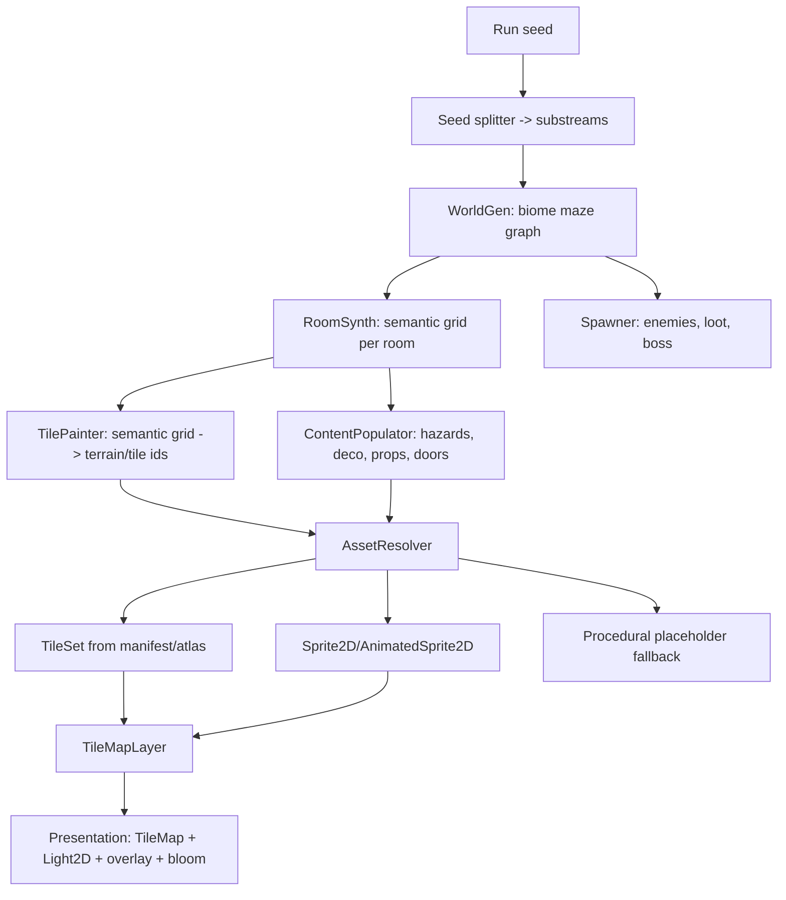

# 10 — Procedural Generation & Asset Interface (design)

> **Status: DESIGN ONLY — no code.** The machine is not built yet. This doc specifies the procedural
> building machine *and* the exact interface through which it consumes images. Companion to
> `.kiro/specs/procedural-zelda-game/design.md` (umbrella architecture) and `09-asset-labeling-convention.md`
> (the asset contract). Where this doc and older notes disagree, **this doc wins for generation**.

**Scope:** seed → world → rooms → tiles → props → entities → presentation, and every point where a
*semantic id* crosses into a *real image* (or a procedural placeholder).

---

## 1. Purpose & scope

VIGIL is a top-down LTTP-style roguelike built on **Godot 4 (GDScript)**. A run is a seeded,
procedurally generated **biome maze** of rooms; each biome is a large maze-like region
(~128×112 tiles = 8×8 LTTP screens @32px), rooms up to 80×56 tiles, free-scroll camera.

**Design goals of the machine:**
1. **Deterministic** — one seed reproduces the whole run (layout, contents, drops).
2. **Art-agnostic** — runs with *zero* authored art (procedural placeholders); art swaps in with no
   code change, via the contract in doc 09.
3. **Composable** — rooms are stitched into one continuous space; doors/locks/reachability are
   per-room under the hood.
4. **Fair** — every harmful action telegraphs; every dungeon is provably traversable.

---

## 2. Architecture overview



The machine **never names a file**. It emits *semantic ids* (`biome`, `role`, `prop_id`, `sprite_id`);
`AssetResolver` turns ids into resources — real art if present, otherwise a generated placeholder.

---

## 3. The generation pipeline

### 3.1 Runs & seeds — `Seed`

- `RunSeed` (int) → `RandomNumberGenerator`s via **substream splitting**, so a change in one stage does
  not cascade into others.
- Substreams: `world`, `room[i]`, `content[room]`, `entities[room]`, `loot[i]`, `overlay`.
  Derived by hashing `RunSeed ^ domain ^ index` — **never** `randi()`/`randf()` globals.
- Property: `generate(seed) == generate(seed)` byte-for-byte, and two substreams are independent.

### 3.2 World graph — `WorldGen`

- Produces a `WorldGraph`: rooms as nodes on a coarse cell grid, orthogonal connections = doors.
- **Biome assignment** by depth/route (later: 7 biomes; POC: darkroom → grasslands → dungeon).
- Guarantees a **single connected component**; tags `start`, `exit`, `boss`, `choice`, `treasure`.
- POC level = short dungeon of ~5–8 rooms incl. one `Choice_Room`; boss antechamber prefab at `exit`.

### 3.3 Room synthesis — `RoomSynth` → **semantic grid**

The heart of the machine. Each room is synthesized as a **semantic grid** `Array[Array[SemanticCell]]`
(W×H cells, 32px each) — *roles*, not tiles yet:

```
enums: FLOOR, FLOOR_ACCENT, WALL, WALL_TOP, PIT, WATER, HAZARD(type),
       DOOR(N/S/E/W), THRESHOLD, STAIRS, DECO(id), PROP(id), LIGHT(id), SPAWN, EMPTY
```

Algorithm per room:
1. **Shell** — walls around the room; carve doorways where the graph has connections.
2. **Floor** — fill interior; stamp the biome's floor pattern + accent variants (seeded).
3. **Structure** — biome-specific features (pit chasms, water pools, pillars, cracked walls).
4. **Hazards** — placed along reachable paths only (never sealing a route).
5. **Decor** — Poisson-disc / socket placement of deco & props (counts from biome params).
6. **Lights** — emissive placements feeding the lighting pass.
7. **Spawns** — enemy + loot anchor cells, tagged for the `Spawner`.

> `Choice_Room` (Req 74): N plinths along a wall, one random item on offer.
> **Prefab chunks** (boss antechamber, set-piece rooms): hand-authored *semantic patterns* merged in
> by `ObjectAssembler` at fixed offsets — not autotiled.

### 3.4 Tiles — `TilePainter` (semantic grid → tile ids)

Converts the semantic grid into a `TileMapLayer`:
- `FLOOR`/`FLOOR_ACCENT` → a **terrain** + variant tile (seeded pick from `manifest.roles.floor`).
- `WALL`/`WALL_TOP` → wall terrain; **corners/edges are resolved by the engine's terrain system**, not
  by hand — we only supply the terrain id at each cell.
- `PIT/WATER/HAZARD/DOOR/THRESHOLD/STAIRS` → explicit role tiles from the manifest.
- `DECO/PROP/LIGHT` → emitted as **scene objects** (Sprite2D/Area2D), not tiles.
- Autotiling contract: the painter writes `(terrain_set, terrain)` per cell; Godot's `TileSet`
  terrain solver chooses the 12-piece corner/edge tile. **We never index the 40 edge tiles directly.**

### 3.5 Entities — `Spawner` (exists, to extend)

- Reads room tags + biome params + depth-derived difficulty; spawns enemies from the bestiary
  (data-driven, Req 19), loot pedestals, and the boss at `exit`.
- Enemy art resolves via `AssetResolver.sprite(bestiary_id)` with placeholder fallback.

### 3.6 Presentation

- `TileMapLayer(s)` stitched per contiguous region; player free-scroll camera with limits.
- `BiomeOverlay` (ambient particles: fireflies, motes) + `Light2D` + selective bloom on emissive pixels.
- PostFX (optional CRT) as a toggle.

---

## 4. The key abstraction: the semantic cell

Everything between generation and rendering speaks **semantics**, never pixels:

| Layer | Speaks | Never speaks |
|---|---|---|
| `WorldGen` | cells, biome, tags | tiles, files |
| `RoomSynth` | `SemanticCell` roles | tiles, files |
| `TilePainter` | terrain ids + role ids | pixels, atlas coords |
| `AssetResolver` | ids → resources | generation logic |
| `TileMapLayer` | atlas coords | semantics |

This is what makes the swap-in free: replace the images, not the machine.

---

## 5. Autotiling (terrain model)

- **Godot `TileSet` terrain sets** are the mechanism. One terrain set per biome, terrains =
  `{floor, wall, water, pit, …}` (whatever the biome uses).
- Each terrain supplies the **12-piece** set (4 outer corners, 4 edges, 4 inner corners) — doc 08's
  "author this FIRST".
- Corner **peering bits** are authored **visually in the Godot editor** once per terrain (they encode
  which neighbours match). The machine only writes terrain ids.
- **Ground truth import:** if a source pack ships Tiled terrain data (see §10), we import those corner
  bits directly instead of guessing.

---

## 6. The asset interface — `AssetResolver` (System S)

### 6.1 Responsibilities

- Map **semantic id → resource**, with a **procedural placeholder** when the resource is absent.
- Build/cache a `TileSet` per biome from the biome manifest + atlas.
- Be the *only* module that knows about `res://art/`.

### 6.2 Resolution order (Property 36)

```
resolve_tileset(biome):
    if manifest+atlas exist -> TileSet built from manifest   (real art)
    else                    -> procedural placeholder TileSet (biome palette)

pick_tile(biome, role, rng):  # deterministic
    if role in manifest.roles -> pick one id (seeded) -> atlas coord
    else                      -> placeholder tile for role

sprite(id):  real sheet if present, else generated placeholder sprite
```

### 6.3 Placeholder generator (EXTEND)

Upgrade the scaffold's flat `Polygon2D` placeholders to a **semantic placeholder tile/sprite
generator**: 3-tone ramp + outline + dither + signature prop, palette from the biome. This lets the
whole machine run and be *played* before any art exists.

---

## 7. Interfaces (GDScript signatures — design, not implemented)

```gdscript
# Seed.gd
static func split(run_seed: int, domain: String, index: int = 0) -> RandomNumberGenerator

# WorldGen.gd
func generate(rng: RandomNumberGenerator, params: WorldParams) -> WorldGraph

# RoomSynth.gd
func synth(room: Room, biome: Biome, rng: RandomNumberGenerator) -> SemanticGrid

# TilePainter.gd
func paint(grid: SemanticGrid, resolver: AssetResolver) -> TileMapLayer

# AssetResolver.gd  (NEW, System S)
func resolve_tileset(biome: String) -> TileSet
func pick_tile(biome: String, role: String, rng: RandomNumberGenerator) -> Vector2i   # atlas coord
func has(biome: String, role: String) -> bool
func sprite(id: String) -> Texture2D

# ObjectAssembler.gd  (NEW)
func assemble(grid: SemanticGrid, prefabs: Array) -> Array[Node2D]
```

**Contract:** generation code depends only on these signatures; swapping art or placeholders changes
nothing above the `AssetResolver` line.

---

## 8. Directory & manifest

Asset layout, role vocabulary, and the `manifest.json` schema are defined in **doc 09**. Summary:

```
res://art/tilesets/<biome>/{atlas.png, manifest.json, <biome>.tres}
res://art/characters/…,  objects/…,  ui/…,  vfx/…
```

`manifest.json` = `roles -> [tile ids]` + `terrain` map + `tiles{id -> atlas coord, role, terrain}`.
The machine reads **only** `manifest.json` (via `AssetResolver`), never the tree.

---

## 9. Correctness properties

1. **Determinism** — `generate(seed, params)` is a pure function of (seed, params, code version).
2. **Reachability** — for every room, every door and every mandatory pickup is reachable from the
   start (Req: hard gate; see `Reachability.gd`). Assert at generation time.
3. **Fairness** — hazardous actions emit a telegraph ≥1 frame before damage (charger wind-up, Req).
4. **Placeholder-complete** — the machine produces a *playable* run with **zero** authored art.
5. **Art-amplifying** — dropping a valid `<biome>/manifest.json` + `atlas.png` *only* changes visuals.

---

## 10. Source-pack metadata as ground truth

Some packs ship real, engineered terrain data. **Prefer this over inference:**

- `lttp-set-b` (grass biome) ships `grass_biome.tsx` with:
  - `<terraintypes>`: `Grass, Water, Forest, Swampgrass, Swamp`
  - per-tile corner terrain bits, e.g. `<tile id="48" terrain="0,0,0,1"/>` (4-corner peering).
- This is **exactly** the 12-piece autotile ground truth for the grasslands terrain — import it (map
  Tiled terrain → our `floor/wall/water` roles) instead of hand-authoring peering bits.
- Intake step (doc 09 §4) should therefore **scan every pack for `.tsx/.tmx`, Aseprite `.ase`
  palettes, and any `wangsets/terraintypes`** before falling back to clustering/vision.

---

## 11. Non-goals / deferred

- No runtime code in this doc's scope (design only).
- Enemies, VFX, full UI art are gaps (doc 08 §E–I).
- 7-biome palette/tileset authoring beyond the POC (darkroom, grasslands, dungeon) is later.
- Terrain peering bits are authored in-editor (visual), not auto-derived, except where imported (§10).

---

## 12. Build order (once coding starts)

1. `Seed` + `AssetResolver` skeleton + placeholder generator → machine runs on placeholders.
2. `WorldGen` + `RoomSynth` + `TilePainter` on the **darkroom** tileset.
3. `grasslands` (import set-b terrain §10), then `dungeon`.
4. Content population, then entities, then presentation.
5. Swap in authored art per biome — no code change.
